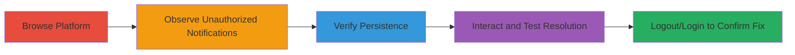

# HackerOne Notification Cache Key Misconfiguration Leading to Unauthorized Notification Disclosure

Multi-stage attack chain demonstrating a complete attack workflow for exploiting a caching issue in HackerOne's notification system.

## Chain Metrics Dashboard

| Metric | Value |
|--------|-------|
| Chain Status | Unverified |
| Total Steps | 4 |
| Execution Time | ~2 minutes |
| Skill Level | Beginner |
| Complexity | Low |
| Impact Level | Medium |

## Attack Flow Visualization

## Prerequisites & Requirements

### Required Tools

- None (browser-based discovery)

### Target Environment

- Web platform (HackerOne application)
- Required services/ports: HTTPS on port 443
- Network access requirements: Internet access to HackerOne

### Initial Access Requirements

- Valid authenticated session to HackerOne
- No prior access needed beyond standard user login

## Detailed Attack Procedures

### Step 1: Browse Platform and Observe Unauthorized Notifications
procedure: [[procedures/Observe-Unauthorized-Notifications-via-Cache-Flaw]]

**Objective**: Identify unexpected notifications in the feed that belong to other users due to caching errors.

**Instructions**: Log in to the HackerOne platform and navigate to the notifications section. Browse through pages while monitoring the notification feed for anomalies.

**Expected Output**: Appearance of notifications related to reports not submitted by the user, such as Yahoo or Slack bug reports.

**Success Indicators**:
- Notifications for external reports (e.g., Yahoo bugs) visible in the feed
- Own notifications mixed with unauthorized ones

### Step 2: Verify Notification Persistence
procedure: [[procedures/Verify-Notification-Persistence-Across-Sessions]]

**Objective**: Confirm that the unauthorized notifications remain visible despite page interactions.

**Instructions**: Refresh the page multiple times and navigate to different URLs within the platform while keeping the notification feed open.

**Expected Output**: Unauthorized notifications persist in the feed without disappearing.

**Success Indicators**:
- Notifications remain after page refresh
- Visibility holds across URL changes

### Step 3: Interact with Unauthorized Notifications
procedure: [[procedures/Test-Notification-Resolution-on-Authentication-Change]]

**Objective**: Attempt to access details of unauthorized notifications and assess limitations.

**Instructions**: Click on the unexpected notifications to attempt viewing their content.

**Expected Output**: Encounter a 'page not found' error upon clicking, indicating partial disclosure without full access.

**Success Indicators**:
- Click leads to 404 error
- No full details accessible, but metadata (e.g., report types) leaked

### Step 4: Test Resolution on Authentication Change
procedure: [[procedures/Test-Notification-Resolution-on-Authentication-Change]]

**Objective**: Validate that the issue is session-bound and resolves on re-authentication.

**Instructions**: Log out of the HackerOne session and log back in, then revisit the notifications feed.

**Expected Output**: Unauthorized notifications no longer appear after logout and login.

**Success Indicators**:
- Feed returns to normal, showing only user's own notifications
- Issue confirmed as cache-related and temporary

## Attack Chain Summary

### Key Achievements

1. Discovered and observed other users' notifications via caching flaw
2. Verified persistence of the leak across interactions
3. Confirmed partial privacy impact with limited access to details
4. Identified resolution mechanism through session refresh

## Technique & Tactic Coverage

### MITRE ATT&CK Techniques

- [[Exploit Public-Facing Application]] Exploit Public-Facing Application
- [[Account Discovery]] Account Discovery

### MITRE ATT&CK Tactics

- [[Discovery]] Discovery

---
*Last updated: 2023-10-01T12:00:00Z*
