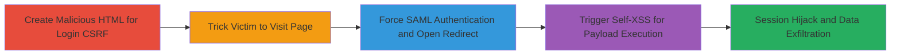

---
tags:
  - saml
  - csrf
  - open-redirect
  - self-xss
  - sso
  - session-hijacking
type: attack_chain
tools: []
tactics:
  - '[[Initial Access]]'
  - '[[Collection]]'
commands: []
platforms:
  - Web
complexity: medium
procedures:
  - '[[procedures/Perform-Login-CSRF-with-Malicious-HTML]]'
  - '[[procedures/Trick-Victim-into-Visiting-Malicious-Page]]'
  - '[[procedures/Exploit-Open-Redirect-in-SAML-Flow]]'
  - '[[procedures/Chain-to-Stored-Self-XSS-Exploitation]]'
step_count: 4
techniques:
  - '[[Drive-by Compromise]]'
  - '[[JavaScript]]'
  - '[[Exploit Public-Facing Application]]'
description: >-
  Multi-stage attack exploiting Login CSRF, Open Redirect, and Self-XSS in
  HackerOne's SAML SSO to force victim authentication, redirect to malicious
  sites, and execute client-side payloads for session hijacking and data
  exfiltration.
skill_level: intermediate
impact_level: high
id: a5e9109e-eeb4-49f3-9d72-d956ea3a15e4
created_at: '2025-12-14T17:27:57.234Z'
updated_at: '2025-12-14T17:27:57.234Z'
verified: false
validated: true
submitted: true
mitre_tactics:
  - '[[Initial Access]]'
  - '[[Collection]]'
mitre_techniques:
  - '[[Drive-by Compromise]]'
  - '[[JavaScript]]'
  - '[[Exploit Public-Facing Application]]'
---
# HackerOne SAML SSO Login CSRF Chained with Open Redirect and Self-XSS

Multi-stage attack chain exploiting vulnerabilities in HackerOne's SAML SSO implementation, including Login CSRF due to missing CSRF protection, Open Redirect in SAML redirects, and chainable Self-XSS in victim-only areas. The attack forces passwordless account authentication, redirects to attacker-controlled sites for phishing, and triggers stored Self-XSS payloads to steal session data and confidential bug reports.

## Chain Metrics Dashboard

| Metric | Value |
|--------|-------|
| Chain Status | Unverified |
| Total Steps | 4 |
| Execution Time | ~10 minutes |
| Skill Level | Intermediate |
| Complexity | Medium |
| Impact Level | High |

## Attack Flow Visualization

## Prerequisites & Requirements

### Required Tools

- Web browser for testing
- Text editor for HTML/JS creation

### Target Environment

- Web platform with SAML SSO (e.g., HackerOne)
- Passwordless accounts configured with external IdPs
- No specific ports; assumes HTTP/HTTPS access

### Initial Access Requirements

- Knowledge of victim's email
- Ability to host malicious HTML page (e.g., via attacker-controlled domain)
- Attacker account on target for IdP configuration (if exploiting redirect)

## Detailed Attack Procedures

### Step 1: Create Malicious HTML for Login CSRF
procedure: [[procedures/Perform-Login-CSRF-with-Malicious-HTML]]

**Objective**: Craft a page that logs out the victim and forces SAML login initiation without CSRF checks.

**Instructions**: Create an HTML file with an invisible iframe to load the logout endpoint, then use JavaScript to redirect to the SAML sign-in endpoint with the victim's email and remember_me=true.

**Expected Output**: Victim's browser initiates SAML flow automatically upon visiting the page.

**Success Indicators**:
- Iframe loads logout without errors
- Redirect to /users/saml/sign_in occurs after delay

### Step 2: Trick Victim into Visiting Malicious Page
procedure: [[procedures/Trick-Victim-into-Visiting-Malicious-Page]]

**Objective**: Socially engineer the victim to load the malicious HTML, triggering the CSRF.

**Instructions**: Host the HTML on an attacker domain and send via phishing email or link. The page uses hidden elements (width:0; height:0) to perform actions invisibly, delaying 5 seconds before redirect.

**Expected Output**: Victim authenticates via SAML without noticing, establishing attacker's session access.

**Success Indicators**:
- Victim visits page (track via logs if hosted on attacker's server)
- SAML flow completes, logging victim in

### Step 3: Exploit Open Redirect in SAML Flow
procedure: [[procedures/Exploit-Open-Redirect-in-SAML-Flow]]

**Objective**: Redirect the authenticated victim to a malicious site during SAML processing.

**Instructions**: Configure a malicious IdP with benign flow for approval, then post-approval alter to include redirect chain (e.g., to corp.attacker.com then malicious URL). The SAML redirect lacks validation.

**Expected Output**: Victim's browser redirects to attacker site, bypassing warnings.

**Success Indicators**:
- IdP configuration approved
- Redirect chain executes, landing on phishing page

### Step 4: Chain to Stored Self-XSS Exploitation
procedure: [[procedures/Chain-to-Stored-Self-XSS-Exploitation]]

**Objective**: Use forced login to trigger victim-only Self-XSS payloads for further attacks.

**Instructions**: After CSRF login, access internal areas to store Self-XSS payload. Logout attacker session and wait for victim interaction to execute JS, stealing session data.

**Expected Output**: Payload executes in victim's context, exfiltrating data like bug reports.

**Success Indicators**:
- Self-XSS payload stored and triggered
- Data leakage observed (e.g., via attacker server logs)

## Attack Chain Summary

### Key Achievements

1. Forced authentication of passwordless accounts via Login CSRF
2. Bypassed link warnings with Open Redirect for phishing
3. Chained to Self-XSS for client-side execution and data theft

## Technique & Tactic Coverage

### MITRE ATT&CK Techniques

- [[Drive-by Compromise]]
- [[JavaScript]]
- [[Exploit Public-Facing Application]]

### MITRE ATT&CK Tactics

- [[Initial Access]]
- [[Collection]]

---
*Last updated: 2023-10-01T00:00:00Z*
