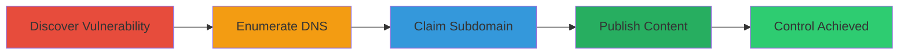

# HackerOne Subdomain Takeover via Instapage Dangling CNAME

Multi-stage attack chain demonstrating a subdomain takeover exploiting an Instapage 0day vulnerability on a dangling CNAME record for www.hacker.one, allowing an attacker to claim and control the subdomain for potential defacement or phishing attacks.

## Chain Metrics Dashboard

| Metric | Value |
|--------|-------|
| Chain Status | Unverified |
| Total Steps | 4 |
| Execution Time | ~15 minutes |
| Skill Level | Intermediate |
| Complexity | Medium |
| Impact Level | High |

## Attack Flow Visualization

## Prerequisites & Requirements

### Required Tools

- Web browser for account creation and DNS checks
- DNS lookup tools (e.g., dig or nslookup, not formalized here)

### Target Environment

- Web platform with DNS resolution
- Access to Instapage service
- No special ports required beyond standard HTTP/HTTPS (80/443)

### Initial Access Requirements

- Public internet access
- No credentials needed initially; new account creation on Instapage
- Knowledge of target's DNS configuration

## Detailed Attack Procedures

### Step 1: Discover Instapage Subdomain Takeover Vulnerability
procedure: [[procedures/Discover-Instapage-Subdomain-Takeover-Vulnerability]]

**Objective**: Identify the Instapage 0day that allows claiming expired or dangling custom domains without validation.

**Instructions**: Research Instapage's domain claiming process to confirm it permits new users to associate with unclaimed CNAME records from deleted accounts. Verify by testing on a known dangling record or through documentation review.

**Expected Output**: Confirmation that Instapage does not validate ownership for CNAME-pointed subdomains.

**Success Indicators**:
- Vulnerability details noted: Instapage allows publishing to dangling CNAMEs
- Potential for subdomain hijacking identified

### Step 2: Enumerate Target DNS for Dangling CNAMEs
procedure: [[procedures/Enumerate-Target-DNS-for-Dangling-CNAMEs]]

**Objective**: Scan the target's DNS records to find subdomains with CNAMEs pointing to vulnerable third-party services like Instapage.

**Instructions**: Use DNS lookup tools to query the target's subdomains, specifically checking for CNAME records. For example, query www.hacker.one to reveal the CNAME to Instapage.

**Expected Output**: DNS record showing CNAME from www.hacker.one to an Instapage endpoint, with no active claim.

**Success Indicators**:
- CNAME record found pointing to Instapage
- Subdomain appears unclaimed or expired

### Step 3: Claim Subdomain via Instapage Account
procedure: [[procedures/Claim-Subdomain-via-Instapage-Account]]

**Objective**: Create an Instapage account and hijack the subdomain by associating it with the dangling CNAME.

**Instructions**: Sign up for a free Instapage account, then in the domain settings, input the target subdomain (www.hacker.one) and link it via the existing CNAME. Instapage will accept it due to lack of validation.

**Expected Output**: Subdomain successfully associated with the new account, ready for publishing.

**Success Indicators**:
- Account creation successful
- Subdomain claim confirmed in Instapage dashboard

### Step 4: Publish Content to Hijacked Subdomain
procedure: [[procedures/Publish-Content-to-Hijacked-Subdomain]]

**Objective**: Demonstrate control by serving custom HTML on the hijacked subdomain.

**Instructions**: In the Instapage dashboard, create a new landing page with custom HTML (e.g., a proof-of-concept message) and publish it to the claimed subdomain. Verify by accessing www.hacker.one in a browser.

**Expected Output**: Custom content visible when visiting the subdomain.

**Success Indicators**:
- Modified HTML loads on www.hacker.one
- Full control over subdomain content confirmed

## Attack Chain Summary

### Key Achievements

1. Exploited Instapage 0day to claim a dangling subdomain without ownership verification.
2. Gained full control over www.hacker.one, a subdomain of HackerOne.
3. Demonstrated potential for defacement or phishing without compromising main domain data.

## Technique & Tactic Coverage

### MITRE ATT&CK Techniques

- [[Exploit Public-Facing Application]]

### MITRE ATT&CK Tactics

- [[Initial Access]]

---
*Last updated: 2023-10-01T12:00:00Z*
