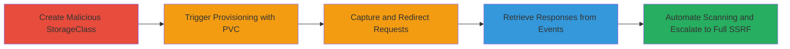

---

# Half-Blind SSRF in Kubernetes Storage Provisioners for Internal Network Enumeration and Escalation

Multi-stage attack chain demonstrating exploitation of a half-blind SSRF vulnerability in the kube-controller-manager component of Kubernetes, targeting custom StorageClasses with provisioners like GlusterFS, ScaleIO, and StorageOS. This allows attackers with cluster access to trigger provisioning requests that scan internal networks, enumerate services, steal credentials from metadata endpoints, and escalate to full SSRF via HTTP smuggling in older versions.

## Chain Metrics Dashboard

| Metric | Value |
|--------|-------|
| Chain Status | Unverified |
| Total Steps | 5 |
| Execution Time | ~10-30 minutes |
| Skill Level | Intermediate |
| Complexity | Medium |
| Impact Level | High |

## Attack Flow Visualization



## Prerequisites & Requirements

### Required Tools

- [[tools/kubectl]]
- [[tools/bash-scanner]]

### Target Environment

- Kubernetes cluster (versions affected: up to 1.15.x with Go <1.12 for full SSRF)
- Managed services like AWS EKS, GKE with custom Storage provisioners (GlusterFS, ScaleIO, StorageOS)
- Ports: 6666 (attacker listener), 2379 (ETCD), 10255 (Kubelet), 169.254.169.254 (Metadata API)

### Initial Access Requirements

- Valid kubeconfig access to create StorageClasses and PVCs (typically cluster-admin or storage provisioner role)
- Attacker-controlled server accessible from internal cluster network
- Network position: Inside the cluster or with API server access

## Detailed Attack Procedures

### Step 1: Create Malicious StorageClass

procedure: [[procedures/Create-Malicious-StorageClass-for-SSRF]]

**Objective**: Define a custom StorageClass that manipulates the resturl parameter to control the provisioning endpoint, exploiting the lack of validation in the GlusterFS client.

**Instructions**: Use [[commands/kubectl-create-yaml]] to apply a YAML file defining the StorageClass with a truncated resturl like 'http://bzh.ovh:6666/#', which leverages URL fragment to bypass the appended '/volumes' path.

```bash
kubectl create -f sc-poc.yaml
```

**Expected Output**: StorageClass created successfully; no immediate errors.

**Success Indicators**:
- StorageClass listed via `kubectl get storageclass`
- No validation errors on resturl parameter

### Step 2: Trigger SSRF with PersistentVolumeClaim

procedure: [[procedures/Trigger-SSRF-with-PersistentVolumeClaim]]

**Objective**: Create a PVC bound to the malicious StorageClass to initiate dynamic provisioning, sending a POST request to the attacker-controlled URL from the internal kube-controller-manager.

**Instructions**: Apply the PVC YAML using [[commands/kubectl-create-yaml]] to request storage and trigger the provisioner.

```bash
kubectl create -f pvc-poc.yaml
```

**Expected Output**: PVC created in Pending state; provisioning event logged.

**Success Indicators**:
- PVC status shows provisioning in progress
- Incoming POST request observed on attacker server

### Step 3: Monitor and Capture SSRF Requests

procedure: [[procedures/Monitor-and-Capture-SSRF-Requests]]

**Objective**: Set up a listener to confirm arbitrary URL control and capture the half-blind SSRF request from the cluster.

**Instructions**: Run a simple HTTP server or use netcat on port 6666 to log incoming POST requests.

```bash
nc -l 6666
```

**Expected Output**: POST request body containing provisioning JSON payload.

**Success Indicators**:
- Request received with expected headers and body
- Confirms half-blind SSRF (request sent but no direct response)

### Step 4: Retrieve Internal Responses via Redirects and Events

procedure: [[procedures/Retrieve-Internal-Responses-via-Redirects-and-Events]]

**Objective**: Use 302 redirects to convert POST to GET for internal URLs and extract responses leaked in Kubernetes events.

**Instructions**: Update resturl to point to a redirect endpoint (e.g., 'http://bzh.ovh/redirect.php#') that forwards to internal services like metadata API. Then use [[commands/kubectl-describe-pvc]] and [[commands/kubectl-get-events]] to view leaked JSON.

```bash
kubectl describe pvc poc-ssrf
kubectl get events
```

**Expected Output**: Events showing JSON responses from internal endpoints (e.g., AWS metadata).

**Success Indicators**:
- Non-200 status codes with JSON bodies in events
- Credential data or service info exfiltrated

### Step 5: Automate Internal Network Scanning and Escalation

procedure: [[procedures/Automate-Internal-Network-Scanning-and-Escalation]]

**Objective**: Script parallel scans of internal IPs/ports and escalate to full SSRF using CRLF injection in older Go versions for complete request crafting.

**Instructions**: Run the bash scanner script with [[tools/bash-scanner]] to iterate over targets like 172.16.0.0/12, creating/deleting resources dynamically. For escalation, craft resturl with smuggling payload.

```bash
./scanner.sh
```

**Expected Output**: List of open internal services; full responses in logs if accessible.

**Success Indicators**:
- Discovered open ports (e.g., Kubelet 10255)
- Escalated requests chaining to arbitrary internals

## Attack Chain Summary

### Key Achievements

1. Achieved half-blind SSRF to confirm internal request origination
2. Enumerated internal services including metadata, Kubelet, and ETCD
3. Exfiltrated credentials via event leaks and redirects
4. Escalated to full SSRF with HTTP smuggling for DoS and priv esc

## Technique & Tactic Coverage

### MITRE ATT&CK Techniques

- [[Exploit Public-Facing Application]]
- [[Remote System Discovery]]
- [[Unsecured Credentials]]

### MITRE ATT&CK Tactics

- [[Initial Access]]
- [[Discovery]]
- [[Collection]]

---

*Last updated: 2023-10-01T00:00:00Z*
