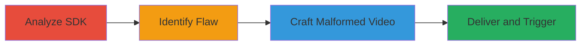

# Heap Buffer Overflow RCE in Nintendo 3DS eShop via Unchecked Audio Channels in Mobiclip SDK

Multi-stage attack chain demonstrating a complete exploit workflow for remote code execution in the Nintendo 3DS eShop application through a heap buffer overflow in the Mobiclip SDK.

## Chain Metrics Dashboard

| Metric | Value |
|--------|-------|
| Chain Status | Unverified |
| Total Steps | 4 |
| Execution Time | ~120 minutes |
| Skill Level | Advanced |
| Complexity | High |
| Impact Level | High |

## Attack Flow Visualization

## Prerequisites & Requirements

### Required Tools

- Reverse engineering tools (e.g., IDA Pro or Ghidra for SDK analysis)
- Hex editor or custom script for crafting moflex files

### Target Environment

- Nintendo 3DS console with eShop application
- Mobiclip SDK integrated in eShop movie player
- Access to deliver videos via eShop submissions or arbitrary file delivery (e.g., combined with vulnerability #894922)

### Initial Access Requirements

- Ability to reverse engineer the Mobiclip SDK binaries
- Knowledge of moflex video file format
- Remote delivery mechanism to the target 3DS eShop (e.g., via catalog or paired vuln)

## Detailed Attack Procedures

### Step 1: Analyze Mobiclip SDK Audio Processing
procedure: [[procedures/Analyze-Mobiclip-SDK-Audio-Processing]]

**Objective**: Examine the audio processing functions in the Mobiclip SDK to understand buffer management and potential flaws.

**Instructions**: Load the Mobiclip SDK binary into a disassembler and focus on the mw::mo::helper::PcmAudioPresentation::GetNextAudioDataPtr function. Trace how it handles audio stream information, including nb_channels from the moflex file header, and observe buffer offset calculations and free space determinations.

**Expected Output**: Disassembled code showing buffer computations based on nb_channels, previous_data_length, and audio data copying logic.

**Success Indicators**:
- Identification of key functions involved in audio data pointer retrieval
- Mapping of variables like already_played, nb_channels, and free_space

### Step 2: Identify Miscalculation in Audio Byte Computation
procedure: [[procedures/Identify-Miscalculation-in-Audio-Byte-Computation]]

**Objective**: Pinpoint the arithmetic error in already_played_bytes calculation that can be abused for buffer overflow.

**Instructions**: In the disassembled GetNextAudioDataPtr function, note that already_played is derived as previous_data_length / (nb_channels * 2). Then, analyze the computation already_played_bytes = already_played << nb_channels. For nb_channels > 2, this left shift effectively multiplies by 2^nb_channels instead of the intended 2 * nb_channels, inflating already_played_bytes and thus free_space.

**Expected Output**: Confirmation of the shift operator misuse leading to oversized free_space values, bypassing checks like free_space < data_size.

**Success Indicators**:
- Verification of overflow potential when nb_channels exceeds 2 (up to 256)
- Calculation examples showing inflated values (e.g., already_played_bytes = 0x8XXXXXXX)

### Step 3: Craft Malformed Moflex Video with Invalid Audio Channels
procedure: [[procedures/Craft-Malformed-Moflex-Video-with-Invalid-Audio-Channels]]

**Objective**: Create a moflex video file that triggers the heap overflow by setting excessive nb_channels.

**Instructions**: Use a hex editor or custom binary manipulation tool to modify a valid moflex video file. Set the nb_channels field in the audio stream info to a value > 2, such as 8 or up to 256. Adjust previous_data_length to control already_played and ensure already_played_bytes becomes sufficiently large to bypass size checks. Ensure the file remains parsable until the audio processing stage.

**Expected Output**: A malformed moflex file that loads in the player but overflows the heap during audio data copy to ap->buffer + offset.

**Success Indicators**:
- File parses headers without crash
- Simulated computation shows free_space inflation and overflow trigger

### Step 4: Deliver and Trigger Overflow in eShop Movie Player
procedure: [[procedures/Deliver-and-Trigger-Overflow-in-eShop-Movie-Player]]

**Objective**: Deliver the crafted video to the target 3DS and execute it in the eShop player to achieve RCE.

**Instructions**: Submit the malformed video via eShop catalog mechanisms or combine with vulnerability #894922 for arbitrary delivery. Launch the eShop application on the 3DS and play the video, triggering the GetNextAudioDataPtr function during audio processing. The overflow enables heap manipulation, potentially leading to usermode RCE without noticeable application disruption.

**Expected Output**: Heap overflow during playback, allowing code execution in the eShop process context.

**Success Indicators**:
- Video plays without immediate crash
- Evidence of heap corruption or controlled execution (e.g., via ROP chain if extended)

## Attack Chain Summary

### Key Achievements

1. Reverse-engineered Mobiclip SDK to uncover unchecked nb_channels flaw
2. Crafted exploitable moflex video inflating free_space via left-shift miscalculation
3. Achieved heap buffer overflow for usermode RCE in eShop
4. Demonstrated remote exploit potential via video delivery

## Technique & Tactic Coverage

### MITRE ATT&CK Techniques

- [[Exploit Public-Facing Application]] Exploit Public-Facing Application
- [[Exploitation for Client Execution]] Exploitation for Client Execution

### MITRE ATT&CK Tactics

- [[Initial Access]] Initial Access
- [[Execution]] Execution

---
*Last updated: 2023-10-01T00:00:00Z*
