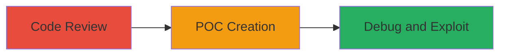

# Heap Overflow in PHP bzdecompress() via Integer Overflow for Arbitrary Code Execution

Multi-stage attack chain demonstrating the discovery and exploitation of an integer overflow in PHP's Bzip2 module, leading to a heap overflow and arbitrary code execution on 32-bit Linux systems.

## Chain Metrics Dashboard

| Metric | Value |
|--------|-------|
| Chain Status | Unverified |
| Total Steps | 3 |
| Execution Time | ~10 minutes |
| Skill Level | Intermediate |
| Complexity | Medium |
| Impact Level | High |

## Attack Flow Visualization



## Prerequisites & Requirements

### Required Tools

- [[tools/GDB]]
- [[tools/PHP]]

### Target Environment

- 32-bit Linux platform
- PHP 7.1 compiled with Bzip2 module
- Access to PHP source code (ext/bz2/bz2.c)

### Initial Access Requirements

- Local access to a vulnerable PHP installation
- No network access required; local execution

## Detailed Attack Procedures

### Step 1: Code Analysis
procedure: [[procedures/Analyze-bzdecompress-Source-for-Integer-Overflow]]

**Objective**: Identify the integer overflow vulnerability in the bzdecompress() function by reviewing the source code.

**Instructions**: Examine the PHP source code in ext/bz2/bz2.c around line 589. Look for the allocation of memory using source_len * 2 without overflow checks.

**Expected Output**: Confirmation of vulnerable code where bzs.avail_out = source_len * 2 leads to small allocation for large inputs.

**Success Indicators**:
- Overflow condition identified in memory allocation
- No size validation before zend_string_alloc

### Step 2: POC Script Creation
procedure: [[procedures/Create-PHP-POC-Script-to-Trigger-bzdecompress-Overflow]]

**Objective**: Develop a PHP script that generates oversized compressed input to trigger the heap overflow.

**Instructions**: Write a PHP script that sets memory_limit to -1, creates a large string of repeated characters including 'BBBB' for EIP control, compresses it with bzcompress(), and calls bzdecompress() on the oversized data.

**Expected Output**: Script that produces compressed data of length ~0x7ffffffe, triggering overflow on decompression.

**Success Indicators**:
- Script compiles and runs without syntax errors
- Compressed input exceeds safe length for 32-bit int multiplication

### Step 3: Execution and Debugging
procedure: [[procedures/Debug-and-Demonstrate-EIP-Control-with-GDB]]

**Objective**: Run the POC under GDB to crash the process and verify control over the EIP register.

**Instructions**: Launch GDB with the PHP CLI executing the POC script using [[commands/gdb-debug-php-script]]:

```bash
gdb --args sapi/cli/php -f ../crash/bz_poc.php
```

After the crash, inspect the EIP register with [[commands/info-registers-eip]]:

```bash
i r eip
```

**Expected Output**: SIGSEGV signal with EIP set to 0x42424242 from input 'BBBB'.

**Success Indicators**:
- Heap overflow confirmed by crash
- EIP overwritten to attacker-controlled value

## Attack Chain Summary

### Key Achievements

1. Discovered integer overflow in bzdecompress() memory allocation
2. Crafted POC to trigger heap overflow with controlled input
3. Demonstrated arbitrary code execution potential via EIP hijacking

## Technique & Tactic Coverage

### MITRE ATT&CK Techniques

- [[Exploitation for Client Execution]] Exploitation for Client Execution
- [[Network Device CLI]] .NET Scripting (adapted for PHP scripting exploitation)

### MITRE ATT&CK Tactics

- [[Execution]] Execution

---

*Last updated: 2023-10-01T00:00:00Z*
