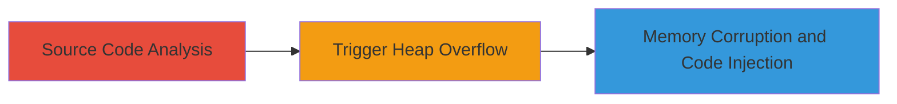

# Heap Overflow in PHP ereg_replace Leading to Potential Code Injection

Multi-stage attack chain demonstrating a complete attack workflow.

## Chain Metrics Dashboard

| Metric | Value |
|--------|-------|
| Chain Status | Unverified |
| Total Steps | 1 |
| Execution Time | ~30 minutes |
| Skill Level | Expert |
| Complexity | High |
| Impact Level | Low |

## Attack Flow Visualization



## Prerequisites & Requirements

### Required Tools

- None (relies on PHP environment and source code access)

### Target Environment

- PHP runtime environment (versions prior to patch for bug #73284)
- Web server hosting PHP applications using ereg_replace
- Access to PHP source code for analysis

### Initial Access Requirements

- Read access to PHP source code
- Ability to execute PHP scripts on a test environment
- No prior network access needed; local or controlled environment suffices

## Detailed Attack Procedures

### Step 1: Trigger Heap Overflow
procedure: [[procedures/Exploiting-Heap-Overflow-in-PHP-ereg-replace]]

**Objective**: Exploit insufficient bounds checking in the ereg_replace function to cause a heap overflow, leading to memory corruption and potential code injection.

**Instructions**: Begin by analyzing the PHP source code for the ereg_replace implementation to identify the lack of bounds checking on the replacement string. Then, craft a PHP script that calls ereg_replace with a specially constructed long replacement string to overflow the heap buffer. For example, use a pattern like '/test/' and a replacement string exceeding buffer limits (e.g., a 10,000+ character string) on a target input string.

```php
<?php
$pattern = '/test/';
$replacement = str_repeat('A', 10000); // Crafted to trigger overflow
$string = 'test case';
$result = ereg_replace($pattern, $replacement, $string);
echo $result;
?>
```

Execute the script in a vulnerable PHP environment to observe the crash or corruption.

**Expected Output**: PHP process crash, segmentation fault, or unexpected memory behavior indicating corruption; potential for arbitrary code execution if further exploited.

**Success Indicators**:
- Heap overflow confirmed via debugger (e.g., valgrind or gdb showing buffer overrun)
- Memory corruption observed, such as altered variables or control flow hijack

## Attack Chain Summary

### Key Achievements

1. Identified heap overflow via PHP source code analysis
2. Triggered memory corruption through crafted input to ereg_replace
3. Demonstrated potential for code injection, reported as low-severity vulnerability (PHP bug #73284)

## Technique & Tactic Coverage

### MITRE ATT&CK Techniques

- [[Exploitation for Client Execution]]

### MITRE ATT&CK Tactics

- [[Execution]]

---
*Last updated: 2023-10-01T12:00:00Z*
