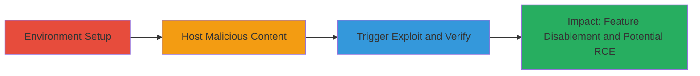

---
tags:
  - kaspersky
  - browser-extension
  - postmessage
  - command-injection
  - defense-evasion
  - rce
type: attack_chain
tools:
  - '[[tools/ssl_server.py]]'
  - '[[tools/Python-3]]'
tactics:
  - '[[Defense Evasion]]'
  - '[[Execution]]'
verified: false
platforms:
  - Windows
  - Browser
submitted: true
complexity: medium
created_at: '2023-10-01T00:00:00Z'
procedures:
  - '[[procedures/Setup-Kaspersky-Test-Environment]]'
  - '[[procedures/Host-Malicious-Exploit-Page]]'
  - '[[procedures/Trigger-and-Exploit-postMessage-Vulnerability]]'
step_count: 3
techniques:
  - '[[Disable or Modify Tools]]'
  - '[[JavaScript]]'
  - '[[Exploitation for Client Execution]]'
updated_at: '2025-12-14T17:28:58.632Z'
description: >-
  Multi-stage attack exploiting the Kaspersky Protect browser extension's URL
  Advisor frame by abusing unrestricted window.postMessage to intercept
  commands, disable security features, and potentially achieve RCE in the
  elevated avp.exe process.
skill_level: intermediate
impact_level: high
id: 8735eb99-5944-45a0-8e5e-276dd6f729b1
validated: true
mitre_tactics:
  - '[[Defense Evasion]]'
  - '[[Execution]]'
mitre_techniques:
  - '[[Disable or Modify Tools]]'
  - '[[JavaScript]]'
  - '[[Exploitation for Client Execution]]'
---
# Hijacking Kaspersky URL Advisor via postMessage Origin Bypass for AV Feature Disablement and Potential RCE

Multi-stage attack chain demonstrating exploitation of the Kaspersky Protect browser extension in Firefox and Chrome, where the URL Advisor frame's use of window.postMessage without origin restrictions allows malicious webpages to hijack the command interface, disable features like Anti-Banner and Private Browsing, manipulate blocklists, and potentially exploit bugs in the elevated-privilege avp.exe process for remote code execution as SYSTEM.

## Chain Metrics Dashboard

| Metric | Value |
|--------|-------|
| Chain Status | Unverified |
| Total Steps | 3 |
| Execution Time | ~10 minutes |
| Skill Level | Intermediate |
| Complexity | Medium |
| Impact Level | High |

## Attack Flow Visualization



## Prerequisites & Requirements

### Required Tools

- [[tools/ssl_server.py]]
- [[tools/Python-3]]

### Target Environment

- Windows OS
- Browsers: Firefox 64+ or Chrome 71+
- Kaspersky Internet Security 19.0.0.1088 with Protect extension
- Required services/ports: Port 5000 for local HTTPS server
- Network access requirements: Localhost access; administrator privileges for hosts file edit

### Initial Access Requirements

- Local administrator access on target machine
- Kaspersky installed and extension enabled
- No remote access needed; assumes physical or local control

## Detailed Attack Procedures

### Step 1: Environment Setup
procedure: [[procedures/Setup-Kaspersky-Test-Environment]]

**Objective**: Configure Kaspersky settings, modify hosts file, and ensure the browser extension is active to prepare for triggering the URL Advisor.

**Instructions**: Enable Anti-Banner and Private Browsing in Kaspersky settings. Edit the Windows hosts file as administrator to map a fake domain starting with 'www.google.' to localhost. Verify the Kaspersky Protect extension is enabled in the browser.

**Expected Output**: Features enabled, domain mapped to 127.0.0.1, extension active.

**Success Indicators**:
- Kaspersky features toggled on in settings
- Hosts file updated without errors
- Extension visible and enabled in browser extensions list

### Step 2: Host Malicious Content
procedure: [[procedures/Host-Malicious-Exploit-Page]]

**Objective**: Set up a local HTTPS server to host the exploit HTML page that will abuse postMessage.

**Instructions**: Download the ssl_server.py and disable_features3.html files. Execute the Python script to start the server on https://localhost:5000, accepting the invalid certificate.

Use [[commands/python-ssl-server-start]]:

```bash
python ssl_server.py
```

**Expected Output**: Server running on port 5000, serving files over HTTPS.

**Success Indicators**:
- Console output shows "HTTPS server running on port 5000"
- Local files accessible via https://localhost:5000/disable_features3.html

### Step 3: Trigger Exploit and Verify
procedure: [[procedures/Trigger-and-Exploit-postMessage-Vulnerability]]

**Objective**: Navigate to the malicious page to exploit the postMessage vulnerability, hijack the command interface, and verify feature disablement.

**Instructions**: Visit https://www.google.example.com:5000/disable_features3.html in the browser, overriding the certificate warning. The page replaces the URL Advisor frame contents to intercept messages and gain control.

**Expected Output**: Anti-Banner and Private Browsing disabled in Kaspersky settings.

**Success Indicators**:
- Certificate warning overridden successfully
- Kaspersky settings show features disabled post-navigation
- Potential for further manipulation like blocklist changes or avp.exe exploitation

## Attack Chain Summary

### Key Achievements

1. Bypassed origin restrictions in postMessage to hijack Kaspersky's URL Advisor frame
2. Disabled critical AV features (Anti-Banner, Private Browsing) via intercepted commands
3. Enabled potential RCE in elevated avp.exe process by exploiting internal bugs

## Technique & Tactic Coverage

### MITRE ATT&CK Techniques

- [[Disable or Modify Tools]] Disable or Modify Tools
- [[JavaScript]] JavaScript
- [[Exploitation for Client Execution]] Exploitation for Client Execution

### MITRE ATT&CK Tactics

- [[Defense Evasion]] Defense Evasion
- [[Execution]] Execution

---
*Last updated: 2023-10-01T00:00:00Z*
