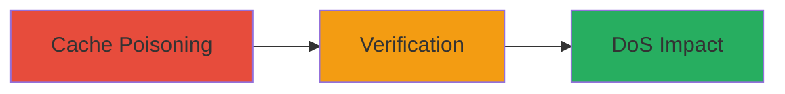

---
tags:
  - web-cache-poisoning
  - dos
  - host-header
  - shopify
  - web
type: attack_chain
tools:
  - '[[tools/curl]]'
  - '[[tools/grep]]'
tactics:
  - '[[Execution]]'
  - '[[Impact]]'
commands:
  - '[[commands/curl-poison-host-header]]'
  - '[[commands/curl-verify-poisoned-cache]]'
platforms:
  - Web
complexity: medium
procedures:
  - '[[procedures/Poison-Web-Cache-with-Modified-Host-Header]]'
  - '[[procedures/Verify-Cache-Poisoning-via-Response-Inspection]]'
  - '[[procedures/Observe-Denial-of-Service-Impact]]'
step_count: 3
techniques:
  - '[[Network Denial of Service]]'
  - '[[Exploit Public-Facing Application]]'
description: >-
  A multi-step attack exploiting improper Host header validation in the web
  cache of https://themes.shopify.com to poison cache entries, resulting in
  broken resource loading and Denial of Service for users.
skill_level: intermediate
impact_level: high
id: aeb9aa1e-628b-4fb7-ae1e-9a57176b0edc
created_at: '2025-12-14T17:26:55.925Z'
updated_at: '2025-12-14T17:26:55.925Z'
verified: false
validated: true
submitted: true
mitre_tactics:
  - '[[Execution]]'
  - '[[Impact]]'
mitre_techniques:
  - '[[Network Denial of Service]]'
  - '[[Exploit Public-Facing Application]]'
---
# Host Header Web Cache Poisoning Leading to DoS on Shopify Themes

Multi-stage attack chain demonstrating a complete workflow to exploit a Host header validation flaw in the web cache of Shopify's themes platform, leading to poisoned cache entries that cause resource loading failures and DoS for subsequent users.

## Chain Metrics Dashboard

| Metric | Value |
|--------|-------|
| Chain Status | Unverified |
| Total Steps | 3 |
| Execution Time | ~5 minutes |
| Skill Level | Intermediate |
| Complexity | Medium |
| Impact Level | High |

## Attack Flow Visualization



## Prerequisites & Requirements

### Required Tools

- [[tools/curl]]
- [[tools/grep]]

### Target Environment

- Web platform
- HTTPS service on port 443
- Access to https://themes.shopify.com

### Initial Access Requirements

- Public network access to the target
- No authentication required
- Ability to send custom HTTP headers

## Detailed Attack Procedures

### Step 1: Cache Poisoning
procedure: [[procedures/Poison-Web-Cache-with-Modified-Host-Header]]

**Objective**: Send repeated requests with a modified Host header to poison the web cache, causing it to store invalid host references.

**Instructions**: Execute the poisoning loop using [[commands/curl-poison-host-header]] to repeatedly target the cache endpoint:

```bash
while true; do curl -ik "https://themes.shopify.com:443/?g4mm4=hitthecache" -H "Host: themes.shopify.com:1337" | grep ":1337"; sleep 0; echo 1; done
```

Monitor for responses containing the poisoned port to confirm injection.

**Expected Output**: Responses showing ':1337' in elements like canonical links.

**Success Indicators**:
- Poisoned elements appear in grep output
- Cache entries are generated with invalid host

### Step 2: Verification
procedure: [[procedures/Verify-Cache-Poisoning-via-Response-Inspection]]

**Objective**: Confirm the cache poisoning by inspecting subsequent requests to the homepage for poisoned content.

**Instructions**: Run the verification loop using [[commands/curl-verify-poisoned-cache]] to check the homepage:

```bash
while true; do curl -ik "https://themes.shopify.com/" | grep ":1337"; done
```

Look for indicators of successful poisoning in the output.

**Expected Output**: Grep matches like <link rel="canonical" href="https://themes.shopify.com:1337/">.

**Success Indicators**:
- ':1337' appears in canonical links or resource URLs
- Consistent poisoning across multiple requests

### Step 3: Impact Observation
procedure: [[procedures/Observe-Denial-of-Service-Impact]]

**Objective**: Demonstrate the DoS effect where poisoned cache causes resources to fail loading for users.

**Instructions**: Access the homepage in a browser or via curl after poisoning, and inspect for broken links. No specific command needed beyond prior verification; observe that images, CSS, and other resources reference port 1337, which does not exist.

**Expected Output**: Failed resource loads, broken page functionality.

**Success Indicators**:
- Resources (e.g., images, CSS) reference invalid port 1337
- Page renders incompletely or with errors for unauthenticated users

## Attack Chain Summary

### Key Achievements

1. Successfully poisoned the web cache with arbitrary Host header modifications
2. Verified cache pollution affecting canonical links and resource URLs
3. Achieved DoS by breaking resource loading for subsequent visitors

## Technique & Tactic Coverage

### MITRE ATT&CK Techniques

- [[Network Denial of Service]]
- [[Exploit Public-Facing Application]]

### MITRE ATT&CK Tactics

- [[Execution]]
- [[Impact]]

---
*Last updated: 2023-10-01T00:00:00Z*
