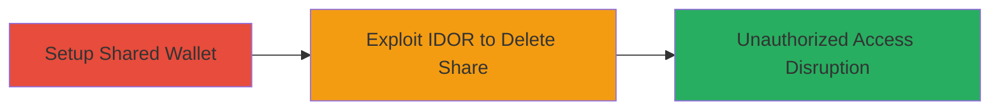

---
tags:
  - idor
  - web
  - access-control-bypass
  - wallet
type: attack_chain
tools: []
tactics:
  - '[[Initial Access]]'
verified: false
platforms:
  - Web
submitted: true
complexity: low
created_at: '2024-01-01T00:00:00Z'
procedures:
  - '[[procedures/Create-and-Share-Wallet-for-IDOR-Testing]]'
  - '[[procedures/Exploit-IDOR-to-Delete-Wallet-Share]]'
step_count: 2
techniques:
  - '[[Exploit Public-Facing Application]]'
updated_at: '2025-12-14T17:25:23.437Z'
description: >-
  Multi-stage attack exploiting an Insecure Direct Object Reference (IDOR)
  vulnerability in the Enter wallet app's sharing feature, enabling unauthorized
  users to delete other users' shares from shared wallets.
skill_level: intermediate
impact_level: high
id: dc79c19f-e489-4d7d-8bc4-39e1f6525f4d
validated: true
mitre_tactics:
  - '[[Initial Access]]'
mitre_techniques:
  - '[[Exploit Public-Facing Application]]'
---
# IDOR Allowing Unauthorized Deletion of Wallet Shares in Enter Wallet

Multi-stage attack chain demonstrating a complete attack workflow exploiting an IDOR in the Enter wallet application's wallet sharing feature. An attacker can delete shares belonging to other users without authorization, disrupting shared access to wallets and violating access controls. This was discovered by analyzing the sharing deletion endpoint and testing with unauthorized user IDs via POST requests.

## Chain Metrics Dashboard

| Metric | Value |
|--------|-------|
| Chain Status | Unverified |
| Total Steps | 2 |
| Execution Time | ~5 minutes |
| Skill Level | Intermediate |
| Complexity | Low |
| Impact Level | High |

## Attack Flow Visualization



## Prerequisites & Requirements

### Required Tools

- Web browser or HTTP client like curl

### Target Environment

- Web platform
- Enter wallet application at wallet.romit.io
- Active user accounts (at least three: owner and two sharers)

### Initial Access Requirements

- Valid login credentials for at least two user accounts (e.g., User A as owner, User B as unauthorized deleter)
- Network access to the wallet service
- No prior elevated privileges needed; exploits standard user access

## Detailed Attack Procedures

### Step 1: Setup Shared Wallet
procedure: [[procedures/Create-and-Share-Wallet-for-IDOR-Testing]]

**Objective**: Create a wallet as the owner and share it with multiple users to establish a testable shared environment.

**Instructions**: Log in to the Enter wallet app as User A. Navigate to the dashboard, create a new wallet named 'BITCOINS', and share it with User B and User C by entering their bankUserIds or emails in the sharing interface. Confirm that both users receive access notifications.

**Expected Output**: Wallet created successfully, and shares granted to Users B and C, visible in the sharing list.

**Success Indicators**:
- Wallet 'BITCOINS' appears in User A's dashboard.
- Users B and C can view and access the shared wallet.

### Step 2: Exploit IDOR to Delete Share
procedure: [[procedures/Exploit-IDOR-to-Delete-Wallet-Share]]

**Objective**: As an unauthorized user (User B), send a crafted POST request to delete User C's share without ownership verification, demonstrating the IDOR.

**Instructions**: Log in as User B. Identify the account ID of the shared wallet and User C's bankUserId (e.g., via browser dev tools or prior enumeration). Obtain a valid _csrf token from User B's session. Execute the deletion using [[commands/curl-delete-wallet-share-idor]]:

```bash
curl -X POST "https://wallet.romit.io/dashboard/account/<accountID>/sharing/delete" \
  -H "Content-Type: application/x-www-form-urlencoded" \
  -H "X-Requested-With: XMLHttpRequest" \
  -H "Cookie: <redacted>" \
  -d "bankUserId=<User C's ID>&_csrf=3b919c4a-776f-4144-84b7-88d315f57815"
```
Replace <accountID> with the actual wallet account ID, <User C's ID> with the target user's ID, and update the _csrf token and Cookie as needed from the session.

**Expected Output**: HTTP 200 response indicating successful deletion, with User C's share removed from the wallet.

**Success Indicators**:
- User C loses access to the shared wallet.
- No error returned for unauthorized action; share is deleted server-side.

## Attack Chain Summary

### Key Achievements

1. Established a shared wallet environment with multiple users.
2. Exploited IDOR to unauthorizedly delete a share, bypassing access controls.
3. Demonstrated potential for disrupting collaborative wallet access, leading to denial of shared resources.

## Technique & Tactic Coverage

### MITRE ATT&CK Techniques

- [[Exploit Public-Facing Application]]

### MITRE ATT&CK Tactics

- [[Initial Access]]

---
*Last updated: 2024-01-01T00:00:00Z*
