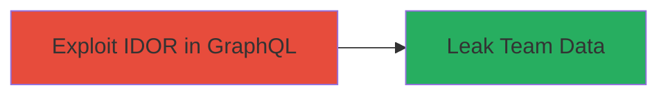

---
tags:
  - idor
  - graphql
  - authorization-bypass
  - data-leak
  - team-data-exposure
type: attack_chain
tools: []
tactics:
  - '[[Discovery]]'
commands:
  - '[[commands/curl-post-graphql-fetchmemberships]]'
platforms:
  - Web
complexity: medium
procedures:
  - '[[procedures/Exploit-IDOR-in-GraphQL-FetchMemberships]]'
step_count: 1
techniques:
  - '[[Account Discovery]]'
description: >-
  An attack chain exploiting an Insecure Direct Object Reference (IDOR)
  vulnerability in the FetchMemberships GraphQL operation to bypass
  authorization and leak sensitive team member information including names,
  emails, roles, and IDs.
skill_level: intermediate
impact_level: high
id: fd34692e-d109-45d6-8e2f-06b92b2eaeb0
created_at: '2025-12-14T17:25:47.598Z'
updated_at: '2025-12-14T17:25:47.598Z'
verified: false
validated: true
submitted: true
mitre_tactics:
  - '[[Discovery]]'
mitre_techniques:
  - '[[Account Discovery]]'
---
# IDOR Authorization Bypass in GraphQL FetchMemberships to Leak Team Member Data

Multi-stage attack chain demonstrating a complete attack workflow.

## Chain Metrics Dashboard

| Metric | Value |
|--------|-------|
| Chain Status | Unverified |
| Total Steps | 1 |
| Execution Time | ~5 minutes |
| Skill Level | Intermediate |
| Complexity | Medium |
| Impact Level | High |

## Attack Flow Visualization



## Prerequisites & Requirements

### Required Tools

- None (uses standard HTTP client like curl)

### Target Environment

- Web platform with GraphQL endpoint
- Exposed API at /api/v1/graphql
- No specific ports required beyond standard HTTPS (443)

### Initial Access Requirements

- Network access to the target web application
- Basic authentication token if partially authenticated (vulnerability allows bypass for disassociated users)
- No prior privileged access needed

## Detailed Attack Procedures

### Step 1: Exploit Authorization Bypass
procedure: [[procedures/Exploit-IDOR-in-GraphQL-FetchMemberships]]

**Objective**: Bypass permission checks in the FetchMemberships GraphQL operation to retrieve unauthorized team member data.

**Instructions**: Identify the GraphQL endpoint and send a POST request with the FetchMemberships query. Use [[commands/curl-post-graphql-fetchmemberships]] to execute the request, potentially including a minimal auth header if the application requires session context, but the IDOR allows access regardless of association.

```bash
curl -X POST https://target.example.com/api/v1/graphql \
  -H "Content-Type: application/json" \
  -H "Authorization: Bearer <optional-token>" \
  -d '{"query": "query FetchMemberships { memberships { id name email role } }"}'
```

**Expected Output**: JSON response containing team member details such as names, email addresses, roles, and IDs.

**Success Indicators**:
- Response includes data for users not associated with the requester's organization
- Sensitive fields like emails and roles are exposed without errors

## Attack Chain Summary

### Key Achievements

1. Bypassed authorization to access FetchMemberships operation
2. Leaked sensitive team data including names, emails, roles, and IDs
3. Demonstrated impact of inadequate permission validation in GraphQL APIs

## Technique & Tactic Coverage

### MITRE ATT&CK Techniques

- [[Account Discovery]]

### MITRE ATT&CK Tactics

- [[Discovery]]

---
*Last updated: 2023-10-01T00:00:00Z*
