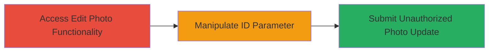

---
tags:
  - idor
  - web
  - account-manipulation
  - authorization-bypass
type: attack_chain
tools:
  - '[[tools/Burp-Suite]]'
tactics:
  - '[[Persistence]]'
  - '[[Initial Access]]'
commands:
  - '[[commands/fetch-autodesk-edit-page]]'
  - '[[commands/update-autodesk-profile-photo]]'
platforms:
  - Web
complexity: low
procedures:
  - '[[procedures/Access-Edit-Photo-Functionality]]'
  - '[[procedures/Manipulate-ID-Parameter-for-IDOR]]'
  - '[[procedures/Submit-Unauthorized-Photo-Update]]'
step_count: 3
techniques:
  - '[[Account Manipulation]]'
  - '[[Exploit Public-Facing Application]]'
description: >-
  An attack chain exploiting an Insecure Direct Object Reference (IDOR)
  vulnerability in Autodesk's user profile photo edit functionality at
  profile.autodesk.com, enabling unauthorized changes to any user's profile
  picture via manipulation of the 'id' parameter without ownership validation.
skill_level: intermediate
impact_level: medium
id: 95f59984-b9d4-44cc-84e7-24cb23daee5e
created_at: '2025-12-14T17:30:27.276Z'
updated_at: '2025-12-14T17:30:27.276Z'
verified: false
validated: true
submitted: true
mitre_tactics:
  - '[[Persistence]]'
  - '[[Initial Access]]'
mitre_techniques:
  - '[[Account Manipulation]]'
  - '[[Exploit Public-Facing Application]]'
---
# IDOR Exploitation Allowing Unauthorized Profile Picture Changes in Autodesk

Multi-stage attack chain demonstrating a complete attack workflow.

## Chain Metrics Dashboard

| Metric | Value |
|--------|-------|
| Chain Status | Unverified |
| Total Steps | 3 |
| Execution Time | ~5 minutes |
| Skill Level | Intermediate |
| Complexity | Low |
| Impact Level | Medium |

## Attack Flow Visualization



## Prerequisites & Requirements

### Required Tools

- [[tools/Burp-Suite]]

### Target Environment

- Web platform
- Autodesk user profile service at profile.autodesk.com
- No specific ports or services beyond standard HTTPS (443)

### Initial Access Requirements

- Valid Autodesk account with active session (authentication required)
- Knowledge of target user's numeric ID (may require prior enumeration via public profiles or API)
- Network access to profile.autodesk.com
- Proxy tool configured for request interception

## Detailed Attack Procedures

### Step 1: Access the Edit Photo Functionality

procedure: [[procedures/Access-Edit-Photo-Functionality]]

**Objective**: Gain access to the photo editing interface on the Autodesk profile page to identify the vulnerable 'id' parameter.

**Expected Output**: The photo edit page loads, revealing the form or API endpoint using the 'id' parameter tied to the authenticated user's profile.

**Success Indicators**:
- Edit interface displays without errors
- Network request shows 'id' parameter with current user's value

**Instructions**: Log in to Autodesk and navigate to profile.autodesk.com. Click on the profile photo or edit section to trigger the photo edit feature. Use [[commands/fetch-autodesk-edit-page]] to verify the endpoint:

```bash
curl -v -H "Cookie: your_session_cookie" "https://profile.autodesk.com/edit-photo?id=your_user_id"
```

Inspect the response for form fields related to photo upload.

### Step 2: Manipulate the ID Parameter

procedure: [[procedures/Manipulate-ID-Parameter-for-IDOR]]

**Objective**: Intercept and alter the 'id' parameter in the request to reference a different user's profile, bypassing authorization checks.

**Expected Output**: The modified request is accepted by the server without validation errors, confirming the IDOR.

**Success Indicators**:
- No 403 Forbidden or ownership error in response
- Server processes the request as if for the target ID

**Instructions**: Configure [[tools/Burp-Suite]] as a proxy in your browser (e.g., set proxy to 127.0.0.1:8080). Reload the edit photo page to intercept the GET or initial request. Edit the 'id' parameter from your_user_id to target_user_id, then forward the request. Repeat for any subsequent form loads to ensure the manipulation persists.

### Step 3: Submit the Request to Change the Photo

procedure: [[procedures/Submit-Unauthorized-Photo-Update]]

**Objective**: Upload a new image using the manipulated 'id' to overwrite the target user's profile picture.

**Expected Output**: The upload succeeds, and the target's profile reflects the new photo upon verification.

**Success Indicators**:
- HTTP 200/302 response with success indicator
- Viewing the target's profile shows the altered photo

**Instructions**: With interception active in Burp Suite, interact with the photo upload form: select a new image file and submit. Intercept the POST request, confirm 'id=target_user_id', and forward. Alternatively, simulate directly with [[commands/update-autodesk-profile-photo]] (requires extracting exact form params from prior inspection):

```bash
curl -X POST -v -H "Cookie: your_session_cookie" -F "id=target_user_id" -F "photo=@/path/to/new_photo.jpg" "https://profile.autodesk.com/update-photo"
```

Verify by accessing the target's public profile page.

## Attack Chain Summary

### Key Achievements

1. Accessed the vulnerable photo edit endpoint without issues
2. Exploited IDOR by manipulating the 'id' parameter to bypass ownership checks
3. Unauthorizedly updated another user's profile picture, enabling defacement or privacy violations

## Technique & Tactic Coverage

### MITRE ATT&CK Techniques

- [[Account Manipulation]] Account Manipulation
- [[Exploit Public-Facing Application]] Exploit Public-Facing Application

### MITRE ATT&CK Tactics

- [[Persistence]] Persistence
- [[Initial Access]] Initial Access

---

*Last updated: 2024-10-04*
