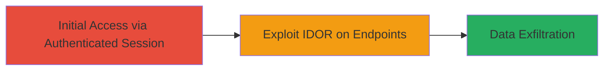

# IDOR Exploitation for Unauthorized Access to Restaurant Loyalty Program Analytics

Multi-stage attack chain demonstrating a complete attack workflow.

## Chain Metrics Dashboard

| Metric | Value |
|--------|-------|
| Chain Status | Unverified |
| Total Steps | 1 |
| Execution Time | ~5 minutes |
| Skill Level | Intermediate |
| Complexity | Medium |
| Impact Level | Medium |

## Attack Flow Visualization

## Prerequisites & Requirements

### Required Tools

- [[tools/Burp-Suite]]

### Target Environment

- Web application (Uber's Loyalty Program interface)
- Required services/ports: HTTPS on port 443
- Network access requirements: Internet access to Uber's web app

### Initial Access Requirements

- Authenticated user account with access to at least one restaurant's analytics
- Network position: External (as a legitimate user)
- Prior access needed: Valid login session

## Detailed Attack Procedures

### Step 1: Exploit IDOR for Unauthorized Analytics Access
procedure: [[procedures/Exploit-IDOR-in-Loyalty-Program-Endpoints]]

**Objective**: Identify and exploit the IDOR vulnerability on three endpoints to access Loyalty Program analytics for any target restaurant without proper authorization.

**Instructions**: Begin by authenticating into the Uber web application and navigating to a restaurant's analytics page to capture a legitimate request. Use Burp Suite to intercept and modify the restaurant ID parameter in the request, replacing it with another restaurant's ID to test for unauthorized access. Repeat for the three affected endpoints related to Loyalty Program analytics.

**Expected Output**: Successful response containing sensitive analytics data (e.g., user engagement metrics, program statistics) for the targeted restaurant.

**Success Indicators**:
- Access granted to analytics of a restaurant not owned by the authenticated user
- No authorization errors returned from the endpoints
- Disclosure of confidential business data

## Attack Chain Summary

### Key Achievements

1. Bypassed authorization checks on Loyalty Program endpoints
2. Accessed unauthorized restaurant analytics data
3. Demonstrated medium-severity impact through data disclosure

## Technique & Tactic Coverage

### MITRE ATT&CK Techniques

- [[Account Discovery]]

### MITRE ATT&CK Tactics

- [[Discovery]]

---
*Last updated: 2023-10-01T00:00:00Z*
