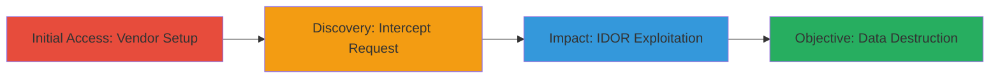

---
tags:
  - idor
  - web
  - unauthorized-deletion
  - dod
  - asp-net-core
type: attack_chain
tools:
  - '[[tools/Burp-Suite]]'
tactics:
  - '[[Initial Access]]'
  - '[[Impact]]'
verified: false
platforms:
  - Web
submitted: true
complexity: medium
created_at: '2023-10-01T00:00:00Z'
procedures:
  - '[[procedures/Setup-Vendor-Account-and-Register-Test-Company]]'
  - '[[procedures/Intercept-Company-Deletion-Request-with-Burp-Suite]]'
  - '[[procedures/Exploit-IDOR-by-Modifying-Company-ID]]'
step_count: 3
techniques:
  - '[[Exploit Public-Facing Application]]'
updated_at: '2025-12-14T17:25:28.824Z'
description: >-
  A multi-stage attack exploiting an Insecure Direct Object Reference (IDOR)
  vulnerability in a U.S. Department of Defense web application's company
  deletion endpoint, allowing unauthorized deletion of any company via ID
  manipulation.
skill_level: intermediate
impact_level: high
id: a3a92684-0b7f-49e3-b5cc-1a45f8f8ae02
validated: true
mitre_tactics:
  - '[[Initial Access]]'
  - '[[Impact]]'
mitre_techniques:
  - '[[Exploit Public-Facing Application]]'
---
---

# IDOR Exploitation for Unauthorized Company Deletion in DoD Vendor Portal

Multi-stage attack chain demonstrating a complete attack workflow exploiting IDOR in a DoD web app to delete unauthorized companies.

## Chain Metrics Dashboard

| Metric | Value |
|--------|-------|
| Chain Status | Unverified |
| Total Steps | 3 |
| Execution Time | ~10 minutes |
| Skill Level | Intermediate |
| Complexity | Medium |
| Impact Level | High |

## Attack Flow Visualization

## Prerequisites & Requirements

### Required Tools

- [[tools/Burp-Suite]]

### Target Environment

- Web application using ASP.NET Core
- Access to vendor registration portal
- No specific ports required beyond standard HTTPS (443)

### Initial Access Requirements

- Internet access to the target URL (https://███████/████/Reception/Vendor)
- No prior credentials needed; self-registration available
- Burp Suite configured as proxy for traffic interception

## Detailed Attack Procedures

### Step 1: Initial Access
procedure: [[procedures/Setup-Vendor-Account-and-Register-Test-Company]]

**Objective**: Gain legitimate access to the vendor portal and create a test company to identify the deletion endpoint structure.

**Instructions**: Begin by navigating to the vendor registration page and completing the account creation form. Once logged in, access the companies management page and submit a new company registration form. Return to the company details page to prepare for deletion testing.

**Expected Output**: Successful vendor account creation, test company registered with a unique ID (e.g., 71712), and access to the company management interface.

**Success Indicators**:
- Vendor account active with login confirmation
- Test company listed in the dashboard
- Company details page accessible

### Step 2: Execution
procedure: [[procedures/Intercept-Company-Deletion-Request-with-Burp-Suite]]

**Objective**: Capture the legitimate company deletion request to understand the endpoint and parameters for later manipulation.

**Instructions**: With Burp Suite proxy active, click the delete button on the test company page to trigger the request. Intercept the GET request in Burp's Proxy tab, observing details like the URL (/██████/Vendor/Companies/Delete/{ID}), headers (Host, Cookies including .AspNetCore.Antiforgery and .AspNetAuth, User-Agent), and ensure the request is held for inspection.

**Expected Output**: Intercepted GET request displaying the target company ID and authentication cookies.

**Success Indicators**:
- Request captured without errors
- All headers and cookies visible in Burp
- Test company still intact until forwarded

### Step 3: Privilege Escalation
procedure: [[procedures/Exploit-IDOR-by-Modifying-Company-ID]]

**Objective**: Manipulate the company ID in the intercepted request to delete unauthorized companies, demonstrating full system compromise.

**Instructions**: In Burp Suite's Repeater or Proxy, modify the ID parameter in the URL (e.g., change from 71712 to another valid company ID obtained via enumeration or brute-force). Forward the altered request to the server and repeat for multiple IDs to delete various companies.

**Expected Output**: Server response indicating successful deletion (e.g., 200 OK or redirect), with targeted companies removed from the system upon verification.

**Success Indicators**:
- Unauthorized company deleted without access errors
- No authentication challenges on modified requests
- System-wide disruption confirmed by checking other companies

## Attack Chain Summary

### Key Achievements

1. Established legitimate vendor access to explore the application
2. Identified and intercepted the vulnerable deletion endpoint
3. Exploited IDOR to delete arbitrary companies, enabling potential operational disruption

## Technique & Tactic Coverage

### MITRE ATT&CK Techniques

- [[Exploit Public-Facing Application]]

### MITRE ATT&CK Tactics

- [[Initial Access]]
- [[Impact]]

---

*Last updated: 2023-10-01T00:00:00Z*
