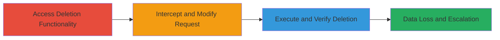

---
tags:
  - idor
  - authorization-bypass
  - data-deletion
  - web-vulnerability
type: attack_chain
tools:
  - '[[tools/Burp-Suite]]'
tactics:
  - '[[Initial Access]]'
  - '[[Privilege Escalation]]'
commands:
  - '[[commands/curl-capture-group-delete]]'
  - '[[commands/curl-modify-group-id]]'
platforms:
  - Web
complexity: medium
procedures:
  - '[[procedures/Access-Veris-Group-Deletion-Functionality]]'
  - '[[procedures/Intercept-and-Modify-Group-Deletion-Request]]'
  - '[[procedures/Execute-Modified-Deletion-and-Verify]]'
step_count: 3
techniques:
  - '[[Exploit Public-Facing Application]]'
description: >-
  A multi-step attack leveraging an Insecure Direct Object Reference (IDOR)
  vulnerability in the Veris application's group deletion endpoint to allow
  authenticated users to delete groups from any organization by manipulating the
  group_id parameter.
skill_level: intermediate
impact_level: high
id: 37db1dd9-43ee-4498-a4d0-65e134fc2f8a
created_at: '2025-12-14T17:25:23.197Z'
updated_at: '2025-12-14T17:25:23.197Z'
verified: false
validated: true
submitted: true
mitre_tactics:
  - '[[Initial Access]]'
  - '[[Privilege Escalation]]'
mitre_techniques:
  - '[[Exploit Public-Facing Application]]'
---
# IDOR Exploitation for Unauthorized Group Deletion Across Organizations in Veris

## Overview

This attack chain exploits a critical Insecure Direct Object Reference (IDOR) vulnerability in the Veris application's group deletion functionality. An authenticated user can delete any group from any organization by simply modifying the group_id parameter in the HTTP DELETE request, bypassing authorization checks. The attack was discovered by testing the groups section, similar to a prior IDOR in member deletion. It involves intercepting a legitimate delete request, altering the group_id to target an unauthorized group, and executing the modified request, resulting in remote data loss and potential service disruption across organizational boundaries.

## Chain Metrics Dashboard

| Metric | Value |
|--------|-------|
| Chain Status | Unverified |
| Total Steps | 3 |
| Execution Time | ~5 minutes |
| Skill Level | Intermediate |
| Complexity | Medium |
| Impact Level | High |

## Attack Flow Visualization



## Prerequisites & Requirements

### Required Tools

- [[tools/Burp-Suite]]

### Target Environment

- Web application (Veris platform)
- Required services/ports: HTTPS (443)
- Network access requirements: Authenticated access to the Veris application

### Initial Access Requirements

- Valid authenticated session in the attacker's own organization
- Network position: Direct access to the web interface
- Prior access needed: User account with group management permissions in own org

## Detailed Attack Procedures

### Step 1: Access Group Deletion Functionality
procedure: [[procedures/Access-Veris-Group-Deletion-Functionality]]

**Objective**: Identify and capture the legitimate HTTP DELETE request for group deletion within the attacker's own organization to understand the request structure.

**Instructions**: Log in to the Veris application, navigate to the groups section, select a group from your own organization, and initiate a deletion. Use a proxy like Burp Suite to intercept the request. Capture the request using [[commands/curl-capture-group-delete]] or equivalent in your proxy:

```bash
curl -X DELETE 'https://veris.example.com/api/groups/{own-group-id}' -H 'Authorization: Bearer {token}' -H 'Content-Type: application/json'
```

**Expected Output**: HTTP request details including the group_id parameter in the URL or body.

**Success Indicators**:
- Successful capture of the DELETE request structure
- Confirmation of group_id parameter presence

### Step 2: Intercept and Modify the Delete Request
procedure: [[procedures/Intercept-and-Modify-Group-Deletion-Request]]

**Objective**: Alter the group_id in the captured request to reference a target group from another organization, exploiting the lack of authorization validation.

**Instructions**: In your proxy tool (e.g., Burp Suite), edit the group_id to the ID of a group in a different organization. For example, change {own-group-id} to {target-group-id}. Forward the modified request using [[commands/curl-modify-group-id]]:

```bash
curl -X DELETE 'https://veris.example.com/api/groups/{target-group-id}' -H 'Authorization: Bearer {token}' -H 'Content-Type: application/json'
```

**Expected Output**: Modified HTTP request with updated group_id.

**Success Indicators**:
- Request modification without errors
- No immediate authorization denial

### Step 3: Execute Modified Deletion and Verify
procedure: [[procedures/Execute-Modified-Deletion-and-Verify]]

**Objective**: Submit the tampered request and confirm the unauthorized group deletion, demonstrating data loss.

**Instructions**: Send the modified DELETE request and check the response for success (e.g., 200 OK). Verify in the application or via API that the target group is deleted. Use the same curl command from Step 2 to execute:

```bash
curl -X DELETE 'https://veris.example.com/api/groups/{target-group-id}' -H 'Authorization: Bearer {token}' -H 'Content-Type: application/json'
```

**Expected Output**: 200 OK response confirming deletion; target group no longer accessible.

**Success Indicators**:
- Successful HTTP response without errors
- Target group deleted from the foreign organization

## Attack Chain Summary

### Key Achievements

1. Bypassed organizational boundaries via IDOR manipulation
2. Achieved unauthorized data deletion remotely
3. Demonstrated potential for widespread service disruption and privilege escalation

## Technique & Tactic Coverage

### MITRE ATT&CK Techniques

- [[Exploit Public-Facing Application]]

### MITRE ATT&CK Tactics

- [[Initial Access]]
- [[Privilege Escalation]]

---
*Last updated: 2023-10-01*
