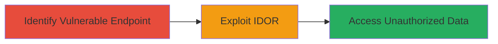

---
tags:
  - idor
  - authorization-bypass
  - privilege-escalation
  - web
type: attack_chain
tactics:
  - '[[Discovery]]'
  - '[[Privilege Escalation]]'
commands:
  - '[[commands/curl-get-user-api]]'
verified: false
platforms:
  - Web
submitted: true
complexity: medium
procedures:
  - '[[procedures/identify-idor-vulnerable-endpoint]]'
  - '[[procedures/exploit-idor-for-unauthorized-access]]'
step_count: 2
techniques:
  - '[[Account Discovery]]'
description: >-
  A multi-stage attack exploiting an Insecure Direct Object Reference (IDOR)
  vulnerability in the Badoo API to bypass authorization and access other users'
  data.
skill_level: intermediate
impact_level: high
id: cacd7035-a6aa-4ddb-ba46-7fc8ecad2910
created_at: '2025-12-14T17:25:23.508Z'
updated_at: '2025-12-14T17:25:23.508Z'
validated: true
mitre_tactics:
  - '[[Discovery]]'
  - '[[Privilege Escalation]]'
mitre_techniques:
  - '[[Account Discovery]]'
---
# IDOR Exploitation for Unauthorized User Data Access in Badoo API

Multi-stage attack chain demonstrating a complete attack workflow exploiting an IDOR vulnerability in the Badoo API endpoint to access unauthorized user data.

## Chain Metrics Dashboard

| Metric | Value |
|--------|-------|
| Chain Status | Unverified |
| Total Steps | 2 |
| Execution Time | ~5 minutes |
| Skill Level | Intermediate |
| Complexity | Medium |
| Impact Level | High |

## Attack Flow Visualization



## Prerequisites & Requirements

### Required Tools

- Web browser or [[commands/curl-get-user-api]] for API testing

### Target Environment

- Web platform
- PHP-based application
- Access to the target API endpoint

### Initial Access Requirements

- Authenticated session as a legitimate user (e.g., login credentials for Badoo)
- Network access to https://badoo.com
- No prior elevated privileges needed

## Detailed Attack Procedures

### Step 1: Identify Vulnerable Endpoint

procedure: [[procedures/identify-idor-vulnerable-endpoint]]

**Objective**: Locate the API endpoint that handles user data retrieval without proper authorization checks.

**Instructions**: Log in to the Badoo application using a legitimate account. Use browser developer tools (Network tab) or [[commands/curl-get-user-api]] to inspect requests to user profile or data retrieval features. Look for endpoints like https://badoo.com/api.phtml?SERVER_GET_USER that accept user-supplied parameters for object references.

```bash
curl -X GET "https://badoo.com/api.phtml?SERVER_GET_USER=your_user_id" -H "Cookie: session=your_session_cookie"
```

**Expected Output**: JSON or data response containing the current user's information, confirming the endpoint accepts direct parameters.

**Success Indicators**:
- Endpoint identified and returns data for the supplied user ID
- No immediate authorization errors for own user

### Step 2: Exploit IDOR for Unauthorized Access

procedure: [[procedures/exploit-idor-for-unauthorized-access]]

**Objective**: Modify the user-supplied parameter to access data belonging to other users, achieving privilege escalation.

**Instructions**: With an authenticated session, alter the SERVER_GET_USER parameter to a different user ID (e.g., obtained from public profiles or enumeration). Use [[commands/curl-get-user-api]] to send the modified request.

```bash
curl -X GET "https://badoo.com/api.phtml?SERVER_GET_USER=other_user_id" -H "Cookie: session=your_session_cookie"
```

**Expected Output**: Response containing the other user's database records or sensitive data without authorization denial.

**Success Indicators**:
- Unauthorized user data retrieved successfully
- Confirmation of bypassed authorization via access to restricted resources

## Attack Chain Summary

### Key Achievements

1. Identified IDOR-vulnerable API endpoint for user data access
2. Exploited parameter manipulation to bypass authorization
3. Achieved privilege escalation to view other users' private data

## Technique & Tactic Coverage

### MITRE ATT&CK Techniques

- [[Account Discovery]]

### MITRE ATT&CK Tactics

- [[Discovery]]
- [[Privilege Escalation]]

---
*Last updated: 2023-10-01*
