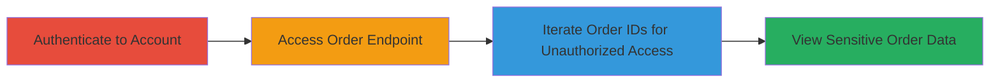

---
tags:
  - idor
  - web
  - authentication
  - sensitive-data-exposure
  - order-information
type: attack_chain
tools: []
tactics:
  - '[[Discovery]]'
commands:
  - '[[commands/curl-get-order-endpoint]]'
platforms:
  - Web
complexity: low
procedures:
  - '[[procedures/Authenticate-to-Bohemia-Interactive-Store]]'
  - '[[procedures/Access-Order-Viewing-Endpoint]]'
  - '[[procedures/Exploit-IDOR-by-Iterating-Order-IDs]]'
step_count: 3
techniques:
  - '[[Account Discovery]]'
description: >-
  An authenticated attack chain exploiting an Insecure Direct Object Reference
  (IDOR) vulnerability in the Bohemia Interactive store's order viewing endpoint
  to access sensitive order details of other users, including IP addresses and
  personal information.
skill_level: beginner
impact_level: high
id: 91a1cd2b-1273-44e8-bd82-e6201ba6abe1
created_at: '2025-12-14T17:25:33.599Z'
updated_at: '2025-12-14T17:25:33.599Z'
verified: false
validated: true
submitted: true
mitre_tactics:
  - '[[Discovery]]'
mitre_techniques:
  - '[[Account Discovery]]'
---
# IDOR Exploitation in Bohemia Interactive Store to Access Other Users' Order Information

Multi-stage attack chain demonstrating a complete attack workflow exploiting an IDOR vulnerability in the Bohemia Interactive store.

## Chain Metrics Dashboard

| Metric | Value |
|--------|-------|
| Chain Status | Unverified |
| Total Steps | 3 |
| Execution Time | ~5 minutes |
| Skill Level | Beginner |
| Complexity | Low |
| Impact Level | High |

## Attack Flow Visualization



## Prerequisites & Requirements

### Required Tools

- Web browser (e.g., Chrome, Firefox)
- Optional: [[tools/curl]] for scripted access

### Target Environment

- Web platform
- Bohemia Interactive store at https://store.bistudio.com
- No specific ports or services beyond standard HTTPS (443)

### Initial Access Requirements

- Valid user credentials for a Bohemia Interactive account
- Network access to the internet
- No prior access needed beyond authentication

## Detailed Attack Procedures

### Step 1: Authenticate to Account
procedure: [[procedures/Authenticate-to-Bohemia-Interactive-Store]]

**Objective**: Gain authenticated access to the Bohemia Interactive store application to enable interaction with protected endpoints.

**Instructions**: Use a web browser to navigate to the login page and enter valid credentials. Alternatively, for automation, use [[commands/curl-get-order-endpoint]] adapted for login (note: login typically requires POST with session handling).

```bash
# Example manual login via browser: Visit https://store.bistudio.com/login and submit credentials
# For curl (requires session cookie handling):
curl -c cookies.txt -d "username=youruser&password=yourpass" https://store.bistudio.com/login
```

**Expected Output**: Successful login redirect to the account dashboard, with active session.

**Success Indicators**:
- Access to personal account dashboard
- Valid session cookie or token established

### Step 2: Access Order Viewing Endpoint
procedure: [[procedures/Access-Order-Viewing-Endpoint]]

**Objective**: Navigate to a legitimate order viewing URL to understand the endpoint structure and prepare for parameter manipulation.

**Instructions**: With an active session, visit a known order URL using the browser or curl. Use [[commands/curl-get-order-endpoint]] to fetch your own order details first.

```bash
curl -b cookies.txt "https://store.bistudio.com/order/1003793?confirmed=true"
```

**Expected Output**: JSON or HTML response containing your own order details.

**Success Indicators**:
- Order page loads with personal data
- No access denied errors

### Step 3: Exploit IDOR by Iterating Order IDs
procedure: [[procedures/Exploit-IDOR-by-Iterating-Order-IDs]]

**Objective**: Manipulate the order ID parameter to access unauthorized order information from other users, exposing sensitive data like IP addresses.

**Instructions**: Increment or decrement the order ID in the URL sequentially (e.g., from 1003793 to 1003792, 1003794, etc.). Use a browser for manual testing or script with curl in a loop. Example using [[commands/curl-get-order-endpoint]]:

```bash
# Manual: Change URL to https://store.bistudio.com/order/1003792?confirmed=true
# Scripted loop example (bash):
for id in {1003790..1003800}; do
  curl -b cookies.txt "https://store.bistudio.com/order/$id?confirmed=true" > order_$id.json
  echo "Checked ID: $id"
done
```

**Expected Output**: Responses containing other users' order details, including IP addresses and personal info, without authentication checks.

**Success Indicators**:
- Unauthorized order data retrieved
- Sensitive fields like IP addresses visible in responses

## Attack Chain Summary

### Key Achievements

1. Authenticated access to the store application
2. Identification of vulnerable order endpoint
3. Unauthorized viewing of multiple users' sensitive order information, including IPs

## Technique & Tactic Coverage

### MITRE ATT&CK Techniques

- [[Account Discovery]]

### MITRE ATT&CK Tactics

- [[Discovery]]

---
*Last updated: 2023-10-01T00:00:00Z*
