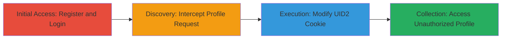

# IDOR Exploitation in DoD Web App via UID2 Cookie Manipulation for Unauthorized Profile Access

Multi-stage attack chain demonstrating a complete workflow to exploit an IDOR vulnerability in a U.S. Department of Defense web application, allowing unauthorized access to other users' sensitive profile data through cookie manipulation.

## Chain Metrics Dashboard

| Metric | Value |
|--------|-------|
| Chain Status | Unverified |
| Total Steps | 4 |
| Execution Time | ~10 minutes |
| Skill Level | Intermediate |
| Complexity | Medium |
| Impact Level | High |

## Attack Flow Visualization

## Prerequisites & Requirements

### Required Tools

- [[tools/Burp-Suite]]

### Target Environment

- Web application hosted on PHP
- Access to login and registration endpoints
- Network access to the DoD web app (e.g., https://███████/)

### Initial Access Requirements

- No prior credentials needed; self-registration allowed
- Ability to create a test account
- Proxy tool configured to intercept HTTPS traffic (requires CA certificate installation)

## Detailed Attack Procedures

### Step 1: Initial Access
procedure: [[procedures/Register-and-Login-to-DoD-Web-App]]

**Objective**: Gain legitimate access to the application by creating and logging in with a test account to establish a session.

**Instructions**: Navigate to the login page and register a new test user, then authenticate to set up the session cookie.

**Expected Output**: Successful login redirect to the dashboard or profile area, with UID2 cookie set for the test user.

**Success Indicators**:
- Test account created without errors
- Login successful, session established

### Step 2: Discovery
procedure: [[procedures/Intercept-Profile-Request-and-Identify-UID2-Cookie]]

**Objective**: Identify the user ID exposure in the profile request to understand the IDOR vector.

**Instructions**: After login, navigate to the 'My Profile Page' and use a proxy to capture the HTTP request, inspecting the UID2 cookie for the user's ID (e.g., 4820038).

**Expected Output**: Captured request showing Cookie: UID2=4820038 in the profile endpoint request.

**Success Indicators**:
- UID2 cookie value visible and matches test user ID
- Profile page loads with own data

### Step 3: Execution
procedure: [[procedures/Modify-UID2-Cookie-to-Target-User-ID]]

**Objective**: Tamper with the session identifier to reference another user's profile.

**Instructions**: In the intercepted request, change the UID2 cookie value from the attacker's ID (4820038) to the target user's ID (e.g., 4820036), obtained via enumeration or guessing.

**Expected Output**: Modified request ready for replay, with updated Cookie: UID2=4820036.

**Success Indicators**:
- Cookie value successfully altered without syntax errors
- Request structure intact

### Step 4: Collection
procedure: [[procedures/Replay-Modified-Request-to-Access-Unauthorized-Profile]]

**Objective**: Retrieve and view sensitive information from the target user's profile due to missing authorization checks.

**Instructions**: Forward the tampered request to the server and observe the response containing the target user's profile data.

**Expected Output**: Server response with HTML or JSON displaying the target user's sensitive information (e.g., personal details).

**Success Indicators**:
- Unauthorized profile data loaded
- No access denied errors from the server

## Attack Chain Summary

### Key Achievements

1. Successful registration and login to establish a baseline session
2. Identification of IDOR via exposed UID2 cookie
3. Unauthorized access to another user's profile, exposing sensitive DoD-related data

## Technique & Tactic Coverage

### MITRE ATT&CK Techniques

- [[Exploit Public-Facing Application]]

### MITRE ATT&CK Tactics

- [[Initial Access]]

---

*Last updated: 2023-10-01T12:00:00Z*
