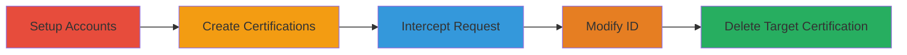

# IDOR Exploitation in HackerOne GraphQL Query to Delete User Certifications

Multi-stage attack chain demonstrating the exploitation of an Insecure Direct Object Reference (IDOR) in HackerOne's platform, allowing authenticated users to delete licenses and certifications belonging to other users via the CreateOrUpdateHackerCertification GraphQL mutation by manipulating the ID parameter without authorization checks.

## Chain Metrics Dashboard

| Metric | Value |
|--------|-------|
| Chain Status | Unverified |
| Total Steps | 5 |
| Execution Time | ~10 minutes |
| Skill Level | Intermediate |
| Complexity | Medium |
| Impact Level | High |

## Attack Flow Visualization

## Prerequisites & Requirements

### Required Tools

- [[tools/Burp-Proxy]]

### Target Environment

- Web platform (HackerOne)
- GraphQL API endpoint
- Authenticated user access

### Initial Access Requirements

- Valid HackerOne account credentials for at least two users
- Network access to HackerOne platform
- No prior elevated privileges needed; uses standard user authentication

## Detailed Attack Procedures

### Step 1: Log in to Test Accounts
procedure: [[procedures/Setup-Test-User-Accounts-and-Certifications]]

**Objective**: Establish authenticated sessions for two separate user accounts to simulate attacker and victim scenarios.

**Instructions**: Open two separate browsers (e.g., Chrome and Firefox) and log in to HackerOne using credentials for User A (attacker) and User B (victim). Ensure sessions are active and isolated.

**Expected Output**: Successful login to both accounts, with access to user profiles.

**Success Indicators**:
- Dashboard accessible in both browsers
- No session conflicts

### Step 2: Create Certifications in Both Accounts
procedure: [[procedures/Setup-Test-User-Accounts-and-Certifications]]

**Objective**: Populate licenses and certifications in both accounts to provide targets for deletion testing.

**Instructions**: In Browser A (User A), navigate to the certifications section and create a sample license or certification. Repeat in Browser B (User B) to create another. Note the certification IDs if visible, or prepare to identify them later.

**Expected Output**: New certifications added to respective user profiles.

**Success Indicators**:
- Certifications listed in user profiles
- IDs obtainable via inspection or subsequent requests

### Step 3: Edit and Intercept Own Certification Request
procedure: [[procedures/Intercept-GraphQL-Mutation-Request-with-Burp]]

**Objective**: Capture the legitimate GraphQL mutation request for editing a certification to understand its structure.

**Instructions**: In Browser A, start editing User A's certification. Configure Burp Proxy to intercept traffic from the browser (set proxy settings to 127.0.0.1:8080). Submit the edit to intercept the CreateOrUpdateHackerCertification GraphQL mutation request.

**Expected Output**: Intercepted HTTP POST request to the GraphQL endpoint containing the mutation body with ID, input fields, etc.

**Success Indicators**:
- Request body visible in Burp, showing JSON with "mutation" and variables including the ID parameter
- Original certification ID matches the one being edited

### Step 4: Modify the ID Parameter for Deletion
procedure: [[procedures/Modify-ID-Parameter-for-IDOR-Exploitation]]

**Objective**: Alter the ID in the intercepted request to target another user's certification, exploiting the lack of authorization checks.

**Instructions**: In Burp Repeater or Intruder, edit the request body JSON. Locate the "id" field in the variables (e.g., "variables": {"id": "original-id", ...}). Replace the value with a target certification ID from User B (obtained by inspecting User B's profile or repeating interception on User B's account). Change the operation to deletion if needed (e.g., set input to remove fields). Forward the modified request.

**Expected Output**: Server response indicating successful mutation (e.g., 200 OK with updated or deleted status).

**Success Indicators**:
- No authorization error in response
- Certification remains editable/deletable for foreign IDs

### Step 5: Verify Deletion of Target Certification
procedure: [[procedures/Modify-ID-Parameter-for-IDOR-Exploitation]]

**Objective**: Confirm the impact by checking that the targeted certification has been deleted from the victim's account.

**Instructions**: Switch to Browser B and refresh the User B profile. Attempt to view or edit the targeted certification. If deleted, it should no longer appear or show as removed.

**Expected Output**: Certification missing from User B's profile.

**Success Indicators**:
- Target certification deleted
- Profile disruption confirmed (e.g., licenses cleared)

## Attack Chain Summary

### Key Achievements

1. Unauthorized access to other users' certifications via ID manipulation
2. Successful deletion of licenses and certifications platform-wide
3. Demonstration of high-impact profile disruption without elevated privileges

## Technique & Tactic Coverage

### MITRE ATT&CK Techniques

- [[Exploit Public-Facing Application]]
- [[Account Access Removal]]

### MITRE ATT&CK Tactics

- [[Initial Access]]
- [[Impact]]

---
*Last updated: 2023-10-01T00:00:00Z*
