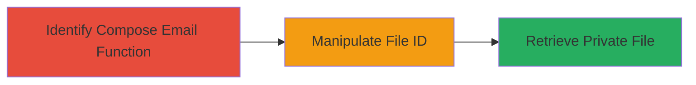

---
tags:
  - idor
  - web
  - unauthorized-access
  - file-theft
  - lark
type: attack_chain
tools: []
tactics:
  - '[[Initial Access]]'
  - '[[Discovery]]'
  - '[[Collection]]'
verified: false
platforms:
  - Web
submitted: true
complexity: medium
created_at: '2023-10-01T00:00:00Z'
procedures:
  - '[[procedures/Identify-File-ID-Handling-in-Compose-Email]]'
  - '[[procedures/Manipulate-File-ID-for-Unauthorized-Access]]'
  - '[[procedures/Retrieve-and-Steal-Private-File]]'
step_count: 3
techniques:
  - '[[Exploit Public-Facing Application]]'
  - '[[Account Discovery]]'
updated_at: '2025-12-14T17:28:28.678Z'
description: >-
  An attack chain exploiting an Insecure Direct Object Reference (IDOR)
  vulnerability in the Lark Compose Email function to gain unauthorized access
  to other users' private files by manipulating alphanumeric file IDs.
skill_level: intermediate
impact_level: high
id: 4d2f4ea5-0006-406a-8ef6-7eb69cabdde8
validated: true
mitre_tactics:
  - '[[Initial Access]]'
  - '[[Discovery]]'
  - '[[Collection]]'
mitre_techniques:
  - '[[Exploit Public-Facing Application]]'
  - '[[Account Discovery]]'
---
# IDOR Exploitation in Lark Compose Email to Steal Private Files

Multi-stage attack chain demonstrating a complete attack workflow exploiting an IDOR vulnerability in Lark's Compose Email function to access and steal private files from other users.

## Chain Metrics Dashboard

| Metric | Value |
|--------|-------|
| Chain Status | Unverified |
| Total Steps | 3 |
| Execution Time | ~5 minutes |
| Skill Level | Intermediate |
| Complexity | Medium |
| Impact Level | High |

## Attack Flow Visualization

## Prerequisites & Requirements

### Required Tools

- Web browser with developer tools (e.g., Chrome DevTools)
- Optional: Proxy tool like Burp Suite for request interception

### Target Environment

- Lark web application
- Authenticated user session
- Knowledge of target user's file ID (e.g., obtained via social engineering or prior reconnaissance)

### Initial Access Requirements

- Valid authenticated account in Lark
- Network access to Lark's web interface
- No prior elevated privileges needed; exploits horizontal access control

## Detailed Attack Procedures

### Step 1: Identify Compose Email Function
procedure: [[procedures/Identify-File-ID-Handling-in-Compose-Email]]

**Objective**: Locate the Compose Email feature and understand how it handles file attachments using alphanumeric IDs without authorization checks.

**Instructions**: Navigate to the Lark web application, log in with a valid account, and access the Compose Email interface. Use browser developer tools to inspect network requests when attempting to attach a file. Observe that file references use alphanumeric IDs in API calls, such as in the attachment endpoint.

**Expected Output**: Identification of the API endpoint (e.g., /api/compose/attach) and confirmation that file IDs are passed directly without ownership validation.

**Success Indicators**:
- API requests reveal file ID format (alphanumeric strings)
- No visible permission checks in the request flow

### Step 2: Manipulate File ID for Unauthorized Access
procedure: [[procedures/Manipulate-File-ID-for-Unauthorized-Access]]

**Objective**: Substitute a known file ID from another user into the Compose Email request to bypass access controls.

**Instructions**: Obtain a target file ID (e.g., through enumeration or external means). In the Compose Email interface, intercept the attachment request using developer tools or a proxy. Replace the file ID in the request payload with the target ID and resend the request to the server.

**Expected Output**: The server processes the request with the manipulated ID, returning metadata or content for the unauthorized file.

**Success Indicators**:
- Request with altered file ID receives a 200 OK response
- File metadata from another user is displayed

### Step 3: Retrieve and Steal Private File
procedure: [[procedures/Retrieve-and-Steal-Private-File]]

**Objective**: Download or view the content of the unauthorized private file.

**Instructions**: Upon successful manipulation, the response from the server will include the file content or a direct download link. Capture the response data using developer tools and save the file locally. If a download is initiated, complete it to exfiltrate the sensitive data.

**Expected Output**: Full access to the private file's contents, such as documents or images belonging to another user.

**Success Indicators**:
- File content is retrieved without authentication errors
- Sensitive data is successfully downloaded and viewed

## Attack Chain Summary

### Key Achievements

1. Bypassed authorization checks in the Compose Email function
2. Accessed private files using manipulated alphanumeric IDs
3. Enabled theft of sensitive user data, potentially leading to further compromise

## Technique & Tactic Coverage

### MITRE ATT&CK Techniques

- [[Exploit Public-Facing Application]] Exploit Public-Facing Application
- [[Account Discovery]] Account Discovery

### MITRE ATT&CK Tactics

- [[Initial Access]] Initial Access
- [[Discovery]] Discovery
- [[Collection]] Collection

---
*Last updated: 2023-10-01T00:00:00Z*
