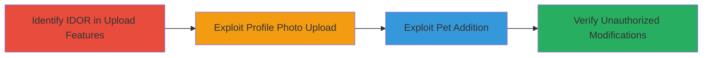

---
tags:
  - idor
  - web-vulnerability
  - unauthorized-access
  - account-modification
type: attack_chain
tools: []
tactics:
  - '[[Initial Access]]'
verified: false
platforms:
  - Web
submitted: true
complexity: medium
created_at: '2023-10-01T00:00:00Z'
procedures:
  - '[[procedures/Exploit-IDOR-in-Profile-Photo-Upload]]'
  - '[[procedures/Exploit-IDOR-in-Pet-Addition]]'
step_count: 2
techniques:
  - '[[Exploit Public-Facing Application]]'
updated_at: '2025-12-14T05:32:13.518Z'
description: >-
  A multi-step attack leveraging Insecure Direct Object Reference (IDOR)
  vulnerabilities in a web application's profile photo upload and pet addition
  features to perform unauthorized modifications on victim user accounts.
skill_level: intermediate
impact_level: high
id: 6d681089-f16a-43cf-973c-4b4bcbbd6cf2
validated: true
mitre_tactics:
  - '[[Initial Access]]'
mitre_techniques:
  - '[[Exploit Public-Facing Application]]'
---
# IDOR Exploitation in Profile Photo Upload and Pet Addition for Unauthorized Account Modifications

Multi-stage attack chain demonstrating a complete attack workflow exploiting IDOR vulnerabilities in a web application to unauthorizedly modify user profiles and add pets to victim accounts, compromising privacy and data integrity.

## Chain Metrics Dashboard

| Metric | Value |
|--------|-------|
| Chain Status | Unverified |
| Total Steps | 2 |
| Execution Time | ~5 minutes |
| Skill Level | Intermediate |
| Complexity | Medium |
| Impact Level | High |

## Attack Flow Visualization

## Prerequisites & Requirements

### Required Tools

- Browser developer tools or proxy like Burp Suite for request manipulation

### Target Environment

- Web application with user authentication
- Access to profile management endpoints
- No special ports required beyond standard HTTPS (443)

### Initial Access Requirements

- Valid authenticated session on the target web application
- Knowledge of victim user identifiers (e.g., user IDs from public profiles or enumeration)
- Network access to the web application

## Detailed Attack Procedures

### Step 1: Exploit Profile Photo Upload IDOR
procedure: [[procedures/Exploit-IDOR-in-Profile-Photo-Upload]]

**Objective**: Identify and exploit the IDOR vulnerability in the profile photo upload feature to upload unauthorized images to a victim user's account.

**Instructions**: Authenticate to the application and navigate to the profile photo upload page. Use browser developer tools or a proxy to intercept the upload request. Identify the user identifier parameter (e.g., `user_id`) in the request payload or URL. Replace it with the victim's user ID and submit a malicious image file. For example, craft an HTTP request to upload an image:

Intercept and modify the POST request to `/upload-profile-photo` with payload including `user_id=victim_id` and the file.

**Expected Output**: The uploaded photo appears in the victim's profile upon viewing their account.

**Success Indicators**:
- Unauthorized photo visible in victim's profile
- No authorization errors during upload

### Step 2: Exploit Pet Addition IDOR
procedure: [[procedures/Exploit-IDOR-in-Pet-Addition]]

**Objective**: Exploit the IDOR in the pet addition system to add unauthorized pets to a victim user's account, further manipulating their data.

**Instructions**: From an authenticated session, go to the pet addition form. Intercept the submission request and manipulate the user identifier parameter (e.g., `owner_id`) to the victim's ID. Submit with pet details like name and type. Example: Modify POST to `/add-pet` with `owner_id=victim_id`, `pet_name=MaliciousPet`, `pet_type=Dog`.

**Expected Output**: The added pet shows up in the victim's account dashboard.

**Success Indicators**:
- New pet listed in victim's account
- Successful addition without ownership validation

## Attack Chain Summary

### Key Achievements

1. Unauthorized profile photo uploads compromising user privacy
2. Arbitrary pet additions enabling account tampering
3. Demonstration of high-severity IDOR leading to data integrity violations

## Technique & Tactic Coverage

### MITRE ATT&CK Techniques

- [[Exploit Public-Facing Application]]

### MITRE ATT&CK Tactics

- [[Initial Access]]

---
*Last updated: 2023-10-01T00:00:00Z*
