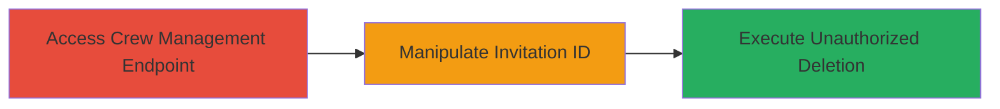

---
tags:
  - idor
  - web
  - api
  - deletion
  - social-club
type: attack_chain
tools: []
tactics:
  - '[[Discovery]]'
commands:
  - '[[commands/curl-delete-crew-invitation]]'
platforms:
  - Web
complexity: low
procedures:
  - '[[procedures/Exploit-IDOR-to-Delete-Crew-Invitations]]'
step_count: 1
techniques:
  - '[[Exploit Public-Facing Application]]'
description: >-
  An attack chain exploiting an Insecure Direct Object Reference (IDOR)
  vulnerability in the Rockstar Games Social Club platform's Crews management
  endpoint, enabling unauthorized deletion of crew invitations for any user and
  crew.
skill_level: intermediate
impact_level: medium
id: 5e5a027b-5d25-4de8-ac94-fef153146d6d
created_at: '2025-12-14T17:25:34.553Z'
updated_at: '2025-12-14T17:25:34.553Z'
verified: false
validated: true
submitted: true
mitre_tactics:
  - '[[Discovery]]'
mitre_techniques:
  - '[[Exploit Public-Facing Application]]'
---
# IDOR Exploitation in Rockstar Social Club for Arbitrary Crew Invitation Deletion

Multi-stage attack chain demonstrating a complete attack workflow targeting the Crews management service in Rockstar Games' Social Club platform.

## Chain Metrics Dashboard

| Metric | Value |
|--------|-------|
| Chain Status | Unverified |
| Total Steps | 1 |
| Execution Time | ~5 minutes |
| Skill Level | Intermediate |
| Complexity | Low |
| Impact Level | Medium |

## Attack Flow Visualization



## Prerequisites & Requirements

### Required Tools

- Browser developer tools or proxy like Burp Suite for request interception

### Target Environment

- Web platform
- Social Club service
- Crews management API endpoint
- Network access to https://socialclub.rockstargames.com/

### Initial Access Requirements

- Valid Social Club account (unauthorized user perspective)
- Ability to view or receive a crew invitation to capture a legitimate request ID
- No elevated privileges required due to IDOR

## Detailed Attack Procedures

### Step 1: Exploit IDOR for Crew Invitation Deletion
procedure: [[procedures/Exploit-IDOR-to-Delete-Crew-Invitations]]

**Objective**: Identify and manipulate the Crew invitation ID in the management endpoint to delete arbitrary invitations without authorization, disrupting crew formations.

**Instructions**: Log in to a Social Club account and navigate to the Crews section to observe or receive an invitation. Use browser developer tools to inspect network requests for the Crews management endpoint (likely a DELETE request to /api/crews/invitations/{invitation_id}). Capture a legitimate invitation ID from your own or a test invitation. Modify the ID in the request to target any other user's outstanding invitation by replacing it with an arbitrary valid ID (discovered via enumeration or guessing). Execute the modified request using [[commands/curl-delete-crew-invitation]]:

```bash
curl -X DELETE 'https://socialclub.rockstargames.com/api/crews/invitations/ARBITRARY_INVITATION_ID/delete' \
  -H 'Authorization: Bearer YOUR_JWT_TOKEN' \
  -H 'Content-Type: application/json'
```

Replace ARBITRARY_INVITATION_ID with the target invitation ID and YOUR_JWT_TOKEN with your session token from browser cookies or headers.

**Expected Output**: HTTP 200 OK response indicating successful deletion, or no error if the server lacks checks.

**Success Indicators**:
- Invitation disappears from the target user's pending list
- No authorization error returned from the endpoint
- Confirmation via checking the Crew's invitation status

## Attack Chain Summary

### Key Achievements

1. Unauthorized access to Crew invitation management
2. Arbitrary deletion of invitations across any Crew and user
3. Disruption of social interactions and crew building in Social Club

## Technique & Tactic Coverage

### MITRE ATT&CK Techniques

- [[Exploit Public-Facing Application]]

### MITRE ATT&CK Tactics

- [[Discovery]]

---
*Last updated: 2023-10-01*
