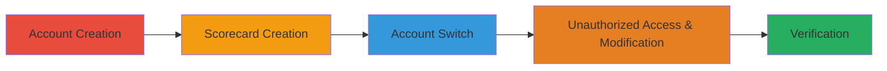

# IDOR Exploitation in Scorecard Management for Unauthorized Access and Modification

Multi-stage attack chain demonstrating the exploitation of an Insecure Direct Object Reference (IDOR) vulnerability in the scorecard management feature of the demo.sftool.gov application. The attack allows an unauthorized user to access, modify, download, and assign permissions to another user's scorecard by directly referencing the scorecard name in the URL, bypassing ownership verification. This compromises sensitive data and access controls, potentially leading to data leakage or further privilege escalation.

## Chain Metrics Dashboard

| Metric | Value |
|--------|-------|
| Chain Status | Unverified |
| Total Steps | 5 |
| Execution Time | ~10 minutes |
| Skill Level | Low |
| Complexity | Low |
| Impact Level | High |

## Attack Flow Visualization

## Prerequisites & Requirements

### Required Tools

- Web browser (e.g., Chrome or Firefox)

### Target Environment

- Web application: https://demo.sftool.gov
- No specific services or ports required beyond standard HTTPS (443)
- Network access: Direct internet access to the target URL

### Initial Access Requirements

- No prior credentials needed; accounts can be created freely
- Attacker must be able to register multiple accounts
- Basic understanding of web navigation and URL manipulation

## Detailed Attack Procedures

### Step 1: Create Multiple User Accounts
procedure: [[procedures/Create-Multiple-User-Accounts-for-IDOR-Testing]]

**Objective**: Establish a victim account and an attacker account to demonstrate unauthorized access across accounts.

**Instructions**: Navigate to the application's registration page and create two separate accounts with distinct credentials. Use one as the 'victim' for creating content and the other as the 'attacker' for unauthorized access.

**Expected Output**: Successful registration confirmations for both accounts, with login capabilities verified.

**Success Indicators**:
- Both accounts are created and can log in independently
- No restrictions on multiple account creation

### Step 2: Create Test Scorecard with Victim Account
procedure: [[procedures/Create-Test-Scorecard-with-Victim-Account]]

**Objective**: Generate a scorecard under the victim account to serve as the target for IDOR exploitation.

**Instructions**: Log in as the victim, navigate to the scorecard management section (/tws), and submit a new scorecard with a predictable name like 'testdsfdfsf'. Note the resulting URL after creation.

**Expected Output**: Scorecard created successfully, with URL https://demo.sftool.gov/TwsHome/ScorecardManage/testdsfdfsf accessible only to the victim initially.

**Success Indicators**:
- Scorecard appears in the victim's dashboard
- URL includes the scorecard name as a direct reference

### Step 3: Switch to Attacker Account
procedure: [[procedures/Switch-to-Attacker-Account]]

**Objective**: Transition from the victim session to the attacker session without clearing any stored URLs.

**Instructions**: Log out of the victim account using the application's logout function, then log in with the attacker account credentials.

**Expected Output**: Successful login as attacker, with no access to victim's scorecard from the dashboard.

**Success Indicators**:
- Attacker session active
- Victim's scorecard not visible in attacker's legitimate views

### Step 4: Access and Modify Scorecard Unauthorized
procedure: [[procedures/Access-and-Modify-Scorecard-Unauthorized]]

**Objective**: Exploit IDOR by directly accessing the victim's scorecard URL from the attacker account, then perform unauthorized actions.

**Instructions**: Paste the victim's scorecard URL (https://demo.sftool.gov/TwsHome/ScorecardManage/testdsfdfsf) into the browser while logged in as attacker. Once accessed, view the content, edit information, add read-only or edit permissions to other users, and download the scorecard.

**Expected Output**: Full access granted without ownership checks; modifications saved and permissions assigned.

**Success Indicators**:
- Scorecard loads and is editable
- Changes persist; download succeeds
- Permissions can be altered

### Step 5: Verify Changes from Victim Account
procedure: [[procedures/Verify-Changes-from-Victim-Account]]

**Objective**: Confirm the impact of the unauthorized modifications by switching back to the victim account.

**Instructions**: Log out of the attacker account, log back in as victim, and navigate to the scorecard to observe alterations, new permissions, and evidence of download activity.

**Expected Output**: Victim sees edited content, assigned permissions, and any download logs if available.

**Success Indicators**:
- Unauthorized changes visible to victim
- Permissions granted to attacker or others
- Data integrity compromised

## Attack Chain Summary

### Key Achievements

1. Bypassed access controls to view private scorecards
2. Modified sensitive scorecard data without authorization
3. Assigned permissions to escalate access risks
4. Downloaded potentially confidential information

## Technique & Tactic Coverage

### MITRE ATT&CK Techniques

- [[Exploit Public-Facing Application]]

### MITRE ATT&CK Tactics

- [[Initial Access]]
- [[Discovery]]

---
*Last updated: 2023-10-01T00:00:00Z*
