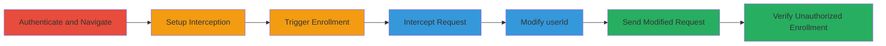

# IDOR Exploitation in Semrush Academy for Unauthorized User Enrollment

Multi-stage attack chain demonstrating a complete workflow to exploit an IDOR vulnerability in Semrush Academy, allowing attackers to enroll any user in courses and access their enrollment data without proper authorization checks.

## Chain Metrics Dashboard

| Metric | Value |
|--------|-------|
| Chain Status | Unverified |
| Total Steps | 7 |
| Execution Time | ~10 minutes |
| Skill Level | Intermediate |
| Complexity | Medium |
| Impact Level | High |

## Attack Flow Visualization

## Prerequisites & Requirements

### Required Tools

- [[tools/Burp-Suite]]

### Target Environment

- Web platform (Semrush Academy at https://www.semrush.com/academy)
- No specific ports or services required beyond standard HTTPS (443)
- Internet access to the target domain

### Initial Access Requirements

- Valid Semrush Academy credentials for authentication (attacker's own account)
- Knowledge of a target user's ID (e.g., obtained via other means like enumeration or social engineering)
- Burp Suite configured as a proxy for the browser

## Detailed Attack Procedures

### Step 1: Login to an Account
procedure: [[procedures/Authenticate-and-Navigate-to-Semrush-Academy]]

**Objective**: Gain authenticated access to the Semrush Academy platform to initiate legitimate requests that can be intercepted.

**Instructions**: Open a web browser configured to proxy traffic through Burp Suite. Navigate to the Semrush Academy login page and enter valid credentials to authenticate.

**Expected Output**: Successful login, redirecting to the dashboard or courses section.

**Success Indicators**:
- Authentication token or session established
- Access to user-specific features like course library

### Step 2: Navigate to the Courses Library Page
procedure: [[procedures/Authenticate-and-Navigate-to-Semrush-Academy]]

**Objective**: Reach the page where course enrollment can be triggered to capture the relevant HTTP request.

**Instructions**: After login, visit the courses library URL: https://www.semrush.com/academy/library/courses?spec=ALL&lang=en-US to browse available courses.

**Expected Output**: Display of course listings with 'Enroll for free' buttons.

**Success Indicators**:
- Course library loads successfully
- Enrollment buttons visible for selected courses

### Step 3: Enable Request Interception in Burp Suite
procedure: [[procedures/Intercept-and-Modify-Enrollment-Request-for-IDOR]]

**Objective**: Prepare Burp Suite to capture and manipulate outgoing HTTP requests during the enrollment process.

**Instructions**: In Burp Suite, navigate to the Proxy tab and enable the Intercept feature to start capturing requests from the proxied browser.

**Expected Output**: Burp Suite interface shows 'Intercept is on' status.

**Success Indicators**:
- Proxy interception activated
- Browser traffic routed through Burp

### Step 4: Click the 'Enroll for Free' Button on a Course
procedure: [[procedures/Intercept-and-Modify-Enrollment-Request-for-IDOR]]

**Objective**: Trigger the legitimate enrollment request to observe its structure before modification.

**Instructions**: Select any course from the library and click the 'Enroll for free' button, which sends a POST request to the enrollment endpoint.

**Expected Output**: The request is intercepted in Burp Suite.

**Success Indicators**:
- POST request to /academy/courses/userEnroll captured
- Request body contains parameters like userId and courseId

### Step 5: Forward Intercepted Requests Until the Enrollment POST is Captured
procedure: [[procedures/Intercept-and-Modify-Enrollment-Request-for-IDOR]]

**Objective**: Isolate the specific enrollment POST request among other traffic.

**Instructions**: In Burp Suite's Proxy > Intercept tab, forward non-relevant requests (e.g., page loads) until the target POST to https://www.semrush.com/academy/courses/userEnroll is held for inspection.

**Expected Output**: The enrollment POST request displayed in Burp, showing JSON or form data with userId, courseId, etc.

**Success Indicators**:
- Specific POST request intercepted
- Parameters visible, including the attacker's userId

### Step 6: Modify the userId Parameter to that of a Victim
procedure: [[procedures/Intercept-and-Modify-Enrollment-Request-for-IDOR]]

**Objective**: Alter the request to reference a different user's ID, exploiting the IDOR to impersonate the victim.

**Instructions**: In the intercepted request's body (e.g., JSON: {"userId": 5410425, "courseId": 123}), change the userId to the victim's ID (e.g., 5407773) while keeping other parameters unchanged.

**Expected Output**: Modified request ready for forwarding, with updated userId.

**Success Indicators**:
- userId successfully changed to victim's
- Request structure intact

### Step 7: Send the Modified Request to the Server
procedure: [[procedures/Intercept-and-Modify-Enrollment-Request-for-IDOR]]

**Objective**: Submit the tampered request to achieve unauthorized enrollment and data access.

**Instructions**: Forward the modified POST request from Burp Suite to the server.

**Expected Output**: Server response with success status, including victim's enrollment details like creationDate, engagement, status, and userEngagement.

**Success Indicators**:
- HTTP 200 OK response
- Unauthorized enrollment confirmed for victim
- Access to sensitive victim data exposed

## Attack Chain Summary

### Key Achievements

1. Successful authentication and navigation to target endpoint
2. Interception and modification of enrollment request to exploit IDOR
3. Unauthorized enrollment of victim in course with exposure of personal enrollment data

## Technique & Tactic Coverage

### MITRE ATT&CK Techniques

- [[Valid Accounts]]
- [[Exploit Public-Facing Application]]

### MITRE ATT&CK Tactics

- [[Initial Access]]

---

*Last updated: 2023-10-01T00:00:00Z*
