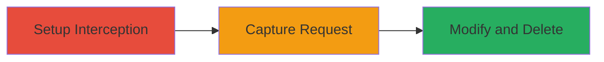

---
tags:
  - idor
  - graphql
  - snapchat
  - web
  - deletion
type: attack_chain
tools:
  - '[[tools/Burp-Suite]]'
tactics:
  - '[[Execution]]'
  - '[[Impact]]'
commands: []
platforms:
  - Web
complexity: medium
procedures:
  - '[[procedures/Setup-Burp-Suite-for-Request-Interception]]'
  - '[[procedures/Capture-and-Analyze-Snapchat-Delete-Request]]'
  - '[[procedures/Modify-and-Replay-GraphQL-Request-for-IDOR]]'
step_count: 3
techniques:
  - '[[Exploit Public-Facing Application]]'
  - '[[Data Destruction]]'
description: >-
  Exploits an Insecure Direct Object Reference vulnerability in Snapchat's
  GraphQL API to delete another user's Spotlight content remotely.
skill_level: intermediate
impact_level: high
id: 1180dcb2-cefb-4876-95d3-65f91ad36f8e
created_at: '2025-12-11T06:10:29.040Z'
updated_at: '2025-12-11T06:10:29.040Z'
verified: false
validated: true
submitted: true
mitre_tactics:
  - '[[TA0002]]'
  - '[[TA0040]]'
mitre_techniques:
  - '[[T1190]]'
  - '[[T1485]]'
---
# IDOR Exploitation in Snapchat Spotlight for Remote Content Deletion

## Overview

This attack chain demonstrates the exploitation of an Insecure Direct Object Reference (IDOR) vulnerability in Snapchat's Spotlight feature. By intercepting and modifying a GraphQL delete request using Burp Suite, an authenticated attacker can delete any user's Spotlight content remotely. This leads to the removal of viral videos, potential loss of crystal awards payments based on views, and financial harm to content creators. The chain involves setting up interception, capturing a legitimate request, and modifying it to target another user's content ID obtained from shared URLs.

## Attack Flow Visualization

## Prerequisites & Requirements

### Required Tools
- [[tools/Burp-Suite]]

### Target Environment
- Web platform
- Snapchat API Gateway with GraphQL
- Authenticated Snapchat account

### Initial Access Requirements
- Valid Snapchat credentials
- Access to https://my.snapchat.com/myposts
- Target Spotlight ID from shared URL (e.g., https://story.snapchat.com/spotlight/█████)

## Detailed Attack Procedures

## Step 1: Interception Setup - [[procedures/Setup-Burp-Suite-for-Request-Interception]]

### Objective

Configure Burp Suite to intercept HTTP requests from the Snapchat web interface for analysis and modification.

### Instructions

Navigate to https://my.snapchat.com/myposts and log in with your credentials. Enable Burp Suite proxy interception to capture outgoing requests.

### Expected Output

Burp Suite is ready to intercept requests, showing incoming traffic in the Proxy tab.

### Success Indicators
- Burp Suite proxy is active and intercepting requests.
- No errors in proxy configuration.

## Step 2: Request Capture - [[procedures/Capture-and-Analyze-Snapchat-Delete-Request]]

### Objective

Trigger and capture a legitimate delete request for your own Spotlight content to extract the GraphQL mutation structure.

### Instructions

Select one of your own posts on the myposts page and initiate deletion. In Burp Suite, intercept the GraphQL request to /myposts containing the mutation: {"operationName":"DeleteStorySnaps","variables":{"ids":["███████"],"storyType":"SPOTLIGHT_STORY"},"query":"mutation DeleteStorySnaps($ids: [String!]!, $storyType: StoryType!) {\n deleteStorySnaps(ids: $ids, storyType: $storyType)\n}\n"}.

### Expected Output

Captured request in Burp Suite Repeater or Proxy history, with the 'ids' parameter visible.

### Success Indicators
- GraphQL mutation is captured successfully.
- The request structure is analyzable for modification.

## Step 3: Request Modification and Execution - [[procedures/Modify-and-Replay-GraphQL-Request-for-IDOR]]

### Objective

Modify the captured request with a target user's Spotlight ID and forward it to delete the content remotely.

### Instructions

In Burp Suite, replace the ID in the 'ids' array with the target's ID from a shared URL. Forward the modified request to the server.

### Expected Output

The server processes the request, resulting in the deletion of the targeted Spotlight content.

### Success Indicators
- Targeted content is no longer accessible via the shared URL.
- No authorization errors returned, confirming IDOR exploitation.

## Attack Chain Summary

### Key Achievements
1. Successful interception and analysis of Snapchat's GraphQL delete mutation.
2. Unauthorized deletion of another user's Spotlight content via IDOR.
3. Demonstration of impact including loss of views and potential payments.

## Technique & Tactic Coverage

### MITRE ATT&CK Techniques
- [[Exploit Public-Facing Application]]
- [[Data Destruction]]

### MITRE ATT&CK Tactics
- [[Execution]]
- [[Impact]]
