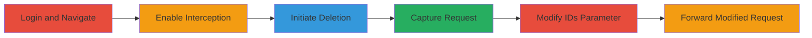

---
tags:
  - idor
  - graphql
  - snapchat
  - deletion
type: attack_chain
tools:
  - '[[tools/Burp-Suite]]'
tactics:
  - '[[Impact]]'
commands: []
platforms:
  - Web
complexity: medium
procedures:
  - '[[procedures/Intercept-and-Modify-GraphQL-Delete-Request]]'
step_count: 6
techniques:
  - '[[Data Manipulation]]'
description: >-
  Exploitation of an Insecure Direct Object Reference (IDOR) vulnerability in
  Snapchat's Spotlight feature to delete any user's content remotely
skill_level: intermediate
impact_level: high
id: 95d39ab5-e1c8-43b1-ad2b-e1776688e895
created_at: '2025-12-11T03:47:56.660Z'
updated_at: '2025-12-11T03:47:56.660Z'
verified: false
validated: true
submitted: true
mitre_tactics:
  - '[[TA0040]]'
mitre_techniques:
  - '[[T1565]]'
---
# IDOR Exploitation in Snapchat Spotlight for Unauthorized Content Deletion

Multi-stage attack chain demonstrating the exploitation of an IDOR vulnerability in Snapchat's Spotlight feature, allowing authenticated users to delete any other user's Spotlight content by modifying the 'ids' parameter in a GraphQL delete request. This can lead to unauthorized removal of viral videos, potentially preventing content creators from receiving payments through Snapchat's crystal awards system.

## Chain Metrics Dashboard

| Metric | Value |
|--------|-------|
| Chain Status | Unverified |
| Total Steps | 6 |
| Execution Time | ~5 minutes |
| Skill Level | Intermediate |
| Complexity | Medium |
| Impact Level | High |

## Attack Flow Visualization

## Prerequisites & Requirements

### Required Tools

- [[tools/Burp-Suite]]

### Target Environment

- Platform: Web
- Services: Snapchat Spotlight
- Tech Stack: GraphQL, API Gateway

### Initial Access Requirements

- Valid Snapchat account credentials
- Network access to https://my.snapchat.com
- Knowledge of target's Spotlight ID from public share URLs

## Detailed Attack Procedures

### Step 1: Navigate to User's Posts Page and Log In - [[procedures/Intercept-and-Modify-GraphQL-Delete-Request]]

**Procedure**: [[procedures/Intercept-and-Modify-GraphQL-Delete-Request]]

**Objective**: Access the personal posts page to initiate the deletion process for own content, which will be intercepted.

**Expected Output**: Successful login and view of personal posts.

**Success Indicators**:
- Page loads at https://my.snapchat.com/myposts
- User's own posts are visible

### Step 2: Enable Interception with Burp Suite - [[procedures/Intercept-and-Modify-GraphQL-Delete-Request]]

**Procedure**: [[procedures/Intercept-and-Modify-GraphQL-Delete-Request]]

**Objective**: Set up Burp Suite to capture outgoing HTTP requests for modification.

**Expected Output**: Burp Suite proxy intercepting traffic.

**Success Indicators**:
- Interception toggle is enabled in Burp Suite
- No errors in proxy setup

### Step 3: Select a Personal Post and Initiate Deletion - [[procedures/Intercept-and-Modify-GraphQL-Delete-Request]]

**Procedure**: [[procedures/Intercept-and-Modify-GraphQL-Delete-Request]]

**Objective**: Trigger the deletion action on one of the attacker's own posts to generate the legitimate request.

**Expected Output**: Deletion prompt or action initiated.

**Success Indicators**:
- Delete option clicked on own post
- Request is prepared for interception

### Step 4: Capture the Delete Request - [[procedures/Intercept-and-Modify-GraphQL-Delete-Request]]

**Procedure**: [[procedures/Intercept-and-Modify-GraphQL-Delete-Request]]

**Objective**: Intercept the GraphQL mutation request for DeleteStorySnaps using Burp Suite.

**Expected Output**: Captured request in Burp Suite's intercept tab.

**Success Indicators**:
- GraphQL request visible with 'ids' parameter
- Request details match expected mutation

### Step 5: Modify the 'ids' Parameter in the Request - [[procedures/Intercept-and-Modify-GraphQL-Delete-Request]]

**Procedure**: [[procedures/Intercept-and-Modify-GraphQL-Delete-Request]]

**Objective**: Replace the 'ids' array with the victim's Spotlight ID obtained from share URLs like https://story.snapchat.com/spotlight/█████.

**Expected Output**: Modified request ready to forward.

**Success Indicators**:
- 'ids' parameter updated to target's ID
- No syntax errors in the modified GraphQL payload

### Step 6: Forward the Modified Request - [[procedures/Intercept-and-Modify-GraphQL-Delete-Request]]

**Procedure**: [[procedures/Intercept-and-Modify-GraphQL-Delete-Request]]

**Objective**: Send the altered request to the server to delete the target's Spotlight content.

**Expected Output**: Successful deletion response from the server.

**Success Indicators**:
- HTTP 200 OK or success response
- Target's content is no longer accessible

## Attack Chain Summary

### Key Achievements

1. Unauthorized deletion of Spotlight videos
2. Potential disruption of content creator payments
3. Demonstration of IDOR in GraphQL API

## Technique & Tactic Coverage

### MITRE ATT&CK Techniques

- [[Data Manipulation]]

### MITRE ATT&CK Tactics

- [[Impact]]

*Last updated: 2023-10-01*
