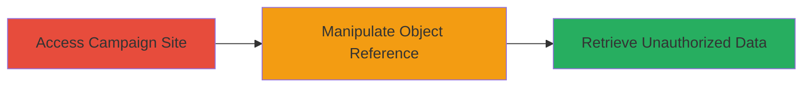

# IDOR Exploitation in Starbucks Campaign Site for Unauthorized Customer Data Access

Multi-stage attack chain demonstrating a complete attack workflow.

## Chain Metrics Dashboard

| Metric | Value |
|--------|-------|
| Chain Status | Unverified |
| Total Steps | 1 |
| Execution Time | ~5 minutes |
| Skill Level | Beginner |
| Complexity | Low |
| Impact Level | Medium |

## Attack Flow Visualization



## Prerequisites & Requirements

### Required Tools

- Browser Developer Tools
- [[tools/curl]]

### Target Environment

- Web platform
- Accessible via public internet
- No specific ports required beyond standard HTTPS (443)

### Initial Access Requirements

- No credentials required (public-facing site)
- Direct network access to campaign.starbucks.com.sg
- No prior access needed

## Detailed Attack Procedures

### Step 1: Exploit IDOR for Data Access
procedure: [[procedures/Exploit-IDOR-in-Web-Application]]

**Objective**: Identify and manipulate a direct object reference parameter to access marketing data belonging to other customers in Singapore.

**Instructions**: Navigate to the campaign site and inspect requests for parameters like user_id or campaign_id. Modify the parameter value to another user's ID and resubmit the request using browser tools or curl to retrieve unauthorized data.

For example, use [[commands/curl-idor-test]] to simulate the request:

```bash
curl -X GET "https://campaign.starbucks.com.sg/api/campaign?user_id=123" -H "Cookie: session=abc123"
```

Replace user_id=123 with another value, such as 124, to access different customer data.

**Expected Output**: JSON or HTML response containing marketing data like preferences or campaign participation details for the targeted user.

**Success Indicators**:
- Response contains data not belonging to the authenticated or expected user
- No authorization error; data is returned successfully

## Attack Chain Summary

### Key Achievements

1. Unauthorized access to limited customer marketing data
2. Demonstration of missing access controls in object referencing
3. Exposure of PII for other Singapore-based customers

## Technique & Tactic Coverage

### MITRE ATT&CK Techniques

- [[Account Discovery]]

### MITRE ATT&CK Tactics

- [[Discovery]]

---
*Last updated: 2023-10-01T00:00:00Z*
