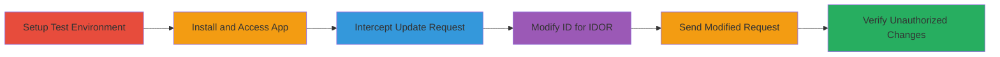

# IDOR Exploitation in Stocky App Allowing Unauthorized Low Stock Variant Settings Modification

Multi-stage attack chain demonstrating a complete workflow to exploit an Insecure Direct Object Reference (IDOR) in the Stocky application's low stock variants settings endpoint. The attack allows an authenticated user to modify another user's column display settings for inventory data without proper authorization checks, altering the presentation of low stock information. Discovered via two test Shopify stores, the exploit involves intercepting a POST request with Burp Suite, swapping the numeric ID, and verifying the unauthorized changes. Impact is low severity as it affects only UI presentation without compromising core data or functionality.

## Chain Metrics Dashboard

| Metric | Value |
|--------|-------|
| Chain Status | Unverified |
| Total Steps | 7 |
| Execution Time | ~15 minutes |
| Skill Level | Intermediate |
| Complexity | Medium |
| Impact Level | Low |

## Attack Flow Visualization

## Prerequisites & Requirements

### Required Tools

- [[tools/Burp-Suite]]

### Target Environment

- Web platform with Shopify stores
- Stocky app installed
- No specific ports required; operates over HTTPS

### Initial Access Requirements

- Authenticated access to two separate Shopify stores (create test accounts if needed)
- Network access to app.stockyhq.com
- Burp Suite configured as browser proxy

## Detailed Attack Procedures

### Step 1: Create Test Shopify Stores
procedure: [[procedures/Create-Test-Shopify-Stores]]

**Objective**: Establish two isolated test environments to simulate attacker and victim stores for demonstrating cross-store unauthorized access.

**Instructions**: Sign up for two Shopify developer accounts and create separate stores, such as test.myshopify.com for User A (attacker) and test1.myshopify.com for User B (victim).

**Expected Output**: Two active Shopify stores with unique domains.

**Success Indicators**:
- Successful store creation confirmation emails
- Ability to log in to both admin panels

### Step 2: Install Stocky App on Both Stores
procedure: [[procedures/Install-Stocky-App-on-Stores]]

**Objective**: Deploy the vulnerable Stocky app on both stores to enable access to the low stock variants feature.

**Instructions**: From each store's Shopify admin, search for and install the Stocky app via the App Store.

**Expected Output**: App installed and accessible at https://app.stockyhq.com/dashboard/ for both stores.

**Success Indicators**:
- Dashboard loads without errors for both users
- Low stock variants section visible

### Step 3: Access Low Stock Variants in Attacker's Store
procedure: [[procedures/Access-Low-Stock-Variants]]

**Objective**: Navigate to the settings interface where the vulnerable endpoint is triggered.

**Instructions**: Log in as User A, go to https://app.stockyhq.com/dashboard/, and click on 'Low Stock Variants' to enter the settings area.

**Expected Output**: Low stock variants page loads, showing column configuration options.

**Success Indicators**:
- Page accessible and editable for User A
- Settings form visible

### Step 4: Intercept Update Request Using Burp Suite
procedure: [[procedures/Intercept-Update-Request-with-Burp]]

**Objective**: Capture the legitimate update request from the attacker's store to analyze the endpoint structure.

**Instructions**: Configure Burp Suite as a proxy in the browser. As User A, navigate to Settings > Columns, modify a column (e.g., set show_title to 0), and click Update. Intercept the POST request to /settings_for_low_stock_variants/111111, noting form data like authenticity_token and show_* parameters.

**Expected Output**: Intercepted POST request with JSON-like form data.

**Success Indicators**:
- Request captured in Burp Repeater or Proxy
- Endpoint path and ID visible (e.g., 111111 for User A's store)

### Step 5: Modify the Request with Victim's ID
procedure: [[procedures/Modify-Request-ID-for-IDOR]]

**Objective**: Exploit the IDOR by replacing the store-specific ID to target the victim's settings.

**Instructions**: In Burp, edit the intercepted request: Change the URL path from /settings_for_low_stock_variants/111111 to /settings_for_low_stock_variants/111112 (User B's ID), retain the original POST body including authenticity_token and modified parameters.

**Expected Output**: Modified request ready in Burp.

**Success Indicators**:
- URL path updated with victim's ID
- Request body unchanged

### Step 6: Send the Modified Request
procedure: [[procedures/Send-Modified-Request]]

**Objective**: Submit the tampered request to apply unauthorized changes to the victim's store.

**Instructions**: Forward the modified POST request through Burp.

**Expected Output**: 302 redirect response indicating successful update.

**Success Indicators**:
- HTTP 302 status code received
- No authorization error in response

### Step 7: Verify the Impact on Victim's Store
procedure: [[procedures/Verify-Unauthorized-Changes]]

**Objective**: Confirm the IDOR exploitation by observing applied changes in the victim's environment.

**Instructions**: Log in as User B, navigate to Low Stock Variants > Columns, and check if User A's modifications (e.g., hidden columns) are now visible.

**Expected Output**: Victim's settings altered to match attacker's changes.

**Success Indicators**:
- Unauthorized settings changes applied
- Display of low stock variants modified

## Attack Chain Summary

### Key Achievements

1. Successful creation and setup of dual test environments
2. Interception and manipulation of vulnerable POST endpoint
3. Demonstration of unauthorized cross-store settings modification via IDOR

## Technique & Tactic Coverage

### MITRE ATT&CK Techniques

- [[Exploit Public-Facing Application]]

### MITRE ATT&CK Tactics

- [[Initial Access]]

---
*Last updated: 2023-10-01T00:00:00Z*
