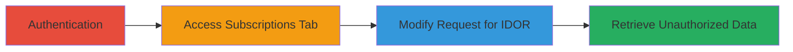

# IDOR Exploitation in Zomato Treat Subscriptions API for Unauthorized User Data Access

Multi-stage attack chain demonstrating the exploitation of an Insecure Direct Object Reference (IDOR) vulnerability in the Zomato web application's API endpoint for fetching treat subscriptions. An authenticated user can manipulate the user_id parameter in the POST request to /php/filter_user_tab_content.php to access subscription details of other users, including Subscription ID, Purchased Date, and Validity, without proper authorization checks. This leads to significant privacy violations by exposing sensitive user data.

## Chain Metrics Dashboard

| Metric | Value |
|--------|-------|
| Chain Status | Unverified |
| Total Steps | 4 |
| Execution Time | ~5 minutes |
| Skill Level | Intermediate |
| Complexity | Medium |
| Impact Level | High |

## Attack Flow Visualization



## Prerequisites & Requirements

### Required Tools

- Browser with developer tools (e.g., Chrome DevTools) or proxy like Burp Suite for request interception
- Valid Zomato account credentials

### Target Environment

- Zomato web platform (https://www.zomato.com)
- PHP-based backend API
- No specific ports required; standard HTTPS (443)

### Initial Access Requirements

- Valid user credentials for authentication
- Active internet connection to the Zomato website
- No prior elevated access needed; standard user session suffices

## Detailed Attack Procedures

### Step 1: Authenticate to Zomato Web Application
procedure: [[procedures/Authenticate-to-Zomato-Web-Application]]

**Objective**: Establish a valid authenticated session to obtain necessary cookies and tokens for API access.

**Instructions**: Navigate to the Zomato login page and enter credentials to log in, capturing the session cookie and CSRF token from the browser's developer tools.

**Expected Output**: Successful login redirect to the user dashboard with active session.

**Success Indicators**:
- Session cookie (e.g., PHPSESSID) present in browser storage
- CSRF token visible in network requests

### Step 2: Access My Subscriptions Tab
procedure: [[procedures/Access-My-Subscriptions-Tab]]

**Objective**: Trigger the initial API request to understand the structure and parameters used for loading subscription data.

**Instructions**: From the user profile, click on the 'My Subscriptions' tab to initiate the POST request to the target endpoint.

**Expected Output**: Display of the authenticated user's own subscription details in the UI.

**Success Indicators**:
- Network tab shows POST to /php/filter_user_tab_content.php with own user_id
- JSON response containing personal subscription data

### Step 3: Modify API Request for IDOR Exploitation
procedure: [[procedures/Modify-API-Request-for-IDOR-Exploitation]]

**Objective**: Craft a modified POST request by altering the user_id parameter to target another user's data.

**Instructions**: Use a tool like curl or Burp Suite to send the intercepted request with an arbitrary user_id (e.g., 4). Include the session cookie and CSRF token from your authenticated session.

Execute the following using [[commands/curl-idor-post-request]]:

```bash
curl -X POST 'https://www.zomato.com/php/filter_user_tab_content.php' \
  -H 'User-Agent: Mozilla/5.0...' \
  -H 'Accept: */*' \
  -H 'Content-Type: application/x-www-form-urlencoded' \
  -H 'Cookie: PHPSESSID=your_session; csrf_token=your_csrf' \
  -d 'user_id=4&tab=treat_subscription&order_history_offset=0&order_history_limit=20'
```

**Expected Output**: Server responds with JSON data for the targeted user_id.

**Success Indicators**:
- Response contains subscription details not belonging to the authenticated user
- No authorization error returned

### Step 4: Retrieve and Analyze Unauthorized Subscription Data
procedure: [[procedures/Retrieve-and-Analyze-Unauthorized-Subscription-Data]]

**Objective**: Parse the response to extract and review sensitive subscription information of the target user.

**Instructions**: Inspect the JSON response from the modified request for fields like Subscription ID, Purchased Date, and Validity.

**Expected Output**: Detailed subscription records for the arbitrary user.

**Success Indicators**:
- Access to private data such as purchase dates and validity periods
- Confirmation of privacy violation through data mismatch with own account

## Attack Chain Summary

### Key Achievements

1. Successful authentication and session establishment on Zomato
2. Identification of vulnerable API endpoint via normal usage
3. Exploitation of IDOR to access arbitrary user data
4. Retrieval of sensitive subscription details leading to privacy leak

## Technique & Tactic Coverage

### MITRE ATT&CK Techniques

- [[Account Discovery]]

### MITRE ATT&CK Tactics

- [[Discovery]]

---
*Last updated: 2023-10-01T00:00:00Z*
