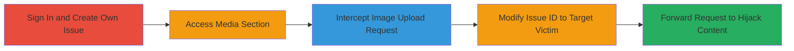

# IDOR Exploitation in getrevue.co to Hijack and Deface User Issues

Multi-stage attack chain demonstrating how authenticated users can exploit an IDOR vulnerability in the getrevue.co platform to unauthorizedly modify other users' issues, adding arbitrary images, titles, and metadata for hijacking and defacement.

## Chain Metrics Dashboard

| Metric | Value |
|--------|-------|
| Chain Status | Unverified |
| Total Steps | 5 |
| Execution Time | ~10 minutes |
| Skill Level | Intermediate |
| Complexity | Medium |
| Impact Level | High |

## Attack Flow Visualization

## Prerequisites & Requirements

### Required Tools

- [[tools/Burp-Suite]]

### Target Environment

- Web platform: getrevue.co
- Required services: API endpoints (POST /app/items), S3 for image storage
- Network access: Internet access to getrevue.co

### Initial Access Requirements

- Valid authenticated account on getrevue.co
- Knowledge of victim's issue ID (e.g., via enumeration or social engineering)
- Proxy tool configured for request interception

## Detailed Attack Procedures

### Step 1: Sign In to the Platform
procedure: [[procedures/Exploit-IDOR-to-Modify-User-Issues-in-getrevue-co]]

**Objective**: Authenticate to gain access to the platform's issue management features.

**Instructions**: Navigate to https://www.getrevue.co and sign in with valid user credentials to establish a session.

**Expected Output**: Successful login, redirect to dashboard with access to 'Issues' section.

**Success Indicators**:
- Session cookie established
- Access to personal issues granted

### Step 2: Create a New Issue
procedure: [[procedures/Exploit-IDOR-to-Modify-User-Issues-in-getrevue-co]]

**Objective**: Generate an issue under the attacker's account to prepare for request interception during media upload.

**Instructions**: Click on 'Issues' in the navigation menu, then select 'Add new issue' to create a draft issue.

**Expected Output**: New issue created with a unique ID assigned to the attacker's account.

**Success Indicators**:
- Issue ID visible in the URL or page (e.g., own_issue_id)
- Media upload option available

### Step 3: Access the Media Section of the Created Issue
procedure: [[procedures/Exploit-IDOR-to-Modify-User-Issues-in-getrevue-co]]

**Objective**: Navigate to the media upload interface to trigger the vulnerable API request.

**Instructions**: Open the newly created issue and scroll to the bottom of the page, then click on 'Media' to initiate the upload process.

**Expected Output**: Media upload interface loads, ready for image selection.

**Success Indicators**:
- 'Media' section expanded
- Upload button functional

### Step 4: Intercept and Upload an Image
procedure: [[procedures/Exploit-IDOR-to-Modify-User-Issues-in-getrevue-co]]

**Objective**: Capture the legitimate upload request using a proxy tool for subsequent modification.

**Instructions**: Configure [[tools/Burp-Suite]] as a proxy in the browser, enable interception, select and upload a test image to trigger the POST /app/items request, and capture it.

**Expected Output**: Intercepted HTTP POST request to /app/items with JSON payload containing the attacker's issue ID.

**Success Indicators**:
- Request paused in proxy tool
- Payload includes 'issue' field with own ID

### Step 5: Modify the Request to Target Another User's Issue
procedure: [[procedures/Exploit-IDOR-to-Modify-User-Issues-in-getrevue-co]]

**Objective**: Alter the 'issue' ID and metadata to hijack the victim's issue, then forward the request.

**Instructions**: In the intercepted request, edit the JSON payload: change 'issue' from own ID to victim's ID (e.g., 347976), set arbitrary values for 'title', 'description', 'author', etc., to malicious content like "Your account has been hacked", and forward the request using [[commands/post-app-items-idor]].

**Expected Output**: Server responds with 200 OK, item added to victim's issue without error.

**Success Indicators**:
- Victim's issue updated with attacker's content
- Arbitrary image and metadata visible in victim's issue

## Attack Chain Summary

### Key Achievements

1. Authenticated access to vulnerable API
2. Successful IDOR exploitation to modify foreign issues
3. Content hijacking leading to defacement and potential account compromise signals

## Technique & Tactic Coverage

### MITRE ATT&CK Techniques

- [[Exploit Public-Facing Application]]

### MITRE ATT&CK Tactics

- [[Initial Access]]

---
*Last updated: 2023-10-01T12:00:00Z*
