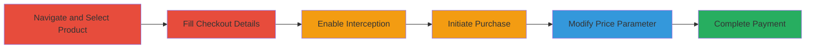

# IDOR Price Manipulation in Acronis Checkout Process

Multi-stage attack chain demonstrating a complete workflow for exploiting an IDOR vulnerability in the Acronis.cz e-commerce checkout to arbitrarily reduce product prices, leading to financial loss for the vendor through underpayment via gateways like GoPay and Bitcoin.

## Chain Metrics Dashboard

| Metric | Value |
|--------|-------|
| Chain Status | Unverified |
| Total Steps | 6 |
| Execution Time | ~10 minutes |
| Skill Level | Intermediate |
| Complexity | Medium |
| Impact Level | High |

## Attack Flow Visualization

## Prerequisites & Requirements

### Required Tools

- [[tools/Burp-Suite]]

### Target Environment

- Web platform (acronis.cz e-commerce site)
- Required services: Checkout endpoint, payment gateways (GoPay, Bitcoin)
- Network access: Direct internet access to acronis.cz

### Initial Access Requirements

- No credentials required (public-facing site)
- Browser with proxy support (e.g., Firefox configured for Burp Suite)
- No prior access needed

## Detailed Attack Procedures

### Step 1: Navigate to the Website and Select a Product
procedure: [[procedures/Initiate-Checkout-Process]]

**Objective**: Begin the purchase flow by accessing the target product page to set up the checkout.

**Instructions**: Open a web browser and visit the Acronis.cz website. Navigate to a product page, such as Acronis Cyber Protect Home Office at https://www.acronis.cz/produkt/acronis-cyber-protect-home-office/. Select the product for purchase.

**Expected Output**: Product details page loaded with 'Buy Now' option visible.

**Success Indicators**:
- Product page accessible without errors
- 'Buy Now' button present

### Step 2: Fill in Purchase Details
procedure: [[procedures/Initiate-Checkout-Process]]

**Objective**: Complete the initial form to reach the point where the checkout request is triggered.

**Instructions**: On the checkout form, enter required details such as contact information, email, and any other mandatory fields. Avoid submitting yet to prepare for interception.

**Expected Output**: Form partially filled, ready for submission.

**Success Indicators**:
- Form validation passes
- Proceed to payment stage visible

### Step 3: Enable Request Interception
procedure: [[procedures/Intercept-and-Modify-Price-Request]]

**Objective**: Set up traffic interception to capture and alter the outgoing HTTP request.

**Instructions**: Configure your browser to proxy through Burp Suite. In Burp Suite, navigate to the Proxy tab and enable Intercept mode to capture the 'Buy Now' request.

**Expected Output**: Burp Suite intercepting browser traffic.

**Success Indicators**:
- Proxy configured successfully
- Intercept mode active (requests paused)

### Step 4: Initiate the Purchase
procedure: [[procedures/Intercept-and-Modify-Price-Request]]

**Objective**: Trigger the checkout request to be captured by the proxy.

**Instructions**: Click the 'Buy Now' button in the browser to send the request, which will be intercepted by Burp Suite.

**Expected Output**: Request paused in Burp Suite for inspection.

**Success Indicators**:
- HTTP POST request to checkout endpoint captured
- Price parameter visible in request body

### Step 5: Modify the Price in the Intercepted Request
procedure: [[procedures/Intercept-and-Modify-Price-Request]]

**Objective**: Alter the price parameter to a minimal value, exploiting the IDOR to bypass validation.

**Instructions**: In the Burp Suite Repeater or Intercept tab, locate the price parameter in the request (e.g., 'price=1000'). Change it to a low positive value like 'price=1'. Forward the modified request. Note: The server rejects prices of 0 or negative but accepts values >0 without further validation.

**Expected Output**: Server accepts the request and proceeds to payment with the altered price.

**Success Indicators**:
- Modified request forwarded successfully
- No server-side rejection for price >0
- Redirect to payment gateway with low price

### Step 6: Complete Payment via Gateway
procedure: [[procedures/Complete-Manipulated-Payment]]

**Objective**: Finalize the transaction using the manipulated price to achieve underpayment.

**Instructions**: Proceed through the payment gateway (e.g., GoPay or Bitcoin) using valid payment details. The gateway will reflect the altered low price. Complete the transaction and check for confirmation.

**Expected Output**: Payment confirmation email or page showing the minimal amount charged.

**Success Indicators**:
- Transaction succeeds with reduced price
- Vendor incurs financial loss (underpayment)
- Confirmation received for low amount

## Attack Chain Summary

### Key Achievements

1. Successful navigation and setup of checkout flow without authentication.
2. Interception and modification of price parameter via IDOR exploitation.
3. Completion of payment with arbitrary price reduction, leading to vendor financial loss.

## Technique & Tactic Coverage

### MITRE ATT&CK Techniques

- [[Exploit Public-Facing Application]] Exploit Public-Facing Application

### MITRE ATT&CK Tactics

- [[Initial Access]] Initial Access

---
*Last updated: 2024-10-01T00:00:00Z*
