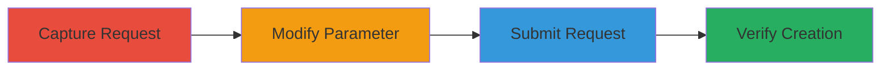

# IDOR Privilege Escalation via Unauthorized Parent Venue Creation in Veris

Multi-stage attack chain demonstrating exploitation of an Insecure Direct Object Reference (IDOR) vulnerability in the Veris application's venue creation process. The attack allows an authenticated user to modify the 'parent' parameter in HTTP requests, bypassing authorization checks to create venues under any parent ID, leading to privilege escalation and potential compromise of the application's hierarchical structure and access controls.

## Chain Metrics Dashboard

| Metric | Value |
|--------|-------|
| Chain Status | Unverified |
| Total Steps | 4 |
| Execution Time | ~5 minutes |
| Skill Level | Intermediate |
| Complexity | Medium |
| Impact Level | High |

## Attack Flow Visualization

## Prerequisites & Requirements

### Required Tools

- Proxy tool like Burp Suite for request interception and modification

### Target Environment

- Veris web application
- Authenticated user session with basic venue creation permissions
- Network access to the venue creation endpoint

### Initial Access Requirements

- Valid user credentials for logging into Veris
- Browser or HTTP client with proxy capabilities
- No elevated privileges required initially

## Detailed Attack Procedures

### Step 1: Capture Original Request
procedure: [[procedures/Capture-Original-Venue-Creation-Request]]

**Objective**: Intercept the legitimate HTTP request for creating a new venue to understand the structure and authorized 'parent' parameter.

**Instructions**: Use a proxy tool to capture the POST request to the venue creation endpoint while performing a standard venue creation action in the application.

**Expected Output**: Raw HTTP request showing form data including the 'parent' parameter set to an authorized value.

**Success Indicators**:
- HTTP request captured with 'parent' parameter visible
- Request includes session cookies for authentication

### Step 2: Modify Parent Parameter
procedure: [[procedures/Modify-Parent-Parameter-for-IDOR]]

**Objective**: Alter the 'parent' parameter to reference an unauthorized venue ID, exploiting the IDOR vulnerability.

**Instructions**: In the intercepted request, edit the 'parent' value to a desired unauthorized ID (e.g., from 123 to 456) without changing other parameters.

**Expected Output**: Modified HTTP request ready for resubmission.

**Success Indicators**:
- 'parent' parameter updated to unauthorized value
- Request structure remains intact

### Step 3: Submit Modified Request
procedure: [[procedures/Submit-Modified-Venue-Creation-Request]]

**Objective**: Send the tampered request to the server to create the venue under the unauthorized parent.

**Instructions**: Forward the modified request through the proxy or use an HTTP client to submit it to the venue creation endpoint.

**Expected Output**: Server response indicating successful creation (e.g., HTTP 200 with venue ID).

**Success Indicators**:
- No authorization error returned
- Venue creation acknowledged by server

### Step 4: Verify Unauthorized Creation
procedure: [[procedures/Verify-Unauthorized-Venue-Creation]]

**Objective**: Confirm the new venue appears under the unauthorized parent, validating privilege escalation.

**Instructions**: Refresh the application interface or query the venue list to check the hierarchy.

**Expected Output**: New venue listed under the targeted unauthorized parent.

**Success Indicators**:
- Venue visible in unauthorized hierarchy
- Access to restricted parent structure granted

## Attack Chain Summary

### Key Achievements

1. Bypassed authorization checks on parent venue selection
2. Created unauthorized hierarchical structures in Veris
3. Demonstrated potential for broader access control compromise

## Technique & Tactic Coverage

### MITRE ATT&CK Techniques

- [[Exploitation for Privilege Escalation]] Exploitation for Privilege Escalation
- [[Exploit Public-Facing Application]] Exploit Public-Facing Application

### MITRE ATT&CK Tactics

- [[Privilege Escalation]] Privilege Escalation
- [[Discovery]] Discovery

---
*Last updated: 2023-10-01T00:00:00Z*
