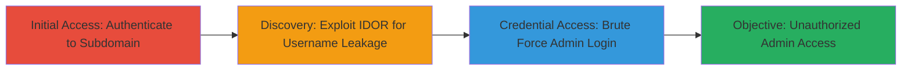

# IDOR Username Leakage Enabling Brute Force Admin Access in DoD Encryption Chat App

Multi-stage attack chain demonstrating exploitation of an Insecure Direct Object Reference (IDOR) in a subdomain of a highly protected DoD encryption chat application, leading to unauthorized username leakage and subsequent brute force access to the admin panel.

## Chain Metrics Dashboard

| Metric | Value |
|--------|-------|
| Chain Status | Unverified |
| Total Steps | 3 |
| Execution Time | ~10 minutes |
| Skill Level | Intermediate |
| Complexity | Medium |
| Impact Level | High |

## Attack Flow Visualization



## Prerequisites & Requirements

### Required Tools

- [[tools/Simple-Bruteforce-Tool]]

### Target Environment

- Web platform
- Encryption chat application services
- Access to DoD program subdomain

### Initial Access Requirements

- Valid test account credentials for initial login
- Network access to the target domain
- No prior admin privileges required

## Detailed Attack Procedures

### Step 1: Authenticate and Access Subdomain
procedure: [[procedures/Authenticate-and-Access-Subdomain]]

**Objective**: Gain authenticated access to the vulnerable subdomain to prepare for parameter manipulation.

**Instructions**: Visit the initial domain and log in using provided test credentials. Navigate to the post-login area to reach the subdomain.

Use a browser to access the initial domain:

```bash
# No specific command; use browser to visit https://target-subdomain.dod.gov
```

Then sign in with test credentials (e.g., username: testuser, password: testpass123).

**Expected Output**: Successful login redirect to the authenticated dashboard at chat.dod.gov.

**Success Indicators**:
- Login successful without errors
- Access to post-login interface confirmed

### Step 2: Exploit IDOR for Username Leakage
procedure: [[procedures/Exploit-IDOR-for-Username-Leakage]]

**Objective**: Manipulate the username parameter in the URL to bypass access controls and leak other users' usernames.

**Instructions**: From the authenticated session, visit the vulnerable endpoint and replace the username parameter with a target identifier. Construct the manipulated URL to trigger the IDOR.

Access the endpoint in the browser:

```bash
# Browser navigation to /api/user/profile/username-parameter
```

Manipulate by replacing 'currentuser' with 'targetuser@domain:port':

```bash
# Final URL example: https://subdomain.dod.gov/api/user/profile/targetuser@domain:port
```

**Expected Output**: Response containing leaked username, e.g., displayname 'adminuser'.

**Success Indicators**:
- Unauthorized username visible in response
- No access denied error

### Step 3: Brute Force Admin Login with Leaked Usernames
procedure: [[procedures/Brute-Force-Admin-Login-with-Leaked-Usernames]]

**Objective**: Use leaked usernames to perform unrestricted brute force attacks on the admin panel login.

**Instructions**: Collect leaked usernames and apply them in brute force attempts against the admin login endpoint using a simple tool, exploiting the lack of rate limiting.

Launch brute force with tool:

```bash
# Use tool to target admin login with wordlist including leaked usernames
bruteforce-tool -u https://admin.dod.gov/login -U leaked_usernames.txt -P common_passwords.txt
```

**Expected Output**: Successful login with valid credential pair, granting admin access.

**Success Indicators**:
- Valid login response
- Admin dashboard accessible

## Attack Chain Summary

### Key Achievements

1. Bypassed authorization via IDOR to leak sensitive usernames
2. Exploited missing rate limiting for efficient brute force
3. Achieved unauthorized admin panel access in a high-security DoD environment

## Technique & Tactic Coverage

### MITRE ATT&CK Techniques

- [[Account Discovery]]
- [[Password Guessing]]

### MITRE ATT&CK Tactics

- [[Discovery]]
- [[Credential Access]]

---
*Last updated: 2023-10-01T00:00:00Z*
