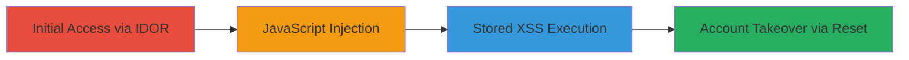

# IDOR and Auth Bypass in Tealium Leading to Stored XSS on Uber Domains

Multi-stage attack chain demonstrating exploitation of access control flaws in Tealium to compromise accounts and deliver stored XSS payloads on Uber's web applications.

## Chain Metrics Dashboard

| Metric | Value |
|--------|-------|
| Chain Status | Unverified |
| Total Steps | 4 |
| Execution Time | ~30 minutes |
| Skill Level | Intermediate |
| Complexity | Medium |
| Impact Level | High |

## Attack Flow Visualization

## Prerequisites & Requirements

### Required Tools

- Web browser with developer tools (e.g., Chrome DevTools)
- Proxy tool like Burp Suite for request manipulation

### Target Environment

- Tealium platform (tag management service)
- Uber domains loading Tealium tags (e.g., uber.com subdomains)
- Web-based, no specific ports required beyond HTTPS (443)

### Initial Access Requirements

- Valid low-privilege Tealium account (e.g., any user account)
- Network access to Tealium's web interface and Uber sites
- No prior admin access needed; exploits enable escalation

## Detailed Attack Procedures

### Step 1: Compromise Admin Account via IDOR
procedure: [[procedures/Exploit-IDOR-for-Tealium-Admin-Compromise]]

**Objective**: Gain unauthorized access to a Tealium administrator account by exploiting insecure direct object references.

**Instructions**: Analyze Tealium's API endpoints for account management. Identify parameters like user IDs that are directly referenced without authorization checks. Use a proxy to intercept and modify requests, replacing the user ID with an admin's ID (e.g., obtained via enumeration). Submit the modified request to access the admin dashboard. For example, in a request to `/api/users/{id}`, change `{id}` to an admin ID.

**Expected Output**: Successful login or session takeover as the admin user, granting control over tag configurations.

**Success Indicators**:
- Access to admin-only features in Tealium interface
- Ability to view or modify admin account settings

### Step 2: Inject Arbitrary JavaScript into Tealium Tags
procedure: [[procedures/Inject-Malicious-JavaScript-into-Tealium-Tags]]

**Objective**: Use the compromised admin account to embed malicious JavaScript payloads into Tealium tags hosted on their CDN.

**Instructions**: Navigate to the tag editing section in the Tealium admin panel. Locate tags for Uber at paths like `https://tags.tiqcdn.com/utag/uber/*`. Edit the tag code to inject a payload, such as `` or more advanced code for data exfiltration (e.g., stealing cookies via `document.cookie`). Save the changes to deploy the modified tag.

**Expected Output**: Updated tag files on the CDN containing the injected JavaScript, verifiable by fetching the URL directly.

**Success Indicators**:
- Modified tag content visible in source code
- No errors in tag deployment logs

### Step 3: Execute Stored XSS on Uber Domains
procedure: [[procedures/Execute-Stored-XSS-via-Tealium-Tags-on-Uber-Domains]]

**Objective**: Trigger the stored XSS payloads when Uber domains load the compromised Tealium tags, affecting multiple users.

**Instructions**: Visit an Uber domain (e.g., uber.com) that integrates Tealium tags. The browser will load the tags from `https://tags.tiqcdn.com/utag/uber/*`, executing the injected JavaScript. Monitor the page load in developer tools to confirm payload execution, such as popups or network requests to an attacker-controlled server.

**Expected Output**: Malicious script runs in the context of Uber's site, potentially hijacking sessions or stealing data.

**Success Indicators**:
- JavaScript alerts or console errors indicating payload execution
- Unauthorized actions like cookie theft observed in network tab

### Step 4: Additional Account Takeover via Reset Vulnerabilities
procedure: [[procedures/Account-Takeover-via-Tealium-Password-and-MFA-Reset]]

**Objective**: Exploit weak reset mechanisms to takeover additional Tealium accounts, enabling further code modifications.

**Instructions**: From any user account, access the password reset endpoint (e.g., `/reset-password?user={target_user}`). Without auth checks, submit a reset for a target user's email or ID. Similarly, target MFA reset features. Follow the reset flow to set a new password, then login as the compromised user to modify tags or accounts.

**Expected Output**: Control over the target account, with ability to edit Tealium configurations on their behalf.

**Success Indicators**:
- Successful password change confirmation
- Login with new credentials to the target account

## Attack Chain Summary

### Key Achievements

1. Compromised Tealium admin account via IDOR, bypassing access controls.
2. Injected and deployed malicious JavaScript into production tags affecting Uber.
3. Achieved stored XSS execution across multiple Uber domains, demonstrating high-impact client-side attacks.
4. Enabled widespread account takeovers through insecure reset functions, amplifying the attack scope.

## Technique & Tactic Coverage

### MITRE ATT&CK Techniques

- [[Exploit Public-Facing Application]]
- [[Valid Accounts]]
- [[Drive-by Compromise]]

### MITRE ATT&CK Tactics

- [[Initial Access]]
- [[Execution]]
- [[Collection]]

---
*Last updated: 2023-10-01T00:00:00Z*
