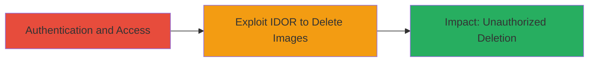

---
tags:
  - idor
  - graphql
  - autodesk
  - web
  - authorization-bypass
type: attack_chain
tools: []
tactics:
  - '[[Initial Access]]'
verified: false
platforms:
  - Web
submitted: true
complexity: medium
created_at: '2023-10-01T00:00:00Z'
procedures:
  - '[[procedures/Exploit-IDOR-in-GraphQL-deleteProfileImages-Mutation]]'
step_count: 1
techniques:
  - '[[Exploit Public-Facing Application]]'
updated_at: '2025-12-14T17:26:00.018Z'
description: >-
  An authenticated attacker exploits an Insecure Direct Object Reference (IDOR)
  vulnerability in the Autodesk User Profile GraphQL mutation to delete profile
  images of other users by manipulating the 'id' parameter.
skill_level: intermediate
impact_level: high
id: e96c6de0-6155-4dad-a580-5397afb7e478
validated: true
mitre_tactics:
  - '[[Initial Access]]'
mitre_techniques:
  - '[[Exploit Public-Facing Application]]'
---
# IDOR in Autodesk GraphQL deleteProfileImages to Delete Other Users' Profile Images

Multi-stage attack chain demonstrating a complete attack workflow exploiting an IDOR vulnerability in Autodesk's GraphQL endpoint.

## Chain Metrics Dashboard

| Metric | Value |
|--------|-------|
| Chain Status | Unverified |
| Total Steps | 1 |
| Execution Time | ~5 minutes |
| Skill Level | Intermediate |
| Complexity | Medium |
| Impact Level | High |

## Attack Flow Visualization



## Prerequisites & Requirements

### Required Tools

- None specialized; uses standard HTTP clients like curl.

### Target Environment

- Web platform with GraphQL API
- Autodesk User Profile service
- Authenticated session required

### Initial Access Requirements

- Valid Autodesk account credentials
- Network access to Autodesk's web application
- Ability to inspect and modify GraphQL requests (e.g., via browser dev tools or proxy)

## Detailed Attack Procedures

### Step 1: Exploit IDOR in GraphQL Mutation
procedure: [[procedures/Exploit-IDOR-in-GraphQL-deleteProfileImages-Mutation]]

**Objective**: Authenticate to the Autodesk platform and manipulate the 'id' parameter in the deleteProfileImages GraphQL mutation to delete another user's profile images without authorization.

**Instructions**: First, authenticate to the Autodesk User Profile feature to obtain a valid session token. Then, identify the GraphQL endpoint (typically at /graphql or similar). Capture a legitimate deleteProfileImages mutation request for your own image using browser developer tools or a proxy like Burp Suite. Modify the 'id' parameter to reference another user's image ID (obtained via enumeration or prior access). Execute the modified mutation using [[commands/curl-graphql-delete-mutation]]:

```bash
curl -X POST https://autodesk.example.com/graphql \
  -H "Content-Type: application/json" \
  -H "Authorization: Bearer YOUR_SESSION_TOKEN" \
  -d '{"query": "mutation deleteProfileImages($id: ID!) { deleteProfileImages(id: $id) { success } }", "variables": {"id": "TARGET_USER_IMAGE_ID"}}'
```

Verify the deletion by checking the target user's profile or API response.

**Expected Output**: JSON response indicating successful deletion, e.g., {"data": {"deleteProfileImages": {"success": true}}}.

**Success Indicators**:
- API returns success without errors
- Target user's profile image is removed upon verification
- No authorization denial in response

## Attack Chain Summary

### Key Achievements

1. Bypassed authorization to access and delete other users' objects
2. Demonstrated impact on user data integrity in Autodesk's profile management
3. Highlighted GraphQL-specific IDOR risks in authenticated endpoints

## Technique & Tactic Coverage

### MITRE ATT&CK Techniques

- [[Exploit Public-Facing Application]]

### MITRE ATT&CK Tactics

- [[Initial Access]]

---
*Last updated: 2023-10-01T00:00:00Z*
