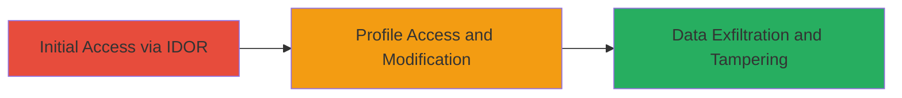

# IDOR in Autodesk User Profile API Allowing Unauthorized Profile Access and Modification

Multi-stage attack chain demonstrating a complete attack workflow exploiting an IDOR vulnerability in the Autodesk User Profile feature.

## Chain Metrics Dashboard

| Metric | Value |
|--------|-------|
| Chain Status | Unverified |
| Total Steps | 1 |
| Execution Time | ~5 minutes |
| Skill Level | Intermediate |
| Complexity | Medium |
| Impact Level | High |

## Attack Flow Visualization



## Prerequisites & Requirements

### Required Tools

- Browser Developer Tools or [[tools/Burp-Suite]]
- API testing tool like curl

### Target Environment

- Web platform
- Autodesk User Profile API service
- Requires authenticated session (e.g., valid user login)

### Initial Access Requirements

- Valid Autodesk account credentials for initial login
- Network access to Autodesk's web application
- No prior elevated access needed, but authentication is required to reach the API endpoint

## Detailed Attack Procedures

### Step 1: Exploit IDOR in User Profile API
procedure: [[procedures/Exploit-IDOR-in-User-Profile-API]]

**Objective**: Identify and manipulate the 'id' parameter in the User Profile API request to access and modify another user's profile without authorization.

**Instructions**: First, authenticate to the Autodesk application and navigate to the user profile functionality to capture the legitimate API request. Use browser dev tools or Burp Suite to intercept the request, which typically looks like a POST or GET to an endpoint such as `/api/user/profile` with an 'id' parameter set to your own user ID.

Identify a target user's ID (e.g., from public profiles or enumeration). Then, modify the 'id' parameter to the target user's ID and resend the request using [[commands/curl-idor-profile-access]]:

```bash
curl -X GET "https://autodesk-api.example.com/api/user/profile?id=TARGET_USER_ID" -H "Authorization: Bearer YOUR_TOKEN" -H "Content-Type: application/json"
```

To modify the profile, switch to a POST request with updated data using [[commands/curl-idor-profile-modify]]:

```bash
curl -X POST "https://autodesk-api.example.com/api/user/profile?id=TARGET_USER_ID" -H "Authorization: Bearer YOUR_TOKEN" -H "Content-Type: application/json" -d '{"email": "attacker@example.com", "name": "Modified Name"}'
```

**Expected Output**: For access, JSON response containing the target user's profile details. For modification, a success response (e.g., 200 OK) confirming the update, or the modified profile data.

**Success Indicators**:
- Unauthorized profile data retrieved without errors
- Profile modifications applied to the target user, verifiable by logging in as the target or checking API responses
- No authorization errors (e.g., 403 Forbidden) when using the manipulated ID

## Attack Chain Summary

### Key Achievements

1. Unauthorized access to other users' sensitive profile information
2. Successful modification of target profiles, leading to privacy violations
3. Demonstration of medium-severity impact (CVSS 5.9) with potential for broader account compromise

## Technique & Tactic Coverage

### MITRE ATT&CK Techniques

- [[Exploit Public-Facing Application]] Exploit Public-Facing Application
- [[Account Discovery]] Account Discovery

### MITRE ATT&CK Tactics

- [[Initial Access]] Initial Access
- [[Discovery]] Discovery

---
*Last updated: 2023-10-01T00:00:00Z*
