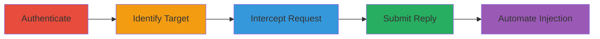

---
tags:
  - idor
  - wordpress
  - buddypress
  - authorization-bypass
  - message-injection
type: attack_chain
tools:
  - '[[tools/Burp-Suite]]'
  - '[[tools/Postman]]'
  - '[[tools/Python]]'
tactics:
  - '[[Execution]]'
verified: false
platforms:
  - Web
  - WordPress
submitted: true
complexity: medium
created_at: '2023-10-01T00:00:00Z'
procedures:
  - '[[procedures/Authenticate-to-WordPress-Site]]'
  - '[[procedures/Identify-Target-Thread-ID]]'
  - '[[procedures/Intercept-and-Modify-Reply-Request]]'
  - '[[procedures/Submit-Unauthorized-Reply]]'
  - '[[procedures/Automate-Message-Injection-with-Python]]'
step_count: 5
techniques:
  - '[[Exploit Public-Facing Application]]'
updated_at: '2025-12-14T17:30:27.371Z'
description: >-
  Authenticated users exploit missing authorization in BuddyPress to inject
  messages into private threads they are not part of, enabling spam or phishing
  disruption.
skill_level: intermediate
impact_level: medium
id: 7bccd8c3-e1b8-4e7f-abae-e9886fb475ce
validated: true
mitre_tactics:
  - '[[Execution]]'
mitre_techniques:
  - '[[Exploit Public-Facing Application]]'
---
# IDOR in BuddyPress Private Messaging for Unauthorized Message Injection

Multi-stage attack chain demonstrating exploitation of missing authorization checks in BuddyPress private messaging to inject unauthorized replies into private threads.

## Chain Metrics Dashboard

| Metric | Value |
|--------|-------|
| Chain Status | Unverified |
| Total Steps | 5 |
| Execution Time | ~10 minutes |
| Skill Level | Intermediate |
| Complexity | Medium |
| Impact Level | Medium |

## Attack Flow Visualization



## Prerequisites & Requirements

### Required Tools

- [[tools/Burp-Suite]]
- [[tools/Postman]]
- [[tools/Python]]

### Target Environment

- WordPress site with BuddyPress plugin enabled and private messaging activated
- Web platform accessible via browser or API tools
- No specific ports beyond standard HTTP/HTTPS (80/443)

### Initial Access Requirements

- Valid authenticated user credentials (low-privilege account)
- Network access to the WordPress site
- No prior elevated access needed

## Detailed Attack Procedures

### Step 1: Authenticate to WordPress Site
procedure: [[procedures/Authenticate-to-WordPress-Site]]

**Objective**: Gain authenticated session to the target WordPress site with BuddyPress.

**Instructions**: Log in using standard WordPress credentials to obtain session cookies required for subsequent requests.

**Expected Output**: Successful login redirect and session cookies in browser or tool.

**Success Indicators**:
- Valid session established
- Access to BuddyPress private messaging interface

### Step 2: Identify Target Thread ID
procedure: [[procedures/Identify-Target-Thread-ID]]

**Objective**: Locate a private message thread ID where the authenticated user is not a participant.

**Instructions**: Query the database or use incremental ID guessing to find target thread_ids. For example, create a test thread between other users or enumerate sequentially.

**Expected Output**: List of potential thread_ids, such as 1, 2, etc.

**Success Indicators**:
- Target thread_id identified
- Confirmation that user is not a participant

### Step 3: Intercept and Modify Reply Request
procedure: [[procedures/Intercept-and-Modify-Reply-Request]]

**Objective**: Capture a legitimate reply request and alter the thread_id to target an unauthorized thread.

**Instructions**: Use [[tools/Burp-Suite]] to intercept a reply from a legitimate thread, then modify the thread_id parameter. Alternatively, craft a new request in [[tools/Postman]]. Include action=messages_send_reply, valid _wpnonce, content, and the manipulated thread_id.

**Expected Output**: Modified POST request ready for submission.

**Success Indicators**:
- Request intercepted and parameters altered
- Valid nonce and cookies preserved

### Step 4: Submit Unauthorized Reply
procedure: [[procedures/Submit-Unauthorized-Reply]]

**Objective**: Inject the message into the unauthorized private thread.

**Instructions**: Send the crafted POST request to /wp-admin/admin-ajax.php using the modified parameters. Execute [[commands/buddypress-unauthorized-reply]] to perform the injection.

```bash
curl -X POST http://target.com/wp-admin/admin-ajax.php \
  -H "Cookie: wordpress_logged_in_...=..." \
  -d "action=messages_send_reply&_wpnonce=...&content=Test Message&thread_id=1"
```

**Expected Output**: JSON response indicating success (e.g., {"success": true}), though the message won't appear in attacker's sentbox.

**Success Indicators**:
- Server accepts the request without error
- Message injected (verifiable by thread participants)

### Step 5: Automate Message Injection with Python
procedure: [[procedures/Automate-Message-Injection-with-Python]]

**Objective**: Scale the attack by injecting messages into multiple unauthorized threads.

**Instructions**: Write a Python script to create a self-thread for max_id, then loop over thread_ids sending replies. Use [[commands/python-automate-injection]] for automation.

**Expected Output**: Script output showing successful injections for valid threads.

**Success Indicators**:
- Multiple threads targeted
- No crashes on invalid IDs

## Attack Chain Summary

### Key Achievements

1. Authenticated access to BuddyPress
2. Unauthorized message injection via IDOR
3. Potential for spam/phishing disruption across threads

## Technique & Tactic Coverage

### MITRE ATT&CK Techniques

- [[Exploit Public-Facing Application]]

### MITRE ATT&CK Tactics

- [[Execution]]

---

*Last updated: 2023-10-01T00:00:00Z*
