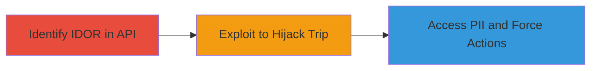

# IDOR in Bykea Ride Booking API for Trip Hijacking and PII Disclosure

Multi-stage attack chain demonstrating a complete attack workflow exploiting IDOR in Bykea's ride booking API.

## Chain Metrics Dashboard

| Metric | Value |
|--------|-------|
| Chain Status | Unverified |
| Total Steps | 2 |
| Execution Time | ~5 minutes |
| Skill Level | Intermediate |
| Complexity | Medium |
| Impact Level | High |

## Attack Flow Visualization



## Prerequisites & Requirements

### Required Tools

- None (manual API testing via tools like curl or Postman)

### Target Environment

- Web-based API (Bykea ride booking service)
- Required services/ports: HTTPS on standard port 443
- Network access requirements: Internet access to Bykea API endpoints

### Initial Access Requirements

- Valid user account (passenger or driver) for authentication
- Network position: External attacker with API access
- Prior access needed: Authenticated session token

## Detailed Attack Procedures

### Step 1: Identify Lack of Validation in API Endpoints
procedure: [[procedures/Test-API-Endpoints-for-IDOR-Vulnerability]]

**Objective**: Test the /acknowledged_the_offer and /accept endpoints to identify IDOR by substituting trip_id parameters from other users.

**Instructions**: Authenticate to the Bykea API using your credentials to obtain a session token. Capture a legitimate trip_id from your own booking. Then, obtain a victim's trip_id (e.g., via social engineering or prior reconnaissance). Send test requests to the endpoints using the victim's trip_id while authenticated as yourself. Use tools like curl to simulate the requests:

```bash
curl -X POST https://api.bykea.com/acknowledged_the_offer \
  -H "Authorization: Bearer YOUR_TOKEN" \
  -d "trip_id=VICTIM_TRIP_ID"
```

If the request succeeds without ownership checks, IDOR is confirmed.

**Expected Output**: Successful response acknowledging or accepting the trip without errors.

**Success Indicators**:
- API responds positively to unauthorized trip_id
- No ownership validation error returned

### Step 2: Exploit IDOR to Hijack Trips
procedure: [[procedures/Exploit-IDOR-to-Hijack-Trips]]

**Objective**: Use the identified IDOR to hijack a victim's trip, forcing acceptance or acknowledgment that exposes PII to unauthorized parties.

**Instructions**: With the confirmed IDOR, target a specific victim's trip_id. Send crafted requests to /acknowledged_the_offer to acknowledge the offer on behalf of the victim, or to /accept to force trip acceptance even if canceled. This can compel a driver to proceed with the ride or expose passenger details to the attacker posing as the driver. Example request:

```bash
curl -X POST https://api.bykea.com/accept \
  -H "Authorization: Bearer YOUR_TOKEN" \
  -d "trip_id=VICTIM_TRIP_ID"
```

Monitor responses for trip status changes and any disclosed PII in subsequent API interactions.

**Expected Output**: Trip status updated (e.g., accepted), potentially including PII like passenger name, location, or contact details.

**Success Indicators**:
- Trip hijacked successfully
- Attacker gains access to victim's ride details or forces unwanted actions
- PII exposure confirmed in API responses or driver/passenger interactions

## Attack Chain Summary

### Key Achievements

1. Identified IDOR in ride booking API endpoints
2. Hijacked trips to force passenger-driver interactions
3. Disclosed PII leading to privacy violations

## Technique & Tactic Coverage

### MITRE ATT&CK Techniques

- [[Exploit Public-Facing Application]]
- [[Valid Accounts]]

### MITRE ATT&CK Tactics

- [[Initial Access]]
- [[Discovery]]

---
*Last updated: 2023-10-01T00:00:00Z*
