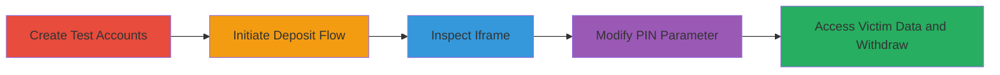

---
tags:
  - idor
  - improper-authentication
  - account-takeover
  - info-disclosure
  - web-vulnerability
type: attack_chain
tools:
  - '[[tools/Browser-Developer-Tools]]'
tactics:
  - '[[Initial Access]]'
  - '[[Collection]]'
  - '[[Privilege Escalation]]'
verified: false
platforms:
  - Web
submitted: true
complexity: medium
created_at: '2023-10-01T00:00:00Z'
procedures:
  - '[[procedures/Create-Test-Victim-and-Attacker-Accounts]]'
  - '[[procedures/Initiate-Cashier-Deposit-Flow]]'
  - '[[procedures/Inspect-Cashier-Iframe-Source]]'
  - '[[procedures/Modify-Iframe-SRC-for-IDOR-Exploitation]]'
  - '[[procedures/Access-Victim-Cashier-and-Initiate-Withdrawal]]'
step_count: 5
techniques:
  - '[[Exploit Public-Facing Application]]'
  - '[[Valid Accounts]]'
updated_at: '2025-12-14T17:25:13.016Z'
description: >-
  Multi-stage attack exploiting insecure direct object reference in the cashier
  iframe to access any user's account details and initiate withdrawals.
skill_level: intermediate
impact_level: high
id: 97f31cfc-7ff6-432b-96bb-38d23809cb65
validated: true
mitre_tactics:
  - '[[Initial Access]]'
  - '[[Collection]]'
  - '[[Privilege Escalation]]'
mitre_techniques:
  - '[[Exploit Public-Facing Application]]'
  - '[[Valid Accounts]]'
---
# IDOR in Cashier Iframe for Unauthorized Access to User Accounts and Fund Withdrawals

Multi-stage attack chain demonstrating exploitation of improper authentication and IDOR in the cashier system's iframe, allowing unauthorized access to any user's sensitive information and initiation of withdrawals.

## Chain Metrics Dashboard

| Metric | Value |
|--------|-------|
| Chain Status | Unverified |
| Total Steps | 5 |
| Execution Time | ~10 minutes |
| Skill Level | Intermediate |
| Complexity | Medium |
| Impact Level | High |

## Attack Flow Visualization

## Prerequisites & Requirements

### Required Tools

- [[tools/Browser-Developer-Tools]]

### Target Environment

- Web platform
- Access to https://www.binary.com/cashier (now Deriv.com)
- No specific ports required; standard HTTPS (443)

### Initial Access Requirements

- Ability to create accounts on the target platform
- Separate browser sessions or incognito modes for victim and attacker accounts
- Valid account IDs (PINs) for victim

## Detailed Attack Procedures

### Step 1: Create Test Accounts
procedure: [[procedures/Create-Test-Victim-and-Attacker-Accounts]]

**Objective**: Establish victim and attacker personas to simulate the attack.

**Instructions**: Register two separate accounts on the platform, designating one as victim and one as attacker. Log in to each in isolated browser sessions to avoid cookie conflicts.

**Expected Output**: Two active accounts with known account IDs (PINs).

**Success Indicators**:
- Successful login to both accounts
- Retrieval of account IDs from user profiles or previous sessions

### Step 2: Initiate Deposit Flow
procedure: [[procedures/Initiate-Cashier-Deposit-Flow]]

**Objective**: Load the cashier iframe with the attacker's credentials to prepare for inspection.

**Instructions**: From the attacker's logged-in session, navigate to the cashier page and start the deposit process to embed the vulnerable iframe.

**Expected Output**: Iframe loaded in the browser displaying the attacker's deposit interface.

**Success Indicators**:
- Cashier page accessible at https://www.binary.com/cashier
- Deposit button clicked, leading to iframe embed

### Step 3: Inspect Iframe Source
procedure: [[procedures/Inspect-Cashier-Iframe-Source]]

**Objective**: Identify the iframe element and its modifiable SRC parameter containing the PIN.

**Instructions**: Use browser developer tools to locate the iframe with id='cashiercont' and examine its src attribute for parameters like PIN, Password, Secret, and Action.

**Expected Output**: Visible iframe src URL with attacker's PIN exposed.

**Success Indicators**:
- Iframe element found in DOM inspector
- PIN parameter confirmed as the account ID

### Step 4: Modify Iframe SRC for IDOR
procedure: [[procedures/Modify-Iframe-SRC-for-IDOR-Exploitation]]

**Objective**: Alter the PIN parameter to the victim's account ID, bypassing authentication.

**Instructions**: Edit the src attribute in developer tools, replacing the PIN with the victim's account ID while keeping other parameters intact.

**Expected Output**: Iframe reloads with victim's cashier interface.

**Success Indicators**:
- Modified URL loads without errors
- Victim's account details visible in iframe

### Step 5: Access Victim Data and Initiate Withdrawal
procedure: [[procedures/Access-Victim-Cashier-and-Initiate-Withdrawal]]

**Objective**: View sensitive information and attempt unauthorized transactions.

**Instructions**: Interact with the loaded victim's cashier to view PII and, for withdrawals, modify Action to PAYOUT and submit to attacker's payment methods.

**Expected Output**: Disclosure of full name, email, phone; withdrawal request initiated (pending manual review).

**Success Indicators**:
- PII exposed via view link
- Withdrawal form accessible and submittable

## Attack Chain Summary

### Key Achievements

1. Unauthorized login to any user's cashier via client-side parameter tampering
2. Full disclosure of sensitive PII including name, email, and phone
3. Initiation of fraudulent withdrawals to attacker's methods, evading initial auth checks

## Technique & Tactic Coverage

### MITRE ATT&CK Techniques

- [[Exploit Public-Facing Application]]
- [[Valid Accounts]]

### MITRE ATT&CK Tactics

- [[Initial Access]]
- [[Collection]]
- [[Privilege Escalation]]

---
*Last updated: 2023-10-01T00:00:00Z*
