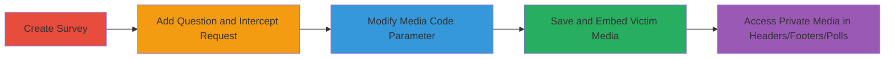

# IDOR in Crowdsignal Media Code Parameter for Unauthorized Media Access

Multi-stage attack chain demonstrating exploitation of an IDOR vulnerability in Crowdsignal's survey editing functionality to unauthorizedly access and embed private media from other users.

## Chain Metrics Dashboard

| Metric | Value |
|--------|-------|
| Chain Status | Unverified |
| Total Steps | 6 |
| Execution Time | ~10 minutes |
| Skill Level | Intermediate |
| Complexity | Medium |
| Impact Level | High |

## Attack Flow Visualization

## Prerequisites & Requirements

### Required Tools

- [[tools/Burp-Suite]]

### Target Environment

- Crowdsignal platform (web-based SaaS)
- Authenticated user account in Crowdsignal
- Network access to Crowdsignal endpoints

### Initial Access Requirements

- Valid Crowdsignal account credentials
- Browser with proxy support (e.g., Firefox configured for Burp)
- No prior access to victim media needed; sequential ID guessing suffices

## Detailed Attack Procedures

### Step 1: Create Survey
procedure: [[procedures/Create-Crowdsignal-Survey]]

**Objective**: Establish a new survey to serve as the base for media embedding.

**Instructions**: Log in to Crowdsignal and navigate to the dashboard to create a new survey. This provides the context for adding questions and media.

**Expected Output**: A new survey is created and editable.

**Success Indicators**:
- Survey dashboard loads with editing options
- Survey ID is generated

### Step 2: Add Question and Prepare Interception
procedure: [[procedures/Intercept-and-Modify-Media-Code-Request]]

**Objective**: Add a survey element (e.g., Free Text question) and set up traffic interception to capture the save request.

**Instructions**: In the survey editor, add a Free Text question. Configure your browser to route traffic through the proxy tool. Edit the question to trigger a media-related save action if applicable, or simply save to capture the baseline request.

**Expected Output**: Proxy is active, and the add/edit action is ready to intercept.

**Success Indicators**:
- Proxy tool (e.g., Burp) is intercepting browser traffic
- Survey question is added successfully in the UI

### Step 3: Trigger and Intercept Save Request
procedure: [[procedures/Intercept-and-Modify-Media-Code-Request]]

**Objective**: Save the question to generate the POST request containing the media_code parameter.

**Instructions**: Edit the question details and click Save. The proxy will catch the outgoing POST request to the survey save endpoint.

**Expected Output**: Intercepted POST request visible in proxy tool, showing media_code parameter.

**Success Indicators**:
- Request body includes media_code (e.g., original value)
- Endpoint like /surveys/:id/edit is targeted

### Step 4: Modify Media Code Parameter
procedure: [[procedures/Intercept-and-Modify-Media-Code-Request]]

**Objective**: Alter the media_code to reference another user's media ID.

**Instructions**: In the proxy tool, locate the media_code parameter in the request body (JSON or form data). Change its value to a guessed sequential 7-digit ID (e.g., 2013124) belonging to a target user's private media.

**Expected Output**: Modified request ready for forwarding.

**Success Indicators**:
- Parameter updated without syntax errors
- ID is a valid 7-digit sequential number

### Step 5: Forward Modified Request
procedure: [[procedures/Embed-Victim-Media-in-Survey]]

**Objective**: Submit the tampered request to the server.

**Instructions**: Forward the modified POST request through the proxy to the Crowdsignal server.

**Expected Output**: Server accepts the request; survey saves with the new media_code.

**Success Indicators**:
- No error response (200 OK)
- Survey editor reflects the change

### Step 6: Verify and Embed Victim Media
procedure: [[procedures/Embed-Victim-Media-in-Survey]]

**Objective**: Confirm unauthorized media access and extend to headers, footers, or polls.

**Instructions**: Preview or publish the survey to view the embedded media. Repeat for headers/footers via similar save requests or polls in team accounts using POST /polls/:pollId/edit.

**Expected Output**: Victim's private media (e.g., images/videos) displays in the attacker's survey.

**Success Indicators**:
- Private media from another user is visible and embeddable
- Works across questions, headers, footers, and team polls

## Attack Chain Summary

### Key Achievements

1. Unauthorized viewing of private media via IDOR in media_code parameter
2. Embedding of victim media in attacker-controlled surveys
3. Extension to team accounts and poll editing endpoints

## Technique & Tactic Coverage

### MITRE ATT&CK Techniques

- [[Exploit Public-Facing Application]]
- [[Account Discovery]]

### MITRE ATT&CK Tactics

- [[Initial Access]]
- [[Discovery]]

---
*Last updated: 2023-10-01T12:00:00Z*
