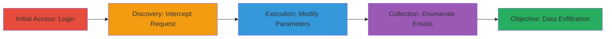

---
tags:
  - idor
  - api
  - enumeration
  - authorization-bypass
  - dashlane
type: attack_chain
tools:
  - '[[tools/Burp-Suite]]'
tactics:
  - '[[Discovery]]'
commands:
  - '[[commands/curl-dashlane-team-members]]'
verified: false
platforms:
  - Web
submitted: true
complexity: medium
created_at: '2023-10-01T00:00:00Z'
procedures:
  - '[[procedures/Login-to-Dashlane-Console]]'
  - '[[procedures/Intercept-Dashlane-API-Request-with-Burp]]'
  - '[[procedures/Extract-Auth-Parameters-from-Request]]'
  - '[[procedures/Send-Request-to-Burp-Repeater]]'
  - '[[procedures/Modify-Request-for-Arbitrary-Team-ID]]'
  - '[[procedures/Send-Modified-API-Request]]'
  - '[[procedures/Analyze-Response-for-Billing-Admins]]'
  - '[[procedures/Enumerate-Multiple-Teams-with-IDOR]]'
step_count: 9
techniques:
  - '[[Account Discovery]]'
updated_at: '2025-12-14T17:28:59.271Z'
description: >-
  An attack chain exploiting an Insecure Direct Object Reference (IDOR)
  vulnerability in the Dashlane team plans API, allowing authenticated users to
  enumerate billing admin email addresses from arbitrary teams by manipulating
  the teamId parameter without authorization checks.
skill_level: intermediate
impact_level: high
id: abf928f0-ee32-4783-b795-d8379cc16165
validated: true
mitre_tactics:
  - '[[Discovery]]'
mitre_techniques:
  - '[[Account Discovery]]'
---
# IDOR in Dashlane API to Enumerate Billing Admin Emails Across Teams

Multi-stage attack chain demonstrating the exploitation of an IDOR vulnerability in Dashlane's team management API. An authenticated user can intercept legitimate API requests, modify the teamId parameter to target arbitrary teams, and extract sensitive billing admin email addresses without proper authorization checks. This leads to unauthorized enumeration of privacy-sensitive data across multiple teams.

## Chain Metrics Dashboard

| Metric | Value |
|--------|-------|
| Chain Status | Unverified |
| Total Steps | 9 |
| Execution Time | ~15 minutes |
| Skill Level | Intermediate |
| Complexity | Medium |
| Impact Level | High |

## Attack Flow Visualization



## Prerequisites & Requirements

### Required Tools

- [[tools/Burp-Suite]]

### Target Environment

- Web platform: console.dashlane.com and ws1.dashlane.com APIs
- Required services/ports: HTTPS (443)
- Network access requirements: Internet access to Dashlane services

### Initial Access Requirements

- Authenticated user account in Dashlane (business trial signup if needed)
- Network position: Direct internet access
- Prior access needed: None, but authentication token extraction required

## Detailed Attack Procedures

### Step 1: Login to Dashlane Console
procedure: [[procedures/Login-to-Dashlane-Console]]

**Objective**: Gain authenticated access to the Dashlane admin console to enable request interception.

**Instructions**: Access the console and authenticate using valid credentials. If no account exists, register via the business trial.

**Expected Output**: Successful login redirect to the dashboard.

**Success Indicators**:
- Dashboard accessible
- User session active

### Step 2: Intercept Request While Managing Users
procedure: [[procedures/Intercept-Dashlane-API-Request-with-Burp]]

**Objective**: Capture a legitimate API request during user management to obtain authentication parameters.

**Instructions**: Configure Burp Suite as a proxy, navigate to Manage Users, and intercept the traffic to identify the team plans API call.

**Expected Output**: Captured POST request to teamPlans/getTeamLastUpdateTs in Burp history.

**Success Indicators**:
- Request intercepted successfully
- Parameters like login and uki visible

### Step 3: Identify and Extract Authentication Parameters
procedure: [[procedures/Extract-Auth-Parameters-from-Request]]

**Objective**: Note key authentication values from the intercepted request for reuse in modified calls.

**Instructions**: Examine the request body in Burp for 'login' and 'uki' parameters.

**Expected Output**: Extracted values for login (email) and uki (session token).

**Success Indicators**:
- login and uki values copied
- No session expiration

### Step 4: Forward Request to Burp Repeater
procedure: [[procedures/Send-Request-to-Burp-Repeater]]

**Objective**: Prepare the captured request for modification and replay.

**Instructions**: Send the intercepted request from Burp Proxy history to the Repeater tab.

**Expected Output**: Request loaded in Repeater interface.

**Success Indicators**:
- Request editable in Repeater
- Original response verifiable

### Step 5: Modify Request URI and Parameters for IDOR
procedure: [[procedures/Modify-Request-for-Arbitrary-Team-ID]]

**Objective**: Alter the endpoint and inject an arbitrary teamId to bypass authorization.

**Instructions**: Change the URI to /1/teamPlans/members and update body to include limit=0&login=<extracted>&orderBy=login&teamId=<arbitrary>&uki=<extracted>.

**Expected Output**: Modified request ready for sending.

**Success Indicators**:
- teamId set to non-owned team value
- Body parameters correctly formatted

### Step 6: Send the Modified Request
procedure: [[procedures/Send-Modified-API-Request]]

**Objective**: Execute the tampered request to query unauthorized team data.

**Instructions**: Use Burp Repeater to forward the modified request to the server. Equivalent curl: Execute [[commands/curl-dashlane-team-members]] with parameters.

```bash
curl -X POST 'https://ws1.dashlane.com/1/teamPlans/members' \
  -H 'Content-Type: application/x-www-form-urlencoded' \
  -d 'limit=0&login=example@email.com&orderBy=login&teamId=12345&uki=session_token_here'
```

**Expected Output**: JSON response from server.

**Success Indicators**:
- HTTP 200 response
- No authorization error

### Step 7: Observe Response for Billing Admin Emails
procedure: [[procedures/Analyze-Response-for-Billing-Admins]]

**Objective**: Parse the API response to extract sensitive email data.

**Instructions**: Inspect the JSON response body for the 'billingAdmins' array containing email addresses.

**Expected Output**: List of billing admin emails for the targeted team.

**Success Indicators**:
- billingAdmins field populated
- Emails from unauthorized team visible

### Step 8: Repeat with Different Team IDs
procedure: [[procedures/Enumerate-Multiple-Teams-with-IDOR]]

**Objective**: Scale the enumeration to multiple teams for broader data collection.

**Instructions**: Increment or randomize teamId values (e.g., 12345, 12346) and resend requests in Burp Repeater.

**Expected Output**: Multiple JSON responses with emails from various teams.

**Success Indicators**:
- Successful responses for multiple teamIds
- Cumulative email list built

### Step 9: Validate and Document Findings

**Objective**: Confirm the vulnerability impact and prepare report.

**Instructions**: Compile extracted emails and verify they belong to non-owned teams.

**Expected Output**: Documented list of enumerated billing admins.

**Success Indicators**:
- Privacy violation confirmed
- No rate limiting encountered

## Attack Chain Summary

### Key Achievements

1. Authenticated access to Dashlane console without admin privileges.
2. Successful IDOR exploitation to access arbitrary team data.
3. Enumeration of sensitive billing admin emails across teams, enabling potential phishing or privacy breaches.

## Technique & Tactic Coverage

### MITRE ATT&CK Techniques

- [[Account Discovery]]

### MITRE ATT&CK Tactics

- [[Discovery]]

---
*Last updated: 2023-10-01T00:00:00Z*
